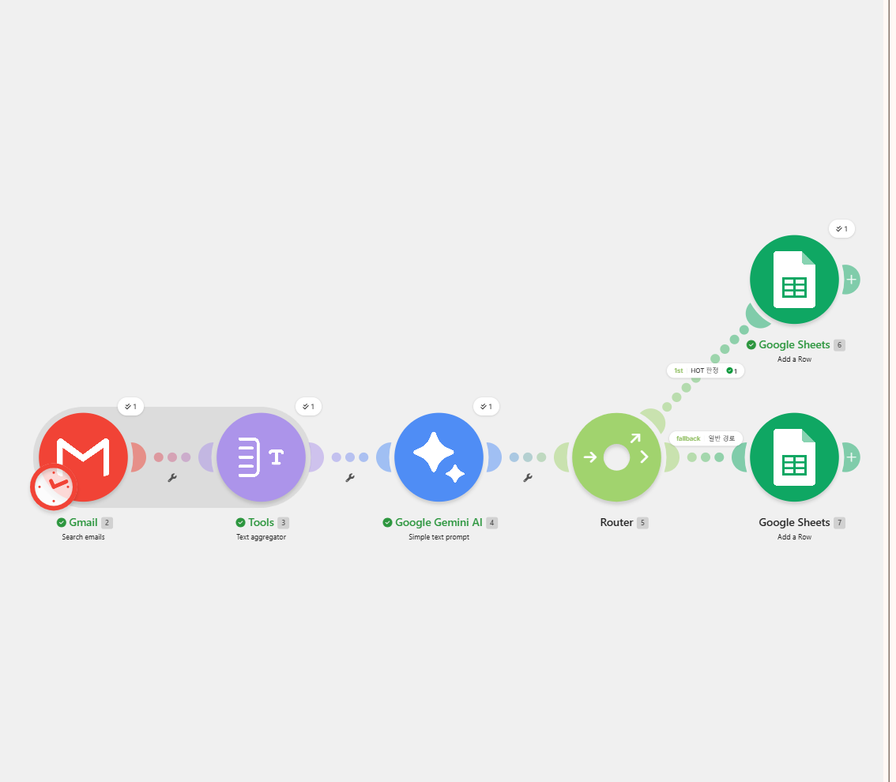
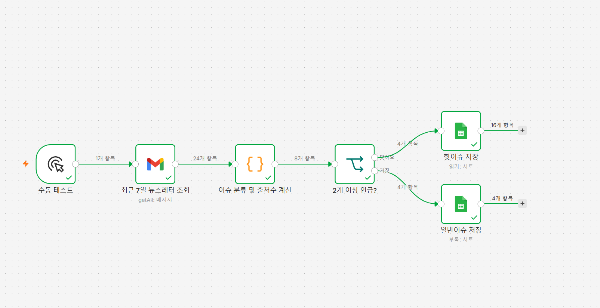
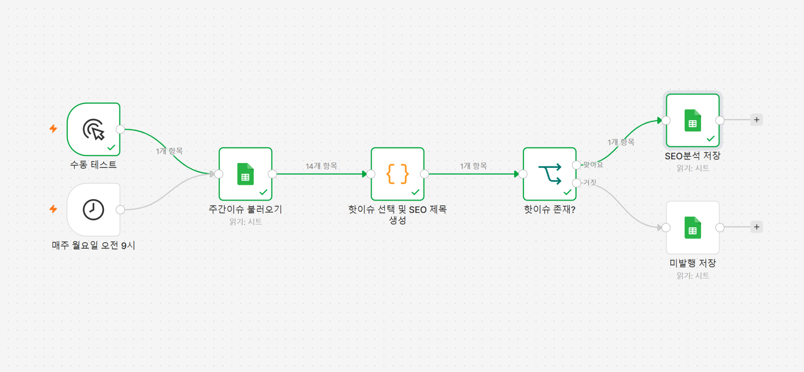
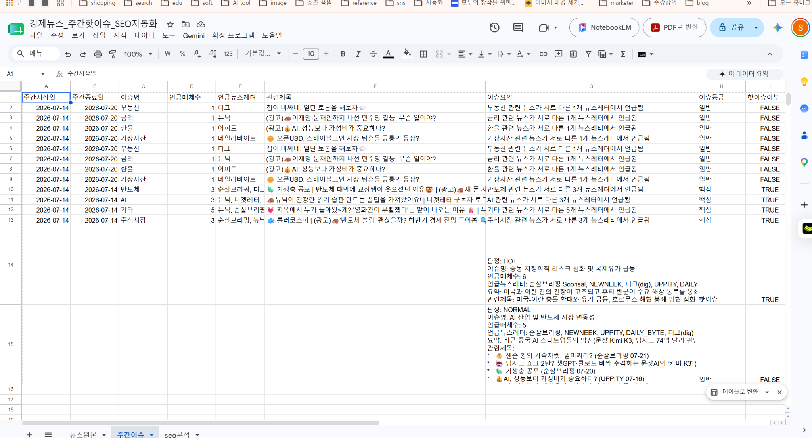
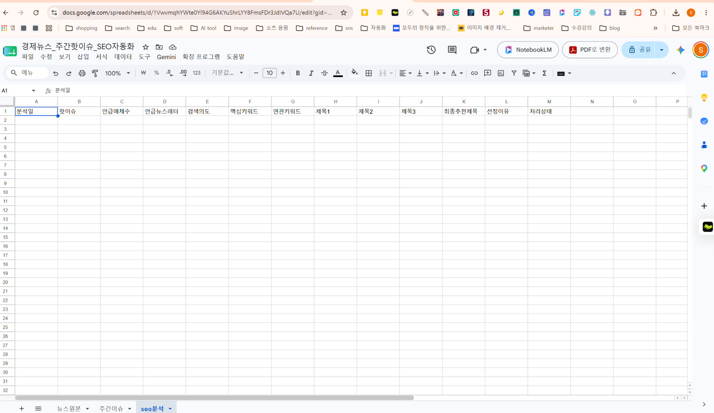

# 노코드 자동화 기초: 워크플로우 설계 과제 보고서

경제 뉴스레터 기반 주간 핫이슈 분류 및 SEO 제목 자동화

| 항목 | 내용 |
|---|---|
| 과제 | 3차 미션 |
| 프로젝트 1 | Make와 n8n의 동일 워크플로우 비교 구현 |
| 프로젝트 2 | n8n 기반 주간 핫이슈 SEO 제목 자동 생성 |
| 작성일 | 2026년 7월 21일 |
| 구현 환경 | Gmail · Google Sheets · Make · n8n · Google Gemini AI |

## 목차

1. [과제 개요](#1-과제-개요)
2. [핵심 개념](#2-핵심-개념)
3. [프로젝트 1 — 자동화 도구 비교 구현](#3-프로젝트-1--자동화-도구-비교-구현)
4. [프로젝트 2 — n8n 자유 주제 자동화](#4-프로젝트-2--n8n-자유-주제-자동화)
5. [테스트 결과 및 검증](#5-테스트-결과-및-검증)
6. [요구사항 충족 점검](#6-요구사항-충족-점검)
7. [보안·비용·운영 고려사항](#7-보안비용운영-고려사항)
8. [결론](#8-결론)
9. [제출 파일 및 캡처 체크리스트](#9-제출-파일-및-캡처-체크리스트)
10. [참고한 공식 자료](#10-참고한-공식-자료)

## 1. 과제 개요

본 과제는 반복적으로 수신되는 경제 뉴스레터를 자동 수집하고, 여러 뉴스레터에서 공통으로 다뤄진 이슈를 핫이슈로 분류한 뒤 Google Sheets에 저장하는 업무를 자동화한 것이다. 프로젝트 1에서는 Make와 n8n에 같은 핵심 흐름을 구현해 도구별 차이를 비교했고, 프로젝트 2에서는 n8n을 활용해 핫이슈 중 우선순위가 높은 이슈를 선정하고 SEO 제목 3개를 자동 생성하도록 확장했다.

> **핵심 문제**  
> 경제 뉴스레터를 매일 수작업으로 열어보고, 중복 이슈를 판단하고, 제목 후보를 작성하는 과정은 반복성이 높고 누락 가능성이 있다. 자동화를 통해 수집·분류·저장·제목 생성 과정을 일관된 규칙으로 처리하는 것이 목표다.

## 2. 핵심 개념

| 개념 | 정의 | 본 과제 적용 |
|---|---|---|
| Trigger | 자동화가 시작되는 조건 또는 이벤트 | 수동 테스트, 정기 스케줄, Gmail 검색 |
| Action | Trigger 이후 실행되는 처리 단계 | 메일 통합, AI 분석, Code 처리, Google Sheets 저장 |
| Filter / Router / IF | 조건에 따라 실행 경로를 나누는 기능 | HOT 경로와 일반·미발행 경로 분리 |
| Mapping | 앞 단계의 출력값을 다음 단계 입력값에 연결 | Gemini Result와 시트 열 연결 |
| Execution Log | 실행 성공·실패와 단계별 데이터를 확인하는 기록 | Make 실행 버블, n8n 노드별 Input/Output |

## 3. 프로젝트 1 — 자동화 도구 비교 구현

### 3.1 동일 워크플로우 정의

`최근 7일 경제 뉴스레터 조회 → 뉴스 내용 통합 → 공통 이슈 분석 → HOT/NORMAL 조건 분기 → Google Sheets 저장`

| 구분 | Make | n8n | 역할 |
|---|---|---|---|
| Trigger | Gmail Search emails + 실행 스케줄 | Manual Trigger/스케줄 + Gmail 조회 | 최근 7일 뉴스레터 수집 시작 |
| Action 1 | Text Aggregator | Code 노드 또는 데이터 가공 | 여러 메일을 하나의 분석 입력으로 통합 |
| Action 2 | Google Gemini AI | Code/AI 분석 | 중복 이슈와 언급 매체 수 판단 |
| 조건 분기 | Router + HOT 필터 + Fallback | IF 노드 | HOT와 일반 이슈 분기 |
| 저장 | Google Sheets Add a Row | Google Sheets Append Row | 주간이슈 시트에 결과 기록 |

### 3.2 Make 구현

Make에서는 Gmail에서 최근 7일 메일을 검색하고 Text Aggregator로 본문을 합친 뒤 Gemini가 대표 이슈를 판정한다. Router의 첫 번째 경로는 결과에 `판정: HOT`이 포함될 때 실행되고, 두 번째 경로는 Fallback으로 설정해 HOT가 아닌 결과를 처리한다.

*그림 1. Make 프로젝트 1 최종 시나리오 — Gmail → Aggregator → Gemini → Router → Sheets*

### 3.3 n8n 구현

n8n에서는 Gmail 조회 결과를 Code 노드에서 이슈별로 정리하고 언급 매체 수를 계산했다. IF 노드에서 언급 매체 수가 2개 이상이면 핫이슈 시트로, 미만이면 일반 이슈 경로로 전송했다. Make보다 코드 기반 가공이 들어가지만 다수 이슈를 한 번에 처리하고 데이터 구조를 세밀하게 제어할 수 있었다.

*그림 2. n8n 프로젝트 1 워크플로우 — 조회·가공·조건 분기·시트 저장*

### 3.4 도구 비교 분석

| 비교 항목 | Make | n8n |
|---|---|---|
| UI/UX | 모듈과 연결선이 직관적이며 비개발자에게 이해가 쉽다. | 노드 기반이며 데이터 입력·출력을 상세하게 확인할 수 있다. |
| 설정 난이도 | 기본 연결은 쉽지만 Aggregator, Router, Mapping 규칙을 익혀야 한다. | 초기 인증과 노드 설정이 필요하고 Code 노드는 학습 부담이 있으나 제어력이 높다. |
| 조건 분기 | Router와 Filter, Fallback 경로가 시각적으로 명확하다. | IF/Switch 노드로 분기하며 복합 조건과 데이터 타입 제어가 편하다. |
| 데이터 가공 | 내장 함수와 Aggregator 중심으로 처리한다. | Code 노드에서 JavaScript를 사용해 중복 제거·정렬·집계를 자유롭게 처리한다. |
| 실행 로그 | 실행 버블과 Scenario History에서 모듈별 Bundle을 확인한다. | 각 노드의 Input/Output JSON과 Executions에서 상세 추적이 가능하다. |
| 무료 사용 | 공식 Free 플랜은 월 1,000 credits, Router/Filter, 15분 최소 실행 간격을 제공한다. | Cloud는 유료 실행 기반이며, 무료 Community Edition은 직접 설치·운영하는 self-hosted 방식이다. |
| 확장성 | 빠른 업무 자동화와 다양한 SaaS 연결에 적합하다. | 복잡한 데이터 처리, 자체 호스팅, 장기적인 AI·코드 자동화 확장에 적합하다. |
| 오류 대응 | Error Handler 경로를 시각적으로 붙일 수 있다. | Error Workflow, 노드 설정, 실행 데이터 재사용 등 세밀한 디버깅이 가능하다. |

**판단:** Make는 빠르게 구조를 이해하고 시각적으로 설명하기 좋았다. n8n은 설정 과정이 더 복잡하지만 다수 이슈 집계, 한국어 열 이름 정규화, 우선순위 선정 등 실제 업무 로직을 구현하기에 더 적합했다. 따라서 단순 자동화는 Make, 정교한 데이터 처리와 확장은 n8n이 유리하다고 판단했다.

## 4. 프로젝트 2 — n8n 자유 주제 자동화

### 4.1 반복 업무 정의

매주 주간이슈 시트를 확인해 언급 매체 수가 많은 핫이슈를 고르고, 검색 의도와 키워드를 분석해 블로그 제목 후보 3개를 만드는 업무를 자동화했다. 수작업으로는 이슈 비교, 우선순위 판단, 제목 작성에 시간이 소요되고 기준이 흔들릴 수 있다.

### 4.2 도구 선정 및 이유

선정 도구는 n8n이다. 기존 프로젝트 1의 Google Sheets 데이터를 직접 읽을 수 있고, Code 노드에서 `기타`와 같은 의미가 낮은 분류를 제외하거나 언급 매체 수를 기준으로 정렬할 수 있다. 또한 Schedule Trigger를 사용해 매주 자동 실행할 수 있어 프로젝트 2 요구사항에 부합한다.

### 4.3 워크플로우 설계

1. Schedule Trigger / Manual Trigger
2. Google Sheets — 주간이슈 불러오기
3. Code — 핫이슈 선택 및 SEO 제목 생성
4. IF — 핫이슈 존재 여부
5. True: SEO분석 시트에 Append Row
6. False: 미발행 상태를 Append Row

*그림 3. 프로젝트 2 n8n 최종 구조*

### 4.4 데이터 구조

| 시트 | 주요 열 | 용도 |
|---|---|---|
| 주간이슈 | 이슈명, 언급매체수, 언급뉴스레터, 이슈요약, 이슈등급, 핫이슈여부 | 프로젝트 1 결과 및 프로젝트 2 입력 데이터 |
| seo분석 | 분석일, 핫이슈, 검색의도, 핵심키워드, 제목1~3, 최종추천제목, 처리상태 | 프로젝트 2 결과 저장 |

*그림 4. 주간이슈 시트 — 일반 이슈와 핵심 이슈 데이터*

*그림 5. SEO 분석 결과 저장용 시트 구조*

### 4.5 조건 분기와 처리 규칙

- 언급매체수가 2개 이상이거나 핫이슈여부가 `TRUE`인 행을 후보로 선정한다.
- `기타`처럼 분석 가치가 낮은 범주는 제외한다.
- 후보를 언급매체수 내림차순으로 정렬해 1순위 이슈를 선택한다.
- 핫이슈가 있으면 제목 3개와 키워드를 생성해 발행후보로 저장한다.
- 핫이슈가 없으면 미발행 상태와 사유를 같은 시트에 기록한다.

## 5. 테스트 결과 및 검증

| 테스트 | 입력 조건 | 예상 경로 | 확인 항목 | 결과 |
|---|---|---|---|---|
| P1-HOT | Gemini 결과에 `판정: HOT` | Make Router HOT 경로 | HOT Sheets 노드 실행 및 TRUE 저장 | 정상 |
| P1-NORMAL | Gemini 결과를 NORMAL로 강제 | Make Fallback 경로 | 일반 Sheets 노드 실행 및 FALSE 저장 | 정상 |
| P2-핫이슈 있음 | 언급매체수 2 이상 행 존재 | n8n IF True | seo분석에 발행후보 행 추가 | 정상 |
| P2-핫이슈 없음 | 모든 행이 2 미만/False | n8n IF False | 미발행 행 및 사유 저장 | 테스트 필요 |

조건 분기가 있는 경우 각 경로를 최소 1회 실행하고, 워크플로우 화면의 실행 표시와 Google Sheets 결과 행을 함께 캡처한다. 제출 전 계정 이메일, OAuth 정보, API 키, 토큰은 화면에서 가리거나 잘라낸다.

## 6. 요구사항 충족 점검

| 요구사항 | 구현 내용 | 충족 여부 |
|---|---|---|
| Trigger 1개 이상 | Gmail/Manual/Schedule Trigger | 충족 |
| Action 2개 이상 | Aggregator·AI·Code·Sheets | 충족 |
| 조건 분기 1개 이상 | Make Router, n8n IF | 충족 |
| 각 분기 실행 결과 | HOT/NORMAL 및 True/False 테스트 | 충족 또는 최종 캡처 필요 |
| 프로젝트 1 도구 2개 | Make와 n8n | 충족 |
| 프로젝트 2 자동 실행 | 매주 월요일 오전 9시 Schedule Trigger | 충족 |
| AI Action 보너스 | Make Gemini 사용 | 충족 |
| 실패·대체 경로 | 미발행 저장 경로 | 부분 충족 |

## 7. 보안·비용·운영 고려사항

**보안:** 제출 화면에서는 Gmail 주소, Google OAuth Client ID/Secret, API Key, 토큰, 메시지 ID 등 민감정보를 마스킹한다. JSON 파일 제출 시 credentials 항목에 실제 비밀값이 포함되지 않았는지 확인한다.

**비용:** Make 공식 Free 플랜은 월 1,000 credits와 Router/Filter를 제공하지만 최소 실행 간격은 15분이다. n8n Cloud는 실행 횟수 기반 유료 플랜이며, Community Edition은 자체 설치 방식으로 무료 이용할 수 있으나 서버와 업데이트를 사용자가 관리해야 한다.

**운영:** 뉴스레터 형식이나 시트 헤더가 변경되면 Mapping이 깨질 수 있으므로 헤더 이름을 고정하고, 변경 시 노드에서 다시 선택한다. 자동 실행 전에는 Manual Trigger로 먼저 검증한다.

## 8. 결론

이번 과제를 통해 Trigger가 업무를 시작하고, Action이 데이터를 처리하며, Router/IF가 조건에 따라 경로를 분리한다는 원리를 실제로 구현했다. Make는 시각적인 흐름과 빠른 구축에 강점이 있었고, n8n은 Code 노드와 상세 실행 로그를 통해 복잡한 데이터 가공과 확장에 유리했다. 향후에는 실패 알림, 중복 실행 방지 키, 실제 검색량 데이터 연동을 추가해 운영 수준의 콘텐츠 자동화로 발전시킬 수 있다.

## 9. 제출 파일 및 캡처 체크리스트

- [ ] 프로젝트 1 Make 전체 시나리오 화면
- [ ] 프로젝트 1 n8n 전체 워크플로우 화면
- [ ] HOT 경로 실행 화면 및 Google Sheets TRUE 저장 결과
- [ ] NORMAL/Fallback 경로 실행 화면 및 FALSE 저장 결과
- [ ] 프로젝트 2 n8n 전체 워크플로우 화면
- [ ] 프로젝트 2 True 경로 실행 및 seo분석 저장 결과
- [ ] 프로젝트 2 False 경로 실행 또는 미발행 저장 결과
- [ ] 계정 이메일·토큰·키 마스킹 확인
- [ ] 비교 분석 보고서 PDF 또는 DOCX 첨부

## 10. 참고한 공식 자료

- Make Pricing: Free 플랜 1,000 credits/month, Routers & filters, 15-minute minimum interval.
- Make Help Center — Router 및 Filtering: Router는 여러 경로로 분기하고 Filter는 조건에 따라 Bundle 통과 여부를 결정.
- n8n Pricing / Deployment Docs: Cloud는 workflow execution 기반이며 Community Edition은 self-hosted 무료 버전.
- n8n Google Sheets Node Docs: 행 조회, 추가, 업데이트 등 Google Sheets 자동화 기능 제공.
