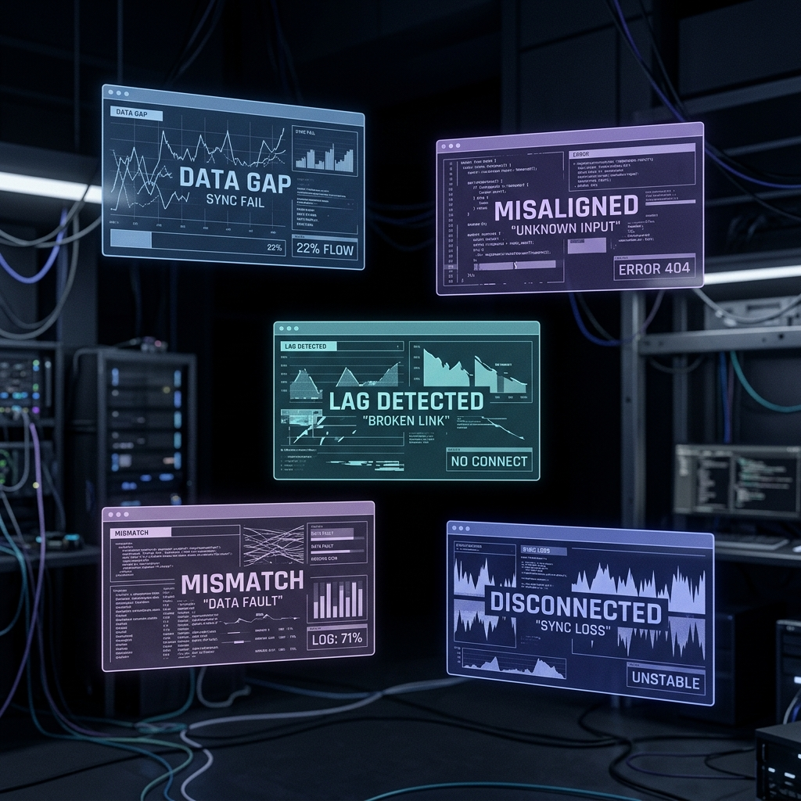
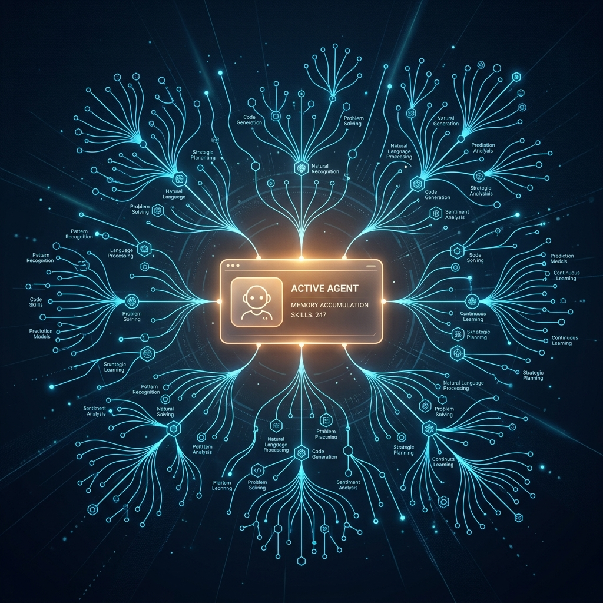
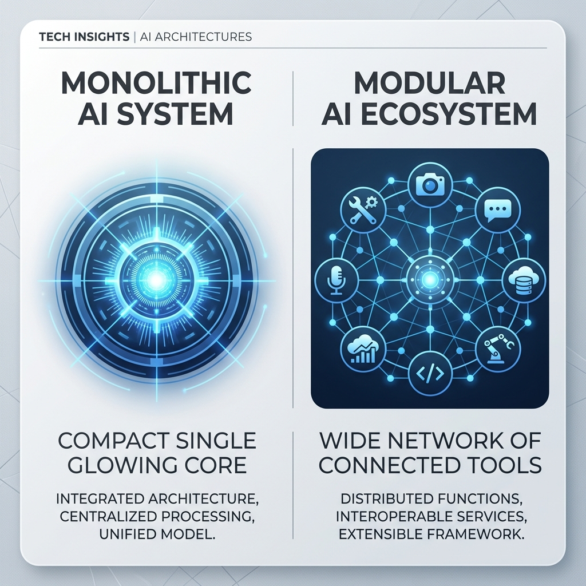

# [기사 핵심 주제]
AI 에이전트 5개를 각각 굴리다 48시간 만에 실패한 핀테크 창업자가, 지속적 메모리를 갖춘 단일 에이전트 프레임워크 Hermes Agent로 통합해 성공한 사례. 이를 통해 본 Hermes Agent의 핵심 기능과 OpenClaw와의 차이.

## [제목 3개]
1. 에이전트 5개가 48시간 만에 무너진 이유 — Hermes Agent 완벽 정리
2. 쓸수록 똑똑해지는 AI 비서, Hermes Agent란?
3. Hermes Agent vs OpenClaw, 무엇이 다른가

## [최종 추천 제목]
에이전트 5개가 48시간 만에 무너진 이유 — Hermes Agent 완벽 정리

## [썸네일 문구 3개]
1. AI 에이전트 5개, 48시간 만에 전멸
2. 1개로 합쳤더니 달라진 것
3. 쓸수록 똑똑해지는 오픈소스 AI 에이전트

## [한 줄 요약]
핀테크 창업자가 AI 에이전트 5개를 하나로 통합해 성공한 사례를 통해 살펴본, 지속적 메모리 기반 오픈소스 AI 에이전트 프레임워크 Hermes Agent.

## [SEO 메타 설명]
오픈소스 AI 에이전트 Hermes Agent의 핵심 기능과 OpenClaw와의 차이, 그리고 5개 에이전트가 실패하고 1개로 통합해 성공한 실제 사례를 정리했습니다.

## [Sora 2용 숏츠 콘셉트]
화면이 여러 개로 쪼개져 각기 다른 톤의 메시지가 어지럽게 깜빡이다가, 하나의 화면으로 통합되며 정돈된 하나의 메시지 흐름으로 안정되는 과정을 보여주는 콘셉트. "혼란스러운 멀티 에이전트 → 정돈된 단일 에이전트"를 시각적 대비로 표현.

## [Sora 2용 12초 영상 프롬프트]
Create a vertical 9:16 short video for Sora 2, exactly 12 seconds long, in a clean modern tech-news style. The video should visually explain the AI news topic based only on the provided news article. Keep the tone realistic, editorial, and polished rather than cinematic sci-fi. Use text-free clean frame, minimal UI, clean tech visuals, subtle motion graphics, modern office or device usage scenes, AI dashboard aesthetics, and credible technology-news visuals. Maintain visual consistency, professional lighting, smooth transitions, mobile-first composition, and a premium but restrained palette. Main message: five separate glowing agent panels flicker out of sync and fragment, then converge and merge into one single steady glowing panel, representing multiple AI agents failing and consolidating into one learning agent.

## [숏츠 내레이션 스크립트]
에이전트 5개를 따로 굴렸더니, 48시간 만에 전부 무너졌습니다. 이유는 하나. 서로 기억을 공유하지 못했기 때문이죠. 전부 하나로 합치자, 마케팅에서 쌓인 톤이 아웃리치에도, 커뮤니티 피드백이 다음 날 콘텐츠에도 그대로 이어졌습니다. 쓸수록 똑똑해지는 에이전트, Hermes였습니다.

## [숏츠 자막 문구]
- 에이전트 5개, 48시간 만에 전멸
- 이유는 "기억 공유 실패"
- 1개로 합치니 톤이 하나로
- 쓸수록 똑똑해지는 AI, Hermes

## [대표 이미지 제작 프롬프트 및 alt 텍스트]

### 대표 이미지 1
- **프롬프트**: Editorial tech illustration of five separate glowing digital agent panels floating in a dark workspace, each panel showing a slightly different mismatched color tone and disconnected data streams, conveying disorganization and miscommunication, modern minimal UI aesthetic, cool blue and muted purple palette, soft studio lighting, clean composition, high quality, 4k, professional tech-editorial style
- **alt 텍스트**: 서로 다른 톤으로 어긋난 다섯 개의 AI 에이전트 패널을 표현한 일러스트
- **이미지**: 

### 대표 이미지 2
- **프롬프트**: Editorial tech illustration of a single glowing digital agent panel with a growing neural network of interconnected memory nodes radiating outward, symbolizing accumulating memory and skills over time, dark background, warm accent light on the central node, modern minimal UI aesthetic, clean composition, high quality, 4k, professional tech-editorial style
- **alt 텍스트**: 기억과 스킬이 축적되며 성장하는 단일 AI 에이전트를 표현한 일러스트
- **이미지**: 

### 대표 이미지 3
- **프롬프트**: Editorial tech illustration showing a clean side-by-side comparison layout of two abstract AI system icons, one labeled with a compact single glowing core and the other labeled with a wide network of connected tool icons, minimal flat modern design, neutral gray and blue palette, soft even lighting, clean composition, high quality, 4k, professional tech-editorial style
- **alt 텍스트**: Hermes Agent와 OpenClaw의 구조적 차이를 비교하는 일러스트
- **이미지**: 
