# Python & Git 기초 — 미션과제 제출보고서

**Git과 함께하는 Python 첫 발자국 — 나만의 프롬프트 관리 프로그램 제작**

| 항목 | 내용 |
|---|---|
| 과제명 | Python & Git 기초: Git과 함께하는 Python 첫 발자국 |
| 산출물 | 콘솔 기반 프롬프트 관리 프로그램 1개 + GitHub 저장소 1개 |
| GitHub 저장소 | <https://github.com/art-ruby/ia-codyssey> — `assignments/A1-1/python-prompt-manager` |
| 작성일 | 2026. 8. 15. |

> **저장소 통합 안내**
> 과제 수행은 전용 저장소 `art-ruby/python-prompt-manager`에서 진행했고, 제출 시점에 과제물을 한 저장소에서 관리하기 위해 **`ia-codyssey/assignments/A1-1/`로 통합**했다.
> 수행 당시의 커밋 이력과 브랜치 분기·병합 그래프는 [GIT_HISTORY.md](GIT_HISTORY.md)와 [이미지 25]에 기록되어 있다.


---

## 1. 미션 개요

여러 문서와 메신저에 흩어져 있던 프롬프트를 한곳에서 관리하기 위해 Python 콘솔 기반 **Prompt Manager**를 제작했다. 메뉴 번호를 입력하면 프롬프트 추가, 목록 조회, 카테고리별 조회, 검색, 상세 보기, 즐겨찾기 관리와 조회를 수행한다.

이 과정에서 Python의 리스트·딕셔너리·함수·조건문·반복문·사용자 입력을 실제 동작하는 프로그램에 적용했다. 동시에 Git으로 기능 단위 변경 이력을 남기고, 별도 브랜치에서 기능을 개발한 뒤 `main`에 병합하며, GitHub 원격 저장소에 코드와 문서를 함께 관리했다.

### 1.1 전체 작업 흐름

```text
개발환경 확인 (python / git 버전)
        ↓
GitHub 빈 저장소 생성
        ↓
hello.py 실행 → git init → 첫 커밋 → 원격 연결 → 첫 push
        ↓
README / .gitignore 작성 → 커밋
        ↓
src/main.py 생성 → 기본 프롬프트 3개 등록 → 커밋
        ↓
메뉴 구조 + 프롬프트 추가 기능 → 커밋
        ↓
feature/prompt-list 브랜치에서 목록 기능 개발 → main에 merge
        ↓
카테고리별 조회 → 상세 보기 → 즐겨찾기 → 입력 검증 → 각각 커밋
        ↓
clone / pull 수행 → README 최종 작성 → git log 확인 → push
```

---

## 2. 개발 환경

| 항목 | 내용 |
|---|---|
| 언어 | Python 3.11.9 (과제 요구: 3.10 이상) |
| 실행 환경 | Windows 11 / PowerShell 터미널 |
| 개발 도구 | Visual Studio Code (Python 확장 설치) |
| 형상 관리 | Git 2.55.0 / GitHub |
| 사용 모듈 | `json`, `pathlib` (표준 라이브러리) |


### 2.1 Python 버전 확인

```powershell
python --version
```


*[이미지 01] VS Code 터미널에서 `python --version` 실행 — Python 3.11.9 확인 (과제 기준 3.10 이상 충족)*

### 2.2 Git 버전 확인

```powershell
git --version
```


*[이미지 02] `python --version`(3.11.9)과 `git --version`(2.55.0)을 연속으로 확인한 화면*

### 2.3 Git 사용자 설정

```powershell
git config --global user.name "GitHub사용자이름"
```

```powershell
git config --global user.email "GitHub이메일"
```

```powershell
git config --global init.defaultBranch main
```

```powershell
git config --global --list
```

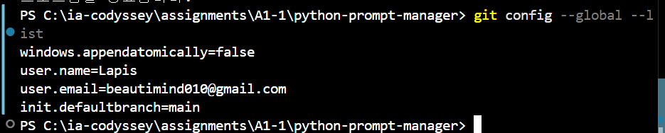

*[이미지 03] `git config --global --list` 실행 — `user.name`, `user.email`, `init.defaultbranch=main`이 모두 설정된 것을 확인*

기본 브랜치가 `main`으로 설정되어 있으므로, 이후 `git init` 시 별도 변경 없이 `main` 브랜치로 저장소가 시작된다.

---

## 3. GitHub 저장소 생성과 로컬 초기화

### 3.1 GitHub 빈 저장소 생성

GitHub에서 `python-prompt-manager` 저장소를 **Public**으로 생성했다. README와 .gitignore는 자동 생성하지 않고, 로컬에서 직접 만든 뒤 `init → add → commit → push` 흐름을 그대로 남기는 방식을 선택했다.

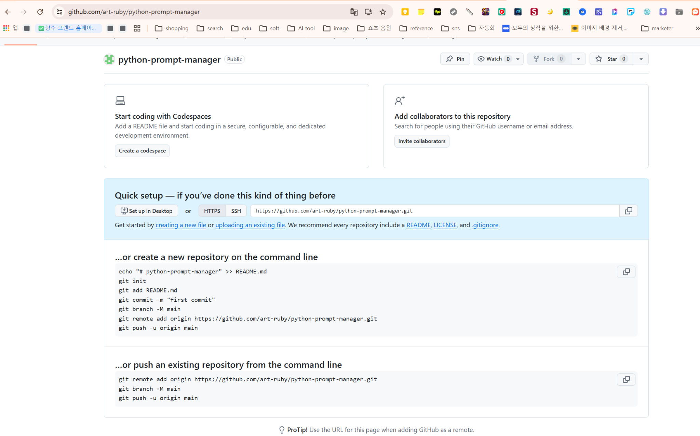

*[이미지 04] 저장소 생성 직후의 Quick setup 화면 — 원격 주소 `https://github.com/art-ruby/python-prompt-manager.git` 확인*

### 3.2 로컬 저장소 초기화

```powershell
git init
```

```powershell
git status
```

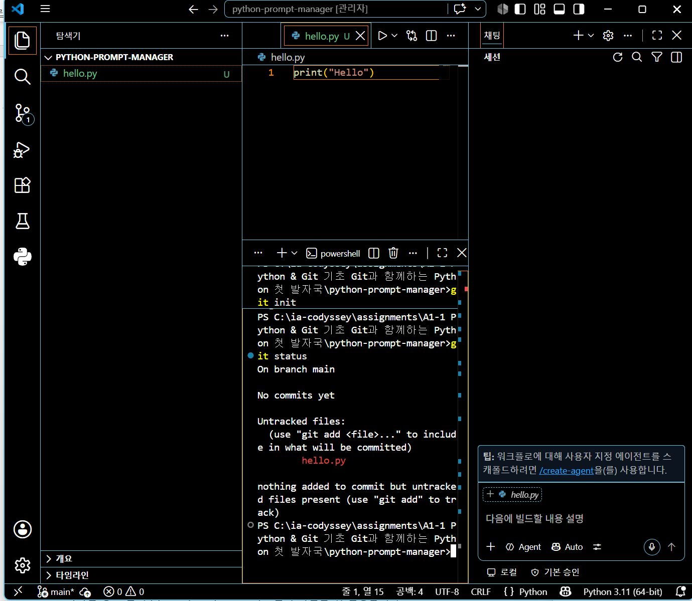

*[이미지 05] `git init` 실행 후 `git status` — `On branch main`, `No commits yet`, `hello.py`가 Untracked 상태로 표시됨*

### 3.3 Hello Python 실행과 첫 커밋

`hello.py`에 아래 한 줄을 작성했다.

```python
print("Hello")
```

```powershell
python hello.py
```

```powershell
git add hello.py
```

```powershell
git commit -m "feat: Hello Python 실행"
```


*[이미지 06] `python hello.py`로 `Hello` 출력 확인 후 첫 커밋 생성 — `[main (root-commit) b1209f8] feat: Hello Python 실행`*

### 3.4 원격 저장소 연결과 첫 push

```powershell
git remote add origin https://github.com/art-ruby/python-prompt-manager.git
```

```powershell
git push -u origin main
```

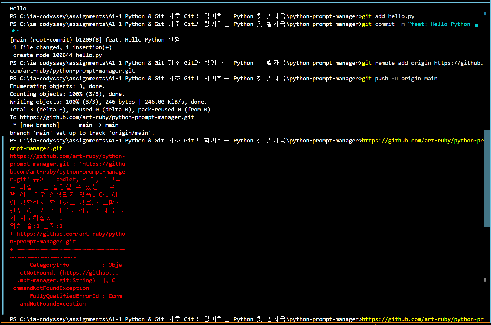

*[이미지 07] `git remote add origin`과 `git push -u origin main` 성공 — `* [new branch] main -> main`, `branch 'main' set up to track 'origin/main'`*


---

## 4. README와 .gitignore 작성

### 4.1 ignore 파일 오탈자와 발견 과정

ignore 규칙 파일을 만들 때 파일명을 `.gitignore`가 아니라 **`.gitnore`로 잘못 작성**했다. 이 상태에서 `git add .gitignore`를 실행하자 아래 오류가 발생하면서 오탈자를 발견했다.

```text
fatal: pathspec '.gitignore' did not match any files
```


*[이미지 08] `.gitnore` 파일 내용과, `.gitignore`를 찾지 못해 발생한 `fatal: pathspec` 오류 — 파일명 오탈자를 확인한 화면*

작성한 ignore 규칙은 다음과 같다.

```gitignore
__pycache__/
*.pyc
.venv/
venv/
.env
.vscode/
```

> 이 시점에는 오탈자를 그대로 두고 진행했고, 과제 마무리 단계에서 `git mv .gitnore .gitignore`로 수정했다. (7.2절 참조)

### 4.2 README와 ignore 파일 커밋

```powershell
git add .
```

```powershell
git commit -m "docs: README와 gitignore 추가"
```

```powershell
git push
```

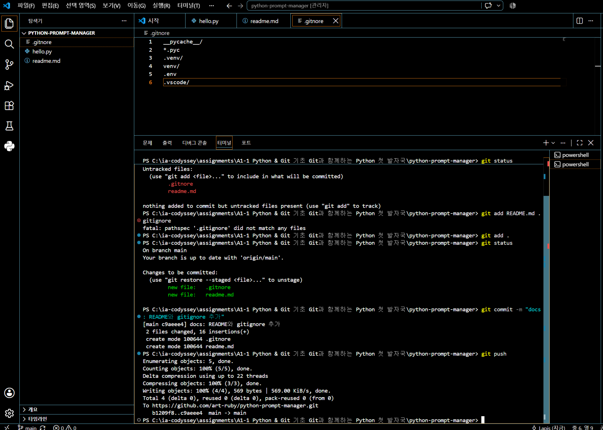

*[이미지 09] `git status`로 스테이징 상태를 확인한 뒤 `docs: README와 gitignore 추가` 커밋(c9aeee4) 생성 및 push 완료*

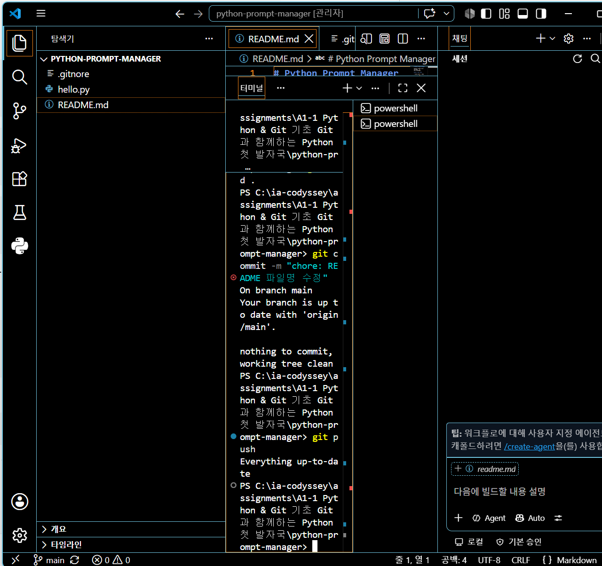

*[이미지 10] README 파일명을 정리한 커밋과 `git push` — `Everything up-to-date` 확인*

---

## 5. 프로그램 구현

### 5.1 프로젝트 폴더 구조 생성

```powershell
mkdir src
```

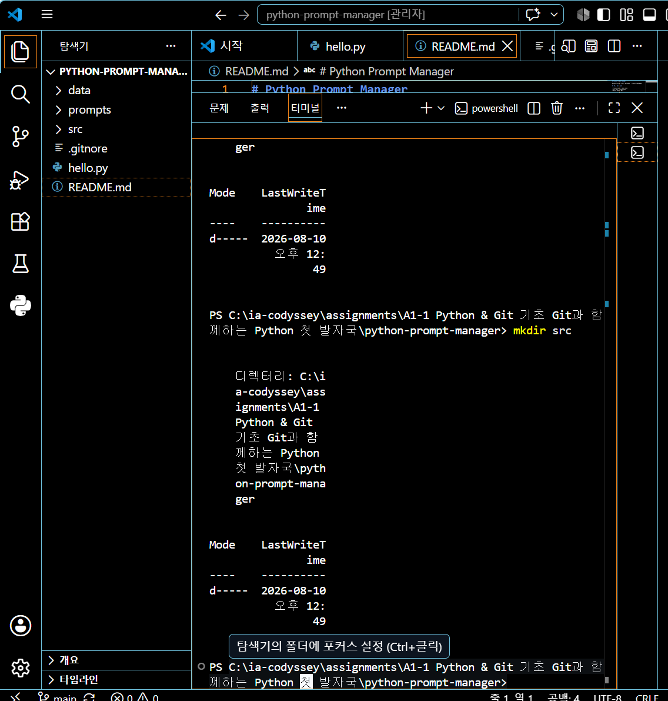

*[이미지 11] `mkdir` 명령으로 소스 폴더를 생성한 화면 — 이때 함께 만든 `data`, `prompts` 폴더는 실제로 사용하지 않아 이후 정리했다*

### 5.2 main.py 생성

```powershell
python src/main.py
```

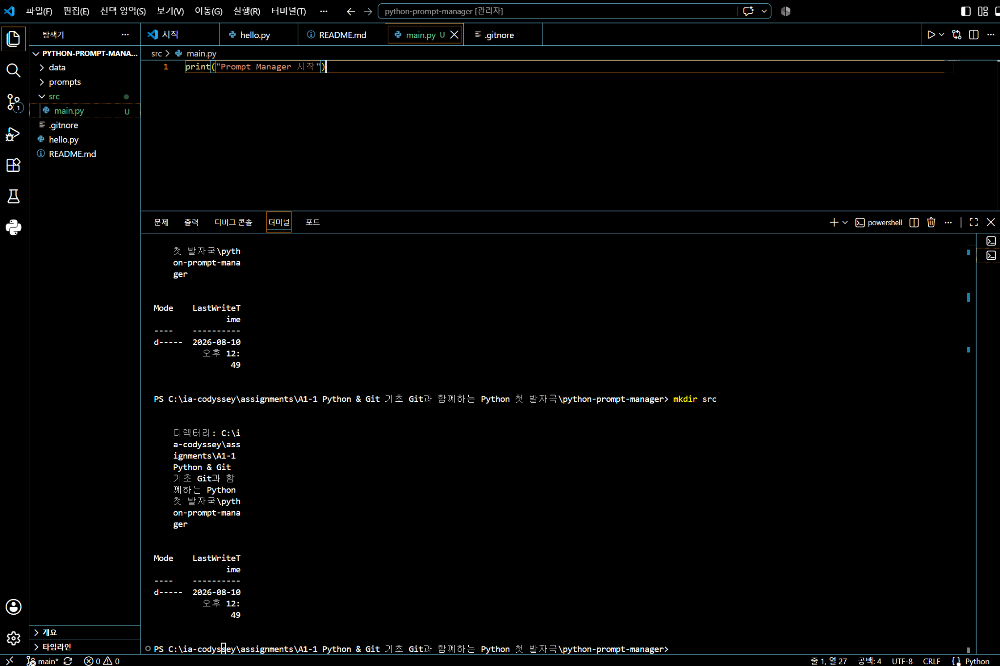

*[이미지 12] `src/main.py` 생성과 프로그램 시작 코드 `print("Prompt Manager 시작")` 작성*

### 5.3 카테고리 목록 구성과 실행 위치 시행착오

카테고리는 과제에서 제시한 6개를 리스트로 정의했다.

```python
CATEGORIES = [
    "텍스트 생성",
    "이미지 생성",
    "영상 생성",
    "페르소나",
    "자동화",
    "기타",
]
```


*[이미지 13] 카테고리 리스트 작성 화면과, Python 대화형 입력창(`>>>`)에서 `python src/main.py`를 입력해 발생한 `SyntaxError: invalid syntax`*

> 파일 실행 명령은 대화형 입력창이 아니라 **프로젝트 경로가 표시되는 터미널**에서 입력해야 한다는 점을 이 오류로 확인했다. (11.4절 이슈 3 참조)


*[이미지 14] 터미널에서 `python src/main.py`를 실행하여 `Prompt Manager 시작`이 정상 출력된 화면*

### 5.4 기본 프롬프트 데이터 등록

프롬프트 데이터는 **리스트 안에 딕셔너리**를 담는 구조로 구성했다. 각 딕셔너리는 `title`, `content`, `category`, `favorite` 네 필드를 가진다.

```python
DEFAULT_PROMPTS = [
    {
        "title": "AI 최신 뉴스 콘텐츠 패키지",
        "content": "뉴스기사를 바탕으로 블로그, 이미지, 영상 콘텐츠를 제작하라.",
        "category": "자동화",
        "favorite": False,
    },
    ...
]
```

이전 미션에서 실제로 사용한 프롬프트를 등록했으며, 현재 `prompts.json`에는 **4개**가 저장되어 있어 과제 기준(최소 3개)을 충족한다.

```powershell
git add src/main.py
```

```powershell
git commit -m "feat: 기본 프롬프트 3개 등록"
```

```powershell
git push
```

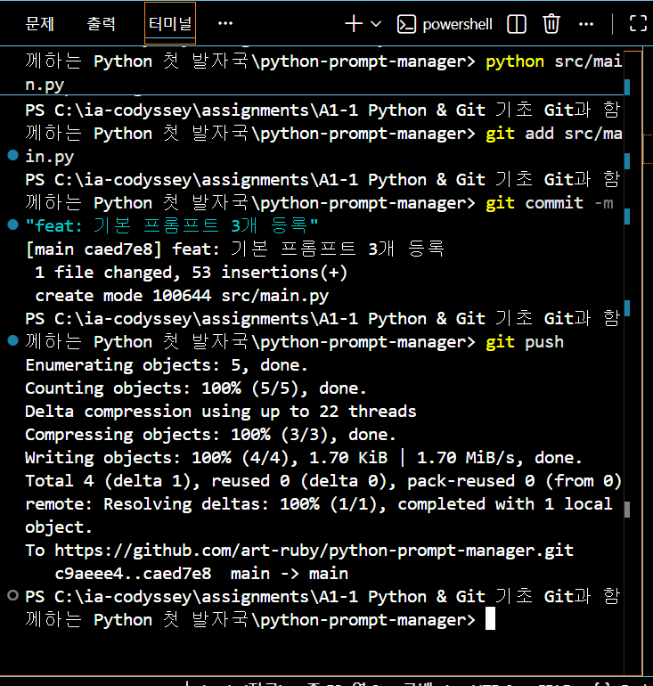

*[이미지 15] `feat: 기본 프롬프트 3개 등록` 커밋(caed7e8) 생성과 push 완료*

### 5.5 JSON 저장·불러오기 (보너스 과제 1)

필수 요구사항은 "실행 중에만 데이터 유지"이지만, 보너스 과제를 반영하여 **종료 후에도 데이터가 유지되도록** JSON 영속화를 구현했다.

```python
DATA_FILE = Path(__file__).parent.parent / "prompts.json"
```

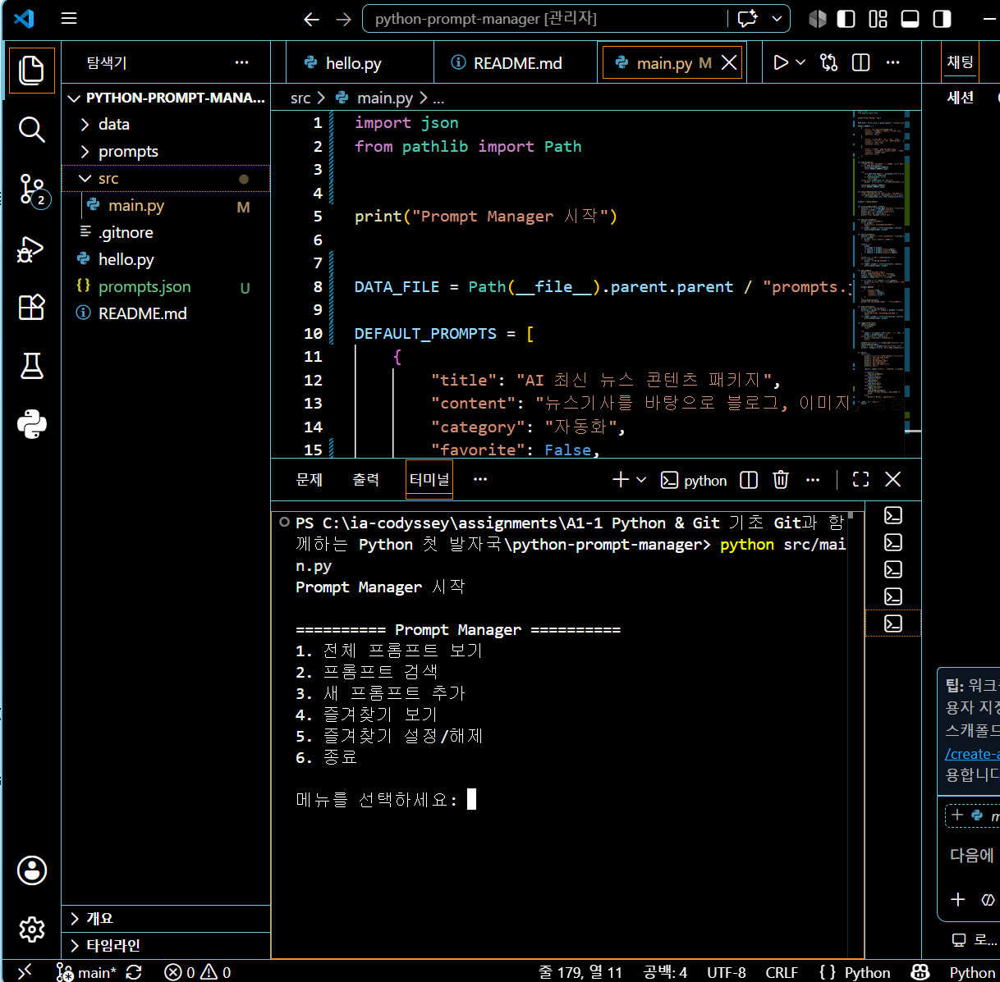

*[이미지 16] `json`·`pathlib` import와 `DATA_FILE` 경로 설정, `DEFAULT_PROMPTS` 정의 코드*

| 시점 | 동작 |
|---|---|
| 프로그램 시작 | `prompts.json`을 UTF-8로 읽어 목록 구성 |
| 파일 없음 / JSON 손상 | 기본 프롬프트 3개로 파일을 다시 생성 |
| 프롬프트 추가 · 즐겨찾기 변경 · 종료 | 전체 목록을 다시 저장 |

저장 시 `ensure_ascii=False`와 `indent=2`를 지정해 한글을 그대로 유지한다.

### 5.6 함수 분리

모든 코드를 한 함수에 몰아넣지 않고 기능별로 분리했다. 현재 `src/main.py`는 **15개 함수**로 구성되어 있다.

```text
main()                     # 메뉴 반복과 입력 분기
 ├─ show_menu()            # 메뉴 출력 및 선택값 반환
 ├─ load_prompts()         # JSON 불러오기
 ├─ save_prompts()         # JSON 저장
 ├─ print_summary_list()   # 목록 공통 출력
 ├─ input_required()       # 빈 값이면 재입력 요청
 ├─ select_category()      # 카테고리 번호 선택 또는 직접 입력
 ├─ ask_prompt_number()    # 목록 번호 입력값 검증
 ├─ add_prompt()
 ├─ show_list()
 ├─ show_by_category()
 ├─ search_prompt()
 ├─ show_detail()
 ├─ toggle_favorite()
 └─ show_favorites()
```

---

## 6. 프로그램 실행 및 기능 테스트

### 6.1 1차 구현 시점의 실행 화면

아래 캡처 4개는 **1차 구현 시점(메뉴 6개 구조)** 의 실행 화면이다. 이후 과제 요구 순서에 맞춰 메뉴를 7개 기능으로 재구성했으므로, 현재 프로그램의 메뉴 번호와는 다르다. 기능 자체의 동작을 확인한 증거로 유지한다.

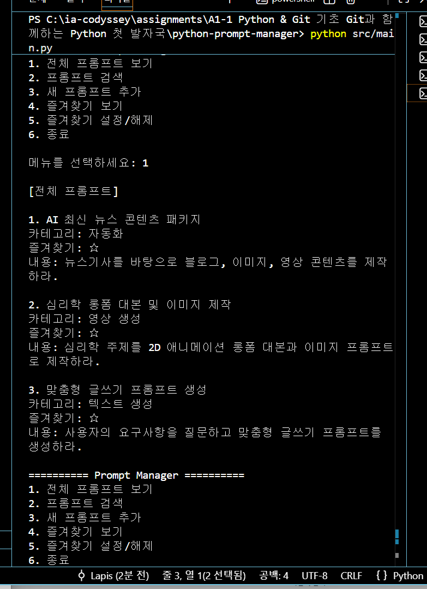

*[이미지 17] 전체 프롬프트 목록 출력과 메뉴 반복 실행 확인*

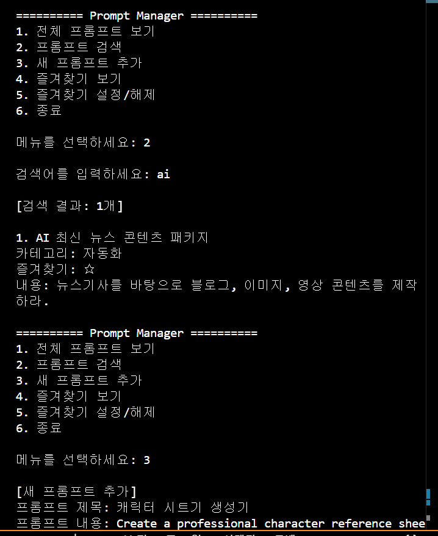

*[이미지 18] 검색어 `ai` 입력 — 제목·내용·카테고리에 키워드가 포함된 프롬프트 1개 검색*


*[이미지 19] 새 프롬프트(`캐릭터 시트 생성기`) 추가 실행 — 제목·내용·카테고리 입력 후 저장 완료 메시지 출력*

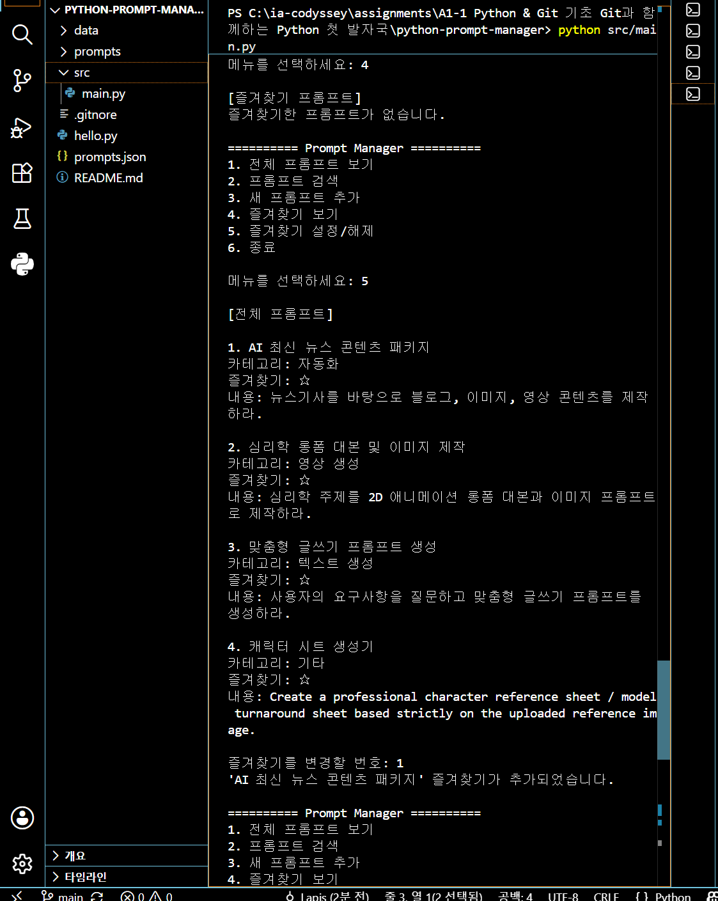

*[이미지 20] 전체 목록에서 번호를 입력해 즐겨찾기를 설정하고, 즐겨찾기 목록으로 결과를 확인한 화면*


*[이미지 21] 메뉴 기능 구현 후 `feat: 프롬프트 관리 메뉴 기능 추가` 커밋(dc8b5e8)과 push 완료*

### 6.2 현재 구현의 실행 결과

메뉴를 과제 요구 순서로 재구성하고 카테고리별 조회·상세 보기를 추가한 뒤의 실제 실행 결과다. 아래 내용은 프로그램 출력을 그대로 옮긴 것이다.

**메뉴 화면**

```text
=== 나만의 프롬프트 관리 ===
1. 프롬프트 추가
2. 프롬프트 목록
3. 카테고리별 조회
4. 프롬프트 검색
5. 프롬프트 상세 보기
6. 즐겨찾기 관리
7. 즐겨찾기 목록
0. 종료
선택:
```

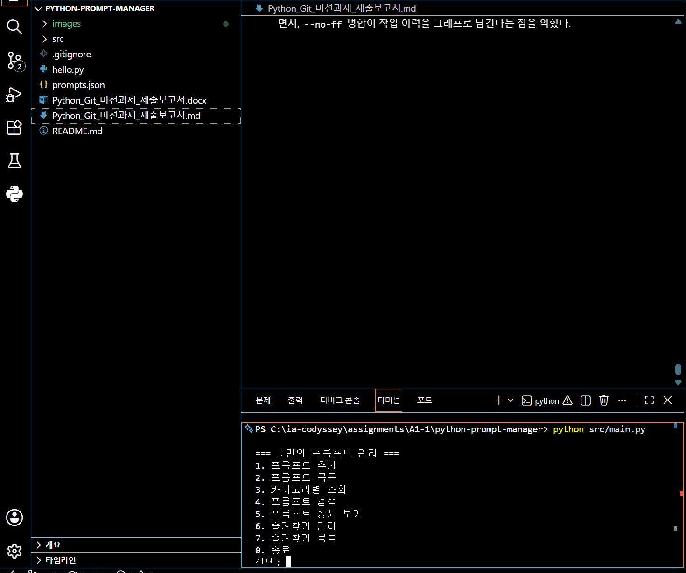

*[이미지 22] VS Code 터미널에서 `python src/main.py` 실행 — 과제 요구 순서대로 재구성한 7개 기능과 `0. 종료` 메뉴 출력*

**프롬프트 추가 (메뉴 1)**

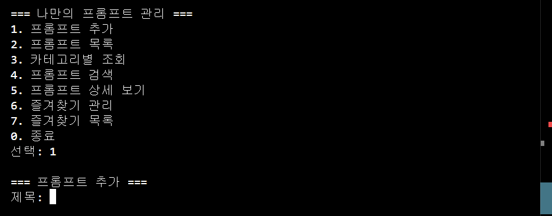

*[이미지 23] 메뉴에서 `1`을 선택해 `=== 프롬프트 추가 ===`로 진입하고 제목 입력을 요청하는 화면*

**프롬프트 목록 (메뉴 2)**

```text
=== 프롬프트 목록 ===
1. [자동화] AI 최신 뉴스 콘텐츠 패키지 ⭐
2. [영상 생성] 심리학 롱폼 대본 및 이미지 제작
3. [텍스트 생성] 맞춤형 글쓰기 프롬프트 생성
4. [기타] 캐릭터 시트 생성기

총 4개의 프롬프트
```

**카테고리별 조회 (메뉴 3)**

```text
=== 카테고리별 조회 ===
1) 텍스트 생성
2) 이미지 생성
3) 영상 생성
4) 페르소나
5) 자동화
6) 기타
선택: 1

[텍스트 생성] 카테고리 프롬프트:
1. [텍스트 생성] 맞춤형 글쓰기 프롬프트 생성

총 1개의 프롬프트
```

해당 카테고리에 프롬프트가 없으면 안내 메시지를 출력한다.

```text
[페르소나] 카테고리 프롬프트:
해당 카테고리에 등록된 프롬프트가 없습니다.
```

**프롬프트 검색 (메뉴 4)**

```text
=== 프롬프트 검색 ===
검색어: 심리학

검색 결과:
1. [영상 생성] 심리학 롱폼 대본 및 이미지 제작

총 1개의 프롬프트
```

**프롬프트 상세 보기 (메뉴 5)**

```text
=== 프롬프트 상세 보기 ===
번호 입력: 1

────────────────────────────
제목: AI 최신 뉴스 콘텐츠 패키지
카테고리: 자동화
즐겨찾기: ⭐
────────────────────────────
내용:
뉴스기사를 바탕으로 블로그, 이미지, 영상 콘텐츠를 제작하라.
────────────────────────────
```

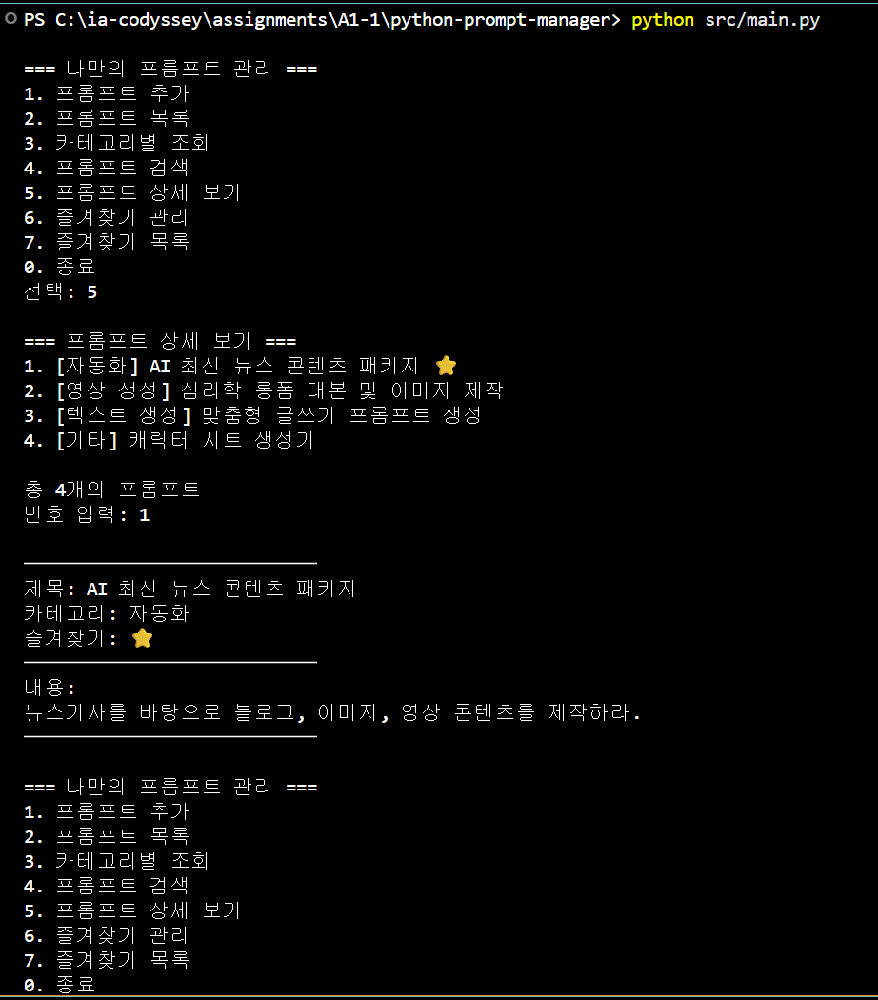

*[이미지 24] 상세 보기 전체 흐름 — 메뉴 `5` 선택 → 목록 4개 제시 → 번호 `1` 입력 → 제목·카테고리·즐겨찾기·내용 전체 출력 → 메뉴로 복귀*

이 캡처 한 장에서 과제 요구사항 세 가지가 함께 확인된다.

| 확인 항목 | 캡처에서 보이는 부분 |
|---|---|
| 번호를 선택할 수 있도록 목록을 먼저 제시 | `총 4개의 프롬프트` 아래 `번호 입력:` |
| 제목·카테고리·즐겨찾기·내용 전체 표시 | 구분선 안쪽의 4개 항목 |
| 기능 수행 후 메뉴로 복귀 | 출력 직후 다시 나타난 `=== 나만의 프롬프트 관리 ===` |

**즐겨찾기 관리 (메뉴 6)**

```text
번호 입력: 2
'심리학 롱폼 대본 및 이미지 제작' 프롬프트를 즐겨찾기에 추가했습니다!
```

### 6.3 입력값 검증 테스트

| 입력 상황 | 기대 동작 | 실제 출력 | 결과 |
|---|---|---|---|
| 메뉴에 `9` 입력 | 안내 후 메뉴 재출력 | `0부터 7까지 입력하세요.` | 정상 |
| 메뉴에 `abc` 입력 | 안내 후 메뉴 재출력 | `0부터 7까지 입력하세요.` | 정상 |
| 제목을 빈 값으로 입력 | 다시 입력 요청 | `값을 입력해야 합니다. 다시 입력하세요.` | 정상 |
| 내용을 빈 값으로 입력 | 다시 입력 요청 | `값을 입력해야 합니다. 다시 입력하세요.` | 정상 |
| 카테고리에 `9` 입력 | 다시 입력 요청 | `0부터 6까지 입력하세요.` | 정상 |
| 상세 보기에 `99` 입력 | 안내 후 메뉴 복귀 | `1부터 4까지의 번호를 입력하세요.` | 정상 |
| 검색어를 빈 값으로 입력 | 안내 후 메뉴 복귀 | `검색어를 입력해야 합니다.` | 정상 |
| 검색 결과 없음 | 안내 후 메뉴 복귀 | `검색 결과가 없습니다.` | 정상 |

> 위 8개 항목은 모두 실제 실행으로 확인했다.

---

## 7. Git 요구사항 점검

### 7.1 커밋 이력과 브랜치 병합

```powershell
git log --oneline --graph
```

```text
* fix: 검색 결과 출력 형식을 통일하고 사용하지 않는 함수 제거
* feat: 즐겨찾기 관리와 즐겨찾기 목록을 요약 목록 기반으로 정리
* feat: 프롬프트 상세 보기 기능 구현
* feat: 카테고리별 조회 기능 구현
*   merge: feature/prompt-list 브랜치의 프롬프트 목록 기능을 main에 병합
|\
| * feat: 프롬프트 목록을 번호·카테고리·즐겨찾기 요약 형식으로 출력
|/
* feat: 프롬프트 추가 시 빈 입력 재요청과 카테고리 번호 선택 구현
* refactor: 메뉴를 과제 요구 순서의 7개 기능으로 재구성하고 show_menu() 분리
* chore: .gitnore 오탈자를 .gitignore로 수정하고 README 파일명 정리
* docs: 제출보고서 사진 추가
* docs: 제출보고서 Markdown 추가
* feat: 프롬프트 저장 및 즐겨찾기 기능 완성
* feat: 프롬프트 관리 메뉴 기능 추가
* feat: 기본 프롬프트 3개 등록
* docs: README와 gitignore 추가
* feat: Hello Python 실행
```


브랜치 작업에 사용한 명령은 다음과 같다.

```powershell
git checkout -b feature/prompt-list
```

```powershell
git branch
```

```powershell
git checkout main
```

```powershell
git merge --no-ff feature/prompt-list -m "merge: feature/prompt-list 브랜치의 프롬프트 목록 기능을 main에 병합"
```

`--no-ff` 옵션을 사용해 병합 커밋을 남겼기 때문에 `git log --graph`에서 분기·병합 흐름이 그대로 보인다.

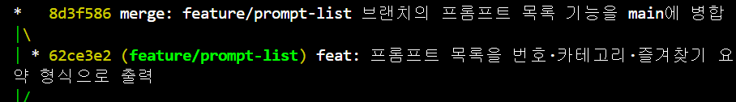

*[이미지 25] `git log --oneline --graph`의 분기·병합 구간 — 병합 커밋 `8d3f586` 아래로 `feature/prompt-list` 브랜치의 커밋 `62ce3e2`가 갈라졌다가 다시 합쳐지는 그래프가 표시된다*

### 7.2 .gitignore 오탈자 수정

4.1절에서 발견한 오탈자를 아래 명령으로 수정했다.

```powershell
git mv .gitnore .gitignore
```

이제 `__pycache__/`, `*.pyc`, `.venv/`, `.env`, `.vscode/`가 Git 추적에서 정상적으로 제외된다.

### 7.3 clone과 pull 수행

과제가 요구하는 8개 명령을 모두 사용하기 위해 공개 샘플 저장소를 clone하여 구조와 로그를 확인했다.

```powershell
git clone https://github.com/octocat/Hello-World.git sample-repo
```

```powershell
git log --oneline
```

```text
7fd1a60 Merge pull request #6 from Spaceghost/patch-1
7629413 New line at end of file. --Signed off by Spaceghost
553c207 first commit
```

확인 후 샘플 폴더는 삭제했다. 본 프로젝트에서는 원격 변경 사항을 반영하기 위해 pull을 수행했다.

```powershell
git pull origin main
```

### 7.4 Git 명령 사용 현황

| 명령 | 사용 위치 | 상태 |
|---|---|---|
| `init` | 3.2절 로컬 저장소 초기화 | 사용 |
| `add` | 3.3·4.2·5.4절 스테이징 | 사용 |
| `commit` | 전 단계 기능 단위 커밋 | 사용 |
| `push` | 3.4·4.2·5.4절 GitHub 업로드 | 사용 |
| `pull` | 7.3절 원격 변경 사항 반영 | 사용 |
| `checkout` | 7.1절 브랜치 생성 및 전환 | 사용 |
| `clone` | 7.3절 공개 샘플 저장소 확인 | 사용 |
| `merge` | 7.1절 `feature/prompt-list` 병합 | 사용 |

### 7.5 GitHub 저장소 확인

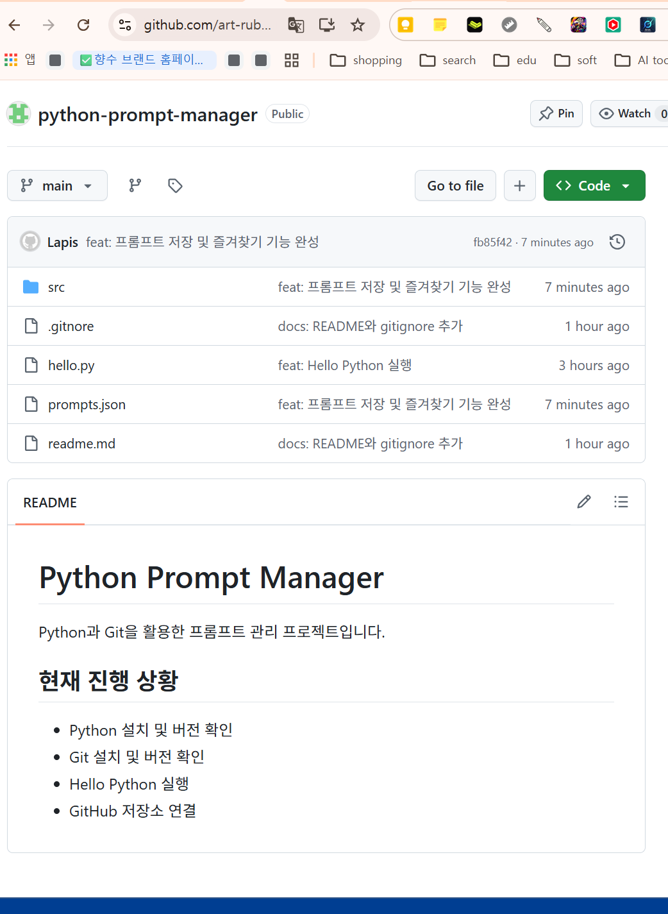

*[이미지 26] GitHub 저장소에 업로드된 파일 목록과 README 렌더링 결과 — 캡처 시점은 1차 구현 완료 직후이다*

---

## 8. 과제 요구사항 대조

| 구분 | 요구사항 | 상태 |
|---|---|---|
| 프로그램 | 콘솔 메뉴 방식, 번호 선택, 종료, 메뉴 복귀 | 충족 |
| 프로그램 | 잘못된 번호 입력 시 안내 후 메뉴 재출력 | 충족 |
| 데이터 | 이전 미션 프롬프트 3개 이상 기본 등록 | 충족 (4개) |
| 데이터 | 리스트 + 딕셔너리 구조, 4개 필드 | 충족 |
| 기능 | 프롬프트 추가 (빈 값 재입력, 카테고리 선택) | 충족 |
| 기능 | 프롬프트 목록 (번호·카테고리·⭐·총 개수) | 충족 |
| 기능 | 카테고리별 조회 | 충족 |
| 기능 | 프롬프트 검색 | 충족 |
| 기능 | 프롬프트 상세 보기 (번호 검증) | 충족 |
| 기능 | 즐겨찾기 추가/해제 및 목록 | 충족 |
| 코드 | 기능별 함수 분리 | 충족 (15개 함수) |
| 코드 | 외부 라이브러리 미사용 | 충족 |
| Git | 의미 있는 커밋 10개 이상 | 충족 (20개 이상) |
| Git | 브랜치 생성 및 병합 기록 | 충족 |
| Git | 8개 명령 각 1회 이상 사용 | 충족 |
| 문서 | README에 설명·실행법·기능·카테고리 | 충족 |
| 보너스 1 | JSON 저장·불러오기 | 구현 |
| 보너스 1 | 카테고리별 Markdown 내보내기 | 미구현 |
| 보너스 2 | 수정/삭제, 조회수, Top 목록 | 미구현 |


---


## 12. 배운 점

**Python 실행 위치** — 대화형 입력창과 프로젝트 터미널의 역할이 다르다는 점을 오류를 통해 체감했다.

**데이터 구조** — 여러 프롬프트를 리스트로 묶고 각 항목의 속성을 딕셔너리로 관리하는 구조가 검색·필터링 기능 구현에 그대로 이어진다는 것을 확인했다.

**함수 분리** — 기능별로 함수를 나누니 카테고리별 조회와 상세 보기를 추가할 때 기존 코드를 거의 건드리지 않아도 되었다. 목록 출력을 `print_summary_list()` 하나로 모으자 목록·검색·카테고리 조회·즐겨찾기 목록이 같은 형식을 자동으로 공유했다.

**입력값 검증** — 빈 값이면 기능을 종료하는 방식보다 다시 입력을 요청하는 방식이 사용자 입장에서 자연스럽다는 것을 알았다.

**저장 방식** — 메모리의 데이터는 종료 시 사라지지만 JSON 파일로 저장하면 다시 불러올 수 있다는 차이를 확인했다.

**Git 브랜치** — 브랜치에서 기능을 개발하고 `main`에 병합하는 흐름을 직접 수행하면서, `--no-ff` 병합이 작업 이력을 그래프로 남긴다는 점을 익혔다.
