# Python 응용: API 활용 국내 여행지 추천 프로그램 개발 — 과제 제출보고서

---

## 1. 과제 개요

### 1.1 미션 요약

단일 API 호출을 넘어 **서로 다른 두 개의 API를 파이프라인으로 연결**하여 하나의 결과물을 만드는 프로그램을 개발하는 것이다.

사용자가 CLI로 여행 날짜와 일수를 입력하면
① LLM(Gemini)이 해당 시기에 적합한 국내 여행지 **2곳**을 추천하여 **JSON으로 구조화**하고,
② 각 도시명을 **Kakao Local API의 검색어로 사용**하여 맛집 정보를 도시별로 수집하며,
③ 두 결과를 다시 Gemini에 전달하여 **일수에 맞는 최종 여행 리포트(Markdown)** 를 생성하고 `results/`에 저장한다.

여행지 추천의 정확도가 아니라 **구조화된 출력 → 다음 API의 입력으로 연결 → 결과 결합**이라는 데이터 흐름의 구현이다.

### 1.2 최종 결과물

| 결과물 | 내용 | 위치 |
|---|---|---|
| CLI 기반 Python 프로그램 | `-date "YYYY-MM-DD"` 필수 + `--days 1\|2` 선택 | `travel_planner.py` (549행) |
| 원본 데이터 JSON | 1차 추천(2곳) + 도시별 맛집 + errors | `results/data_2026-10-15_1d.json` |
| 최종 여행 리포트 | 일수에 맞춘 Markdown 여행 리포트 | `results/report_2026-10-15_1d.md` |
| README | 개요, 실행 방법, API 키 설정, 결과 확인, 보안 주의 | `README.md` |

### 1.3 전체 처리 흐름

```text
사용자 입력 (-date "2026-10-15" --days 1)
        ↓
[1/3] Gemini API — 1차 여행지 추천 (2곳)
        ↓
JSON 구조화 + 필수 키 5개 검증 + 도시 개수 검증
  recommended_cities: [ {city, weather, events, reason, highlight} × 2 ]
        ↓
도시명 2개 추출  →  반복 처리(enumerate 루프)
        ↓
[2/3] Kakao Local API — 도시별 "○○ 맛집" 검색 (각 5곳, FD6)
        ↓
응답 정규화 (place_name→name, x→lng, y→lat …)
        ↓
[3/3] Gemini API — 1차 추천 + 도시별 맛집 + days + errors 결합
        ↓
최종 Markdown 리포트 생성 (1일: A안/B안 · 2일: DAY1/DAY2)
        ↓
results/
├─ data_2026-10-15_1d.json   (원본 데이터 + errors)
└─ report_2026-10-15_1d.md   (최종 리포트)
```

### 1.4 설계 확장 사항

과제 기본 요구사항에 더해 아래 세 가지를 확장했다.

| # | 항목 | 기본 요구 | 실제 구현 | 이유 |
|---|---|---|---|---|
| 1 | 장소 검색 API | Kakao 또는 Naver 택 1 | **Kakao Local (키워드로 장소 검색)** | `category_group_code=FD6`로 음식점만 필터링 가능, `place_url` 제공, 좌표가 이미 소수 형태라 환산 불필요 |
| 2 | 추천 지역 수 | 1곳 | **2곳** | 사용자가 비교·선택할 수 있고, 반복 처리와 지역별 결과 구조 설계를 함께 경험 (보너스 과제 1을 기본 기능으로 포함) |
| 3 | 여행 일수 | 없음 | **`--days 1` 또는 `--days 2`** | 당일치기와 1박 2일은 동선이 다르므로, 추천 조건과 일정 구성이 모두 달라지도록 함 |

**일수 선택에 따른 처리 방식**

| `--days` | LLM 프롬프트 조건 | 일정 구성 |
|---|---|---|
| `1` (당일) | "여행 기간은 **당일 여행**입니다" | 추천 지역 2곳을 **각각 독립적인 당일 코스(A안 / B안)** 로 제안 |
| `2` (1박 2일) | "여행 기간은 **1박 2일 여행**입니다" | **DAY 1은 첫 번째 도시, DAY 2는 두 번째 도시**로 이어지는 연계 코스 제안 |

`-date`는 과제 요구대로 필수 옵션으로 유지했고 `--days`는 기본값 `1`을 갖는 선택 옵션이므로, **`-date`만 입력해도 과제 요구대로 동작한다.** (검증: 6.7절)

---

## 2. 개발 환경 및 사용 기술

| 항목 | 내용 |
|---|---|
| 언어 | Python 3.11.9 (과제 요구: 3.10 이상) |
| 실행 환경 | Windows 11 / PowerShell 터미널 (CLI) |
| 개발 도구 | Visual Studio Code |
| 가상환경 | `.venv` |
| LLM API | Google Gemini — `gemini-3.5-flash` (`google-genai`) |
| 장소 검색 API | Kakao Local — 키워드로 장소 검색 |
| HTTP 요청 | `requests` |
| 환경변수 관리 | `python-dotenv` |
| CLI 인자 파싱 | `argparse` (표준 라이브러리) |
| 데이터 형식 | JSON / Markdown |
| 형상 관리 | Git / GitHub |

### 2.1 의존 패키지 정의

```text
requests
python-dotenv
google-genai
```

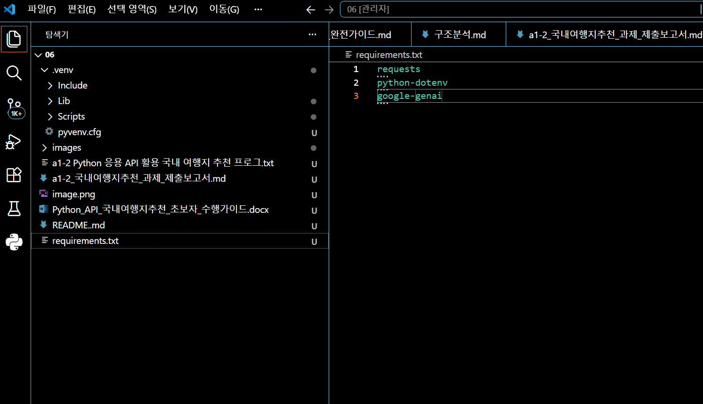

*[이미지 01] `requirements.txt` 작성 — 프로젝트에 필요한 3개 패키지 정의*

### 2.2 가상환경 생성 및 패키지 설치

```powershell
python -m venv .venv
```

```powershell
.\.venv\Scripts\Activate.ps1
```

```powershell
pip install -r requirements.txt
```

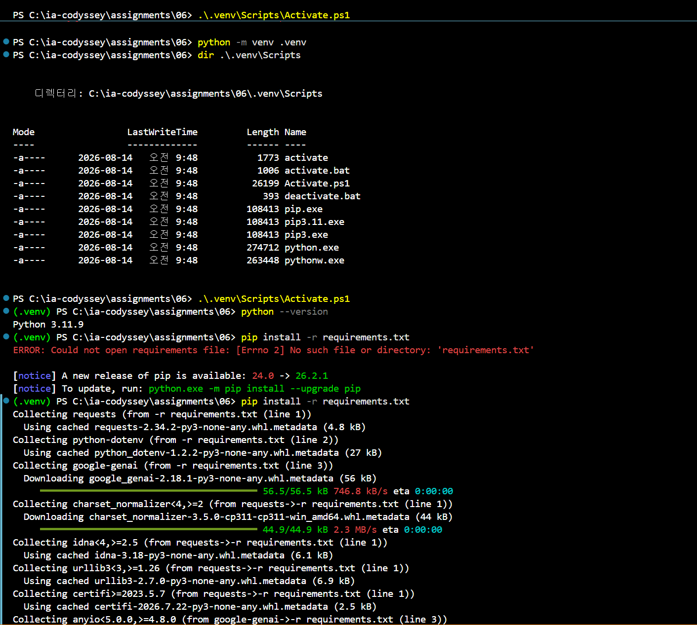

*[이미지 02] 가상환경 활성화 후 `python --version`(3.11.9) 확인 및 `pip install -r requirements.txt` 실행*

> 위 캡처에는 `requirements.txt`를 만들기 전에 설치를 먼저 시도해서 발생한 `ERROR: Could not open requirements file`도 함께 남아 있다. 파일 생성 후 재실행하여 정상 설치되었다. (10장 이슈 2 참조)

---

## 3. 사전 준비 — API 키 발급 및 환경변수 설정

### 3.1 Google Gemini API 키

Google AI Studio에서 API 키를 발급받아 `.env`의 `GEMINI_API_KEY`에 저장했다.

> **키 발급 화면은 보고서에 포함하지 않는다.** 발급 화면에는 API 키 값과 프로젝트 식별자가 함께 표시되며, 마스킹을 해도 화면의 다른 위치에 같은 값이 남을 수 있다. 환경변수 설정에 대한 증빙은 값이 비어 있는 `.env.example`과 `.gitignore`로 대체했다(3.4절). 자세한 판단 근거는 10장 이슈 8에 정리했다.

### 3.2 Kakao REST API 키

Kakao Developers에서 애플리케이션을 등록하고 **REST API 키**를 발급받아 `.env`의 `KAKAO_REST_API_KEY`에 저장했다. Kakao Local 검색 API는 별도의 동의 항목 설정 없이 REST API 키만으로 호출할 수 있다.

### 3.3 Kakao Local API 사전 검증

프로그램을 작성하기 전에 Kakao Developers의 **REST API 테스트 도구**로 "키워드로 장소 검색"을 직접 호출하여, 요청 파라미터와 응답 구조를 먼저 확인했다. 검색어는 실제 프로그램이 만들 형태와 동일하게 `"강릉 맛집"`으로 입력했다.

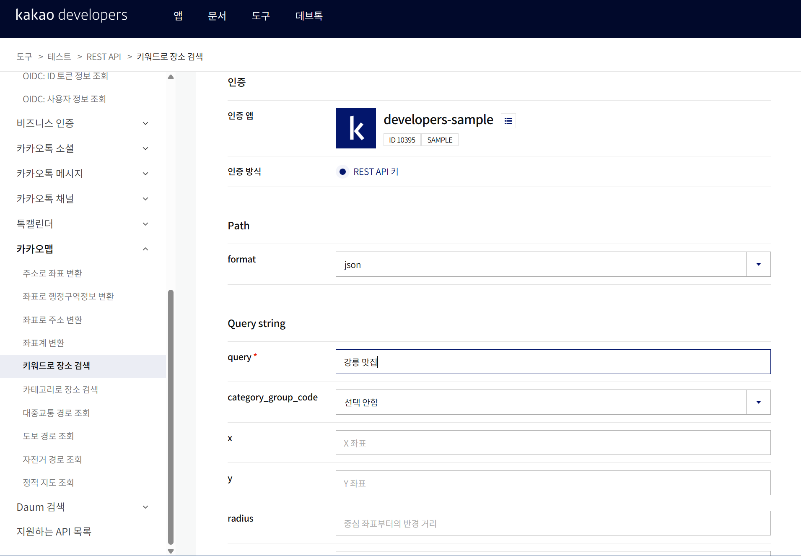

*[이미지 05] Kakao Developers REST API 테스트 도구 — 키워드로 장소 검색(`query="강릉 맛집"`) 사전 검증*

> 코드를 작성하기 전에 이 단계를 거친 덕분에 응답의 `documents` 배열 구조와 각 필드명(`place_name`, `road_address_name`, `x`, `y`, `place_url`)을 미리 확정할 수 있었고, 정규화 함수를 한 번에 작성할 수 있었다.

### 3.4 환경변수 설정 방법

API 키는 **코드에 직접 작성하지 않고** 환경변수 또는 `.env` 파일에서 읽어온다.

**방법 1 — `.env` 파일 (본 프로젝트에서 사용)**

프로젝트 루트에 `.env`를 만들고 발급받은 값을 입력한다.

```env
GEMINI_API_KEY=발급받은_키
KAKAO_REST_API_KEY=발급받은_REST_API_키
```

**방법 2 — 터미널 세션 환경변수**

현재 터미널 세션에만 임시로 설정할 수도 있다.

Windows PowerShell

```powershell
$env:GEMINI_API_KEY="YOUR_KEY"
```

```powershell
$env:KAKAO_REST_API_KEY="YOUR_KEY"
```

macOS / Linux

```bash
export GEMINI_API_KEY="YOUR_KEY"
```

```bash
export KAKAO_REST_API_KEY="YOUR_KEY"
```

> 위 예시는 **설정 방식 참고용**이며, 실제 키 값은 README·보고서·실행 로그·GitHub 어디에도 포함하지 않는다.

**저장소에 포함하는 `.env.example`** (값은 비움)

```env
GEMINI_API_KEY=
KAKAO_REST_API_KEY=
```

**`.gitignore`**

```gitignore
# API 키 (절대 커밋 금지)
.env

# Python
__pycache__/
*.pyc

# 가상환경
.venv/
venv/

# 에디터
.vscode/
```

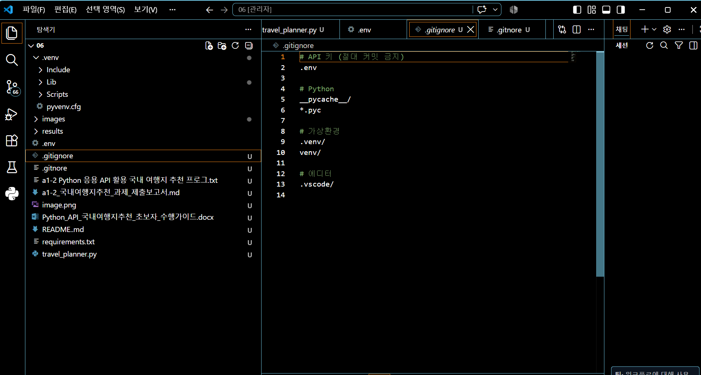

*[이미지 06] `.gitignore` 설정 — 첫 줄에 `.env`를 등록하여 Git 추적에서 제외*

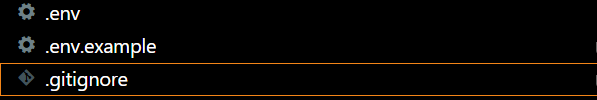

*[이미지 07] `.env`(로컬 전용) / `.env.example`(저장소 포함) / `.gitignore` 파일 구성*

> [이미지 06]의 탐색기 목록에는 `.gitignore`와 함께 오타 파일 `.gitnore`가 함께 보인다. 촬영 시점의 상태이며, **오타난 파일명은 Git이 무시 규칙으로 인식하지 않으므로** 이후 삭제했다. (10장 이슈 4 참조)

---

## 4. 프로젝트 구조

```text
06/
├── travel_planner.py        # CLI 프로그램 전체 (549행)
├── requirements.txt         # 의존 패키지 목록
├── .env                     # 실제 API 키 (Git 제외)
├── .env.example             # 환경변수 이름 예시
├── .gitignore               # .env, __pycache__, .venv 제외
├── README.md                # 실행 방법 및 키 설정 안내
├── images/                  # 보고서 캡처 이미지
│
└── results/                 # 실행 시 자동 생성
    ├── data_2026-10-15_1d.json
    └── report_2026-10-15_1d.md
```

### 단위 설계

`travel_planner.py`는 주석으로 8개 블록을 구분해 작성했다.

```text
main()                              # 8. 메인 실행
 ├─ parse_arguments()               # 1. CLI 입력 — -date(필수) / --days(1|2, 기본 1)
 ├─ validate_date()                 # 2. 날짜 형식 확인
 ├─ load_config()                   # 3. .env에서 API 키 불러오기
 ├─ get_travel_recommendation()     # 4. [1/3] Gemini 여행지 추천 (2곳)
 ├─ search_kakao_restaurants()      # 5. [2/3] Kakao Local 맛집 검색 (도시별 반복)
 ├─ generate_final_report()         # 6. [3/3] Gemini 최종 리포트 생성
 └─ save_results()                  # 7. results/ 폴더에 JSON·Markdown 저장
```

---

## 5. 기능 구현 내용

### 5.1 CLI 인터페이스 및 입력값 검증

`argparse`로 `-date`를 **필수 인자**, `--days`를 **선택 인자(기본 1)** 로 받는다. `--days`는 `choices=[1, 2]`로 제한하여 허용값 외 입력을 argparse가 직접 차단한다. 날짜는 `datetime.strptime()`으로 검증하고, 형식이 잘못되면 **API를 호출하기 전에** 사용법을 출력하고 종료한다.

| 입력 | 판정 |
|---|---|
| `-date "2026-10-15"` | 정상 (days 기본값 1) |
| `-date "2026-10-15" --days 2` | 정상 |
| `-date "2026/10/15"` | 오류 → 사용법 출력 후 종료 |
| `--days 3` | 오류 → argparse가 `choices`로 차단 |
| `-date` 누락 | 오류 → argparse가 필수 인자 누락 안내 |

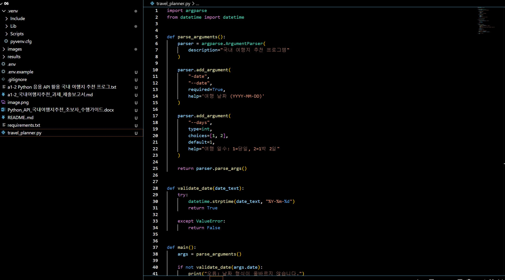

*[이미지 08] `parse_arguments()`의 `-date`(`required=True`) · `--days`(`choices=[1, 2]`, `default=1`) 설정과 `validate_date()` 코드*

### 5.2 API 키 로드 및 미설정 처리

`load_dotenv()`로 `.env`를 읽어 두 키를 로드하고, 하나라도 비어 있으면 **`SystemExit(1)`로 즉시 종료**하고 설정 방법을 안내한다.

```text
오류: KAKAO_REST_API_KEY가 설정되지 않았습니다.
.env 파일을 확인하세요.
```

정상적으로 로드되면 실행 초반에 `API 키 설정 확인 완료`가 출력된다.

### 5.3 [1/3] Gemini 1차 여행지 추천 — 사용자 입력이 프롬프트가 되는 과정

**① 사용자 입력이 프롬프트 변수로 변환된다**

| CLI 입력 | 내부 변수 | 프롬프트에 삽입되는 문장 |
|---|---|---|
| `-date "2026-10-15"` | `date = "2026-10-15"` | `여행 날짜는 2026-10-15입니다.` |
| `--days 1` | `days = 1` → `trip_type = "당일 여행"` | `여행 기간은 당일 여행입니다.` |
| `--days 2` | `days = 2` → `trip_type = "1박 2일 여행"` | `여행 기간은 1박 2일 여행입니다.` |

```python
if days == 1:
    trip_type = "당일 여행"
else:
    trip_type = "1박 2일 여행"
```

**② 실제 프롬프트 전문**

```text
여행 날짜는 {date}입니다.
여행 기간은 {trip_type}입니다.

이 조건에 적합한 대한민국 국내 여행지 2곳을 추천하세요.

두 지역은 가능하면 서로 다른 매력을 가진 곳으로 추천하세요.

반드시 다음 JSON 형식으로만 응답하세요.

{
  "recommended_city": "첫 번째 추천 도시",
  "weather": "첫 번째 추천 도시의 해당 시기 일반적 날씨",
  "events": ["행사 또는 축제 후보 1", "행사 또는 축제 후보 2"],
  "reason": "첫 번째 추천 도시를 추천하는 이유 2~4문장",
  "recommended_cities": [
    {
      "city": "첫 번째 도시",
      "weather": "날씨",
      "events": ["행사 또는 축제"],
      "reason": "추천 이유",
      "highlight": "대표 여행 매력"
    },
    {
      "city": "두 번째 도시",
      "weather": "날씨",
      "events": ["행사 또는 축제"],
      "reason": "추천 이유",
      "highlight": "대표 여행 매력"
    }
  ]
}

규칙:
- recommended_cities에는 정확히 2개의 도시를 넣으세요.
- recommended_city는 recommended_cities의 첫 번째 city와 같아야 합니다.
- events는 문자열 배열이어야 합니다.
- JSON 이외의 설명은 작성하지 마세요.
- Markdown 코드블록을 사용하지 마세요.
```

**③ 호출 코드**

```python
client = genai.Client(api_key=gemini_key)
response = client.models.generate_content(
    model="gemini-3.5-flash",
    contents=prompt
)
result = json.loads(response.text.strip())
```

**응답 스키마**

| 키 | 타입 | 설명 |
|---|---|---|
| `recommended_city` | string | **과제 최소 스키마 호환용** — 대표 도시(2곳 중 첫 번째) |
| `weather` | string | 대표 도시의 해당 시기 날씨 요약 |
| `events` | array of string | 대표 도시의 행사·축제 후보 |
| `reason` | string | 대표 도시 추천 근거 2~4문장 |
| `recommended_cities` | array (길이 2) | **확장 스키마** — 도시별 상세 정보 + `highlight` |

> **설계 의도**: 과제가 요구하는 최소 스키마(`recommended_city` / `weather` / `events` / `reason`)를 그대로 유지한 채 `recommended_cities` 배열을 덧붙였다. 요구사항 충족과 기능 확장을 동시에 만족하고, 이후 추천 지역 수를 늘려도 기존 키 구조가 깨지지 않는다.

### 5.4 응답 검증 및 재시도 1회

LLM 응답은 구조가 어긋날 수 있으므로 **파싱 직후 세 가지를 검증**한다.

1. `json.loads()`로 파싱되는가
2. 필수 키 5개가 모두 있는가
3. `recommended_cities`의 길이가 **정확히 2**인가

셋 중 하나라도 실패하면 **최대 1회만** 재요청하며, 기존 프롬프트 뒤에 아래 교정 지시를 덧붙인다.

```text
이전 응답을 JSON으로 파싱하지 못했습니다.

설명 문장과 Markdown 코드블록을 모두 제거하고
위에서 요구한 JSON 객체 하나만 다시 출력하세요.
```

```python
for attempt in range(2):        # 최초 1회 + 재요청 1회 = 최대 2회
    try:
        ...
    except (json.JSONDecodeError, ValueError) as e:
        if attempt == 0:
            print("  - JSON 파싱 실패")
            print("  - Gemini에 1회 재요청합니다.")
            prompt += 교정_지시
            continue
        errors.append({"step": "gemini_recommendation",
                       "type": "JSON_PARSE_ERROR", "message": str(e)})
        raise RuntimeError("Gemini JSON 파싱에 최종 실패했습니다.")
```

`for attempt in range(2)` 구조 자체가 **재시도 상한을 코드로 강제**하므로 무한 재시도가 발생할 수 없다.

### 5.5 [2/3] Kakao Local 검색 — 추천 도시명이 검색어가 되는 과정

**① 앞 단계의 출력이 이 단계의 입력이 된다**

```python
for index, city_info in enumerate(recommendation["recommended_cities"], start=1):
    city = city_info["city"]            # "경주시" / "가평군"
    query = f"{city} 맛집"               # "경주시 맛집" / "가평군 맛집"
```

| 1차 추천 JSON | 검색어로 조립 | 실제 요청 |
|---|---|---|
| `recommended_cities[0].city` = `"경주시"` | `"경주시 맛집"` | `[1/2]` 요청 |
| `recommended_cities[1].city` = `"가평군"` | `"가평군 맛집"` | `[2/2]` 요청 |

**② 요청 정보**

| 항목 | 값 |
|---|---|
| URL | `https://dapi.kakao.com/v2/local/search/keyword.json` |
| Method | `GET` |
| 인증 헤더 | `Authorization: KakaoAK {KAKAO_REST_API_KEY}` |
| 타임아웃 | `timeout=10` |

| 파라미터 | 값 | 의미 |
|---|---|---|
| `query` | `f"{city} 맛집"` | 검색 키워드 |
| `category_group_code` | `FD6` | 음식점 카테고리로 한정 |
| `size` | `5` | 도시당 결과 개수 |
| `page` | `1` | 페이지 번호 |
| `sort` | `accuracy` | 정확도순 정렬 |

**③ 응답 필드 정규화**

| Kakao 응답 | 프로그램 내부 | 처리 |
|---|---|---|
| `place_name` | `name` | 그대로 |
| `road_address_name` → `address_name` | `address` | 도로명 우선, 없으면 지번 (`or` 연산) |
| `category_name` | `category` | 예: `음식점 > 한식 > 해물,생선` |
| `place_url` | `url` | 카카오맵 상세 페이지 |
| `phone` | `phone` | 빈 값 가능 |
| `x` | `lng` | `float()` 변환, 값 없으면 `None` |
| `y` | `lat` | `float()` 변환, 값 없으면 `None` |

> **NAVER 대비 차이점**: NAVER 지역 검색은 좌표가 정수형(`mapx=1269873882`)이라 `10,000,000`으로 나누는 환산이 필요하고 `title`에 `<b>` 태그가 섞여 들어오지만, Kakao는 `x`/`y`가 이미 소수 좌표 문자열이라 `float()` 변환만 하면 되고 장소명에 HTML 태그가 포함되지 않는다.

**④ 실패·0건 처리**

```text
검색 결과 0건        → errors에 EMPTY_RESULT 기록 후 [] 반환
requests 예외 발생   → errors에 API_ERROR 기록 후 [] 반환
```

두 경우 모두 **예외를 밖으로 던지지 않고 빈 리스트를 반환**하므로, 한 도시의 검색이 실패해도 다른 도시의 검색과 이후 단계는 계속 진행된다.

### 5.6 [3/3] Gemini 최종 리포트 생성 — 두 API의 결과를 합쳐 프롬프트로

**① 앞의 모든 결과가 프롬프트 입력이 된다**

| 입력 | 출처 | 프롬프트 삽입 방식 |
|---|---|---|
| `date` | CLI `-date` | `여행 날짜:` 아래에 그대로 |
| `days` | CLI `--days` | `여행 일수: {days}일` |
| `recommendation` | [1/3] Gemini 응답 | `json.dumps(..., ensure_ascii=False, indent=2)` |
| `restaurants_by_city` | [2/3] Kakao 응답 | `json.dumps(..., ensure_ascii=False, indent=2)` |
| `errors` | 누적된 오류 목록 | `json.dumps(..., ensure_ascii=False, indent=2)` |
| `schedule_rule` | `days` 값에 따른 분기 | 일정 형식 지시문으로 삽입 |

**② 일수에 따른 일정 구성 분기 (`schedule_rule`)**

```python
if days == 1:
    schedule_rule = """
일정 제안은 두 추천 도시를 각각 독립적인 당일 코스로 작성하세요.

### A안 — 첫 번째 도시 당일 코스
- 오전
- 오후
- 저녁

### B안 — 두 번째 도시 당일 코스
- 오전
- 오후
- 저녁
"""
else:
    schedule_rule = """
일정 제안은 다음과 같이 작성하세요.

### DAY 1 — 첫 번째 도시
- 오전
- 오후
- 저녁

### DAY 2 — 두 번째 도시
- 오전
- 오후
- 저녁
"""
```

**③ 실제 프롬프트 전문**

```text
다음 정보를 바탕으로 국내 여행 추천 리포트를
Markdown 형식으로 작성하세요.

여행 날짜:
{date}

여행 일수:
{days}일

여행 추천 정보:
{recommendation JSON}

Kakao 맛집 검색 결과:
{restaurants_by_city JSON}

오류 목록:
{errors JSON}

반드시 다음 항목을 포함하세요.

# {date} 국내 여행 추천 리포트
## 추천 지역
## 추천 이유
## 날씨 요약
## 행사/축제
## 맛집 추천
## 일정 제안

{schedule_rule}

## 오류 요약

규칙:
- 맛집은 Kakao 검색 결과에 실제로 존재하는 식당만 사용하세요.
- Kakao 검색 결과에 없는 식당을 새로 만들어내지 마세요.
- 각 식당의 이름과 주소를 보기 쉽게 정리하세요.
- 맛집 결과가 없으면 '데이터 없음'이라고 작성하세요.
- 오류가 없으면 '오류 없음'이라고 작성하세요.
```

> 마지막 5개 규칙 중 앞 두 줄이 **환각(hallucination) 방지 장치**다. 실제 실행 결과에서 이 규칙이 지켜졌는지 10곳 전부를 대조 검증했다. 결과는 7.4절에 있다.

### 5.7 결과 저장

`save_results()`가 `results/` 폴더를 만들고(`os.makedirs(exist_ok=True)`) 두 파일을 저장한다. 파일명에 **날짜와 일수를 모두 포함**시켜, 같은 날짜라도 일수가 다르면 결과가 덮어써지지 않는다.

```python
json_path = f"results/data_{date}_{days}d.json"
md_path   = f"results/report_{date}_{days}d.md"
```

한글이 깨지지 않도록 저장 시 `encoding="utf-8"`과 `ensure_ascii=False`를 지정했다.

### 5.8 오류 처리 정책

| 오류 상황 | 처리 방식 | 프로그램 진행 |
|---|---|---|
| 날짜 형식 오류 | 사용법 출력 후 `return` | 중단 |
| `--days` 허용값 외 | argparse `choices`가 차단 | 중단 |
| API 키 미설정 | 안내 후 `SystemExit(1)` | 중단 |
| Gemini 1차 호출 실패 | `API_ERROR` 기록 후 안내 | 중단 |
| JSON 파싱/구조 검증 실패 | 재요청 1회 → 실패 시 `JSON_PARSE_ERROR` | 재시도 후 중단 |
| Kakao 검색 0건 | `EMPTY_RESULT` 기록, `[]` 반환 | **계속** |
| Kakao 인증/네트워크 오류 | `API_ERROR` 기록, `[]` 반환 | **계속** |
| 좌표 값 없음 | `None` 처리 | 계속 |
| 최종 리포트 생성 실패 | `final_report` 단계 `API_ERROR` 기록 후 안내 | 중단 |

모든 오류는 `main()`에서 생성한 `errors` 리스트에 누적되며, 각 함수가 이 리스트를 인자로 받아 기록하고 최종적으로 원본 JSON에 저장된다.

```json
{ "step": "place_search", "city": "가평군",
  "type": "EMPTY_RESULT", "message": "0 results for query=가평군 맛집" }
```

---

## 6. 실행 및 검증 명령어

수행 순서대로 실제로 입력한 명령을 정리한다.

### 핵심 명령 5개

```powershell
# 1. 가상환경 활성화
.\.venv\Scripts\Activate.ps1

# 2. 기본 정상 실행 (과제 원문이 요구하는 형태)
python travel_planner.py -date "2026-10-15"

# 3. 당일 여행 실행
python travel_planner.py -date "2026-10-15" --days 1

# 4. 1박 2일 실행
python travel_planner.py -date "2026-10-15" --days 2

# 5. 날짜 오류 테스트
python travel_planner.py -date "2026/10/15"
```

### 6.1 프로젝트 폴더로 이동

```powershell
cd C:\ia-codyssey\assignments\06
```

### 6.2 가상환경 활성화

PowerShell 실행 정책 때문에 활성화가 차단되는 경우, **현재 터미널 세션에만** 실행 권한을 허용한다.

```powershell
Set-ExecutionPolicy -Scope Process -ExecutionPolicy RemoteSigned
```

```powershell
.\.venv\Scripts\Activate.ps1
```

정상적으로 활성화되면 프롬프트 앞에 `(.venv)`가 표시된다.

```text
(.venv) PS C:\ia-codyssey\assignments\06>
```

### 6.3 Python 버전 확인

```powershell
python --version
```

실제 개발 환경은 Python 3.11.9이며, 과제 요구사항인 3.10 이상을 만족한다.

### 6.4 필요한 패키지 설치

```powershell
pip install -r requirements.txt
```

`requirements.txt`에는 `requests`, `python-dotenv`, `google-genai` 세 패키지가 포함되어 있다.

### 6.5 정상 실행 — 당일 여행

```powershell
python travel_planner.py -date "2026-10-15" --days 1
```

진행 순서는 다음과 같다.

```text
[1/3] Gemini 여행지 추천 생성
        ↓
[2/3] Kakao 맛집 검색
        ↓
[3/3] Gemini 최종 리포트 생성
        ↓
JSON 및 Markdown 파일 저장
```

최종 출력은 다음과 같다.

```text
결과 저장 완료
  - results/data_2026-10-15_1d.json
  - results/report_2026-10-15_1d.md

완료!
```

전체 로그와 결과는 7장에 있다.

### 6.6 정상 실행 — 1박 2일

```powershell
python travel_planner.py -date "2026-10-15" --days 2
```

일정이 다음 구조로 생성되고, 결과 파일은 `_2d`로 저장되어 `_1d` 결과와 함께 남는다.

```text
DAY 1 — 첫 번째 추천 도시
DAY 2 — 두 번째 추천 도시
```

```text
results/data_2026-10-15_2d.json
results/report_2026-10-15_2d.md
```

### 6.7 `--days` 생략 실행

`--days`의 기본값은 `1`이므로 과제가 요구하는 `-date`만 입력해도 실행된다.

```powershell
python travel_planner.py -date "2026-10-15"
```

이는 아래 명령과 동일하게 동작한다.

```powershell
python travel_planner.py -date "2026-10-15" --days 1
```

> 추가한 `--days` 옵션 때문에 **과제 원문이 요구한 기본 실행 형식이 깨지지 않았다**는 것을 확인하는 명령이다.

### 6.8 잘못된 날짜 형식 테스트

```powershell
python travel_planner.py -date "2026/10/15"
```

```text
오류: 날짜 형식이 올바르지 않습니다.

사용법:
python travel_planner.py -date "YYYY-MM-DD" [--days 1|2]
```

API를 호출하기 전에 종료되므로 불필요한 API 사용도 방지한다.

### 6.9 허용되지 않은 여행 일수 테스트

```powershell
python travel_planner.py -date "2026-10-15" --days 3
```

`argparse`의 `choices=[1, 2]` 설정에 의해 프로그램 로직이 실행되기 전에 차단된다.

### 6.10 필수 날짜 누락 테스트

```powershell
python travel_planner.py
```

`argparse`가 필수 인자(`-date`) 누락을 안내하고 종료한다.

### 6.11 결과 파일 확인

```powershell
dir .\results
```

당일 실행 결과로 다음 두 파일이 존재해야 한다.

```text
data_2026-10-15_1d.json
report_2026-10-15_1d.md
```

원본 JSON에는 `date`, `days`, `recommendation`, `restaurants_by_city`, `errors`가 저장된다.

### 6.12 Git 보안 설정 확인

```powershell
git status --ignored
```

`.env`가 **Ignored files** 목록에 표시되면 정상이다. GitHub에 올리는 파일과 올리지 않는 파일은 다음과 같다.

| 업로드 | 업로드 금지 |
|---|---|
| `travel_planner.py`, `requirements.txt`, `README.md`, `.env.example`, `.gitignore`, `results/`, `images/` | **`.env`** (실제 API 키) |

---

## 7. 실행 결과

아래는 **실제 실행 결과**이며, `results/` 폴더에 저장된 파일에서 그대로 인용했다.

### 7.1 실행 로그

```powershell
python travel_planner.py -date "2026-10-15" --days 1
```

```text
국내 여행지 추천 프로그램
여행 날짜: 2026-10-15
여행 일수: 1일 (당일)
API 키 설정 확인 완료

[1/3] Gemini 여행지 추천 생성 중...
  - JSON 응답 수신 완료
  - 추천 지역 1: 경주시
  - 추천 지역 2: 가평군

[2/3] Kakao 맛집 검색 중...
  - [1/2] 검색어: "경주시 맛집"
    → 5곳 검색 완료
  - [2/2] 검색어: "가평군 맛집"
    → 5곳 검색 완료

[3/3] Gemini 최종 리포트 생성 중...
  - 최종 리포트 생성 완료

결과 저장 완료
  - results/data_2026-10-15_1d.json
  - results/report_2026-10-15_1d.md

완료!
```

> `[1/3]` 아래에는 `google-genai` 라이브러리의 AFC 권고 메시지 한 줄이 함께 출력된다. 오류가 아니며 동작에 영향이 없다. (10장 이슈 6 참조)

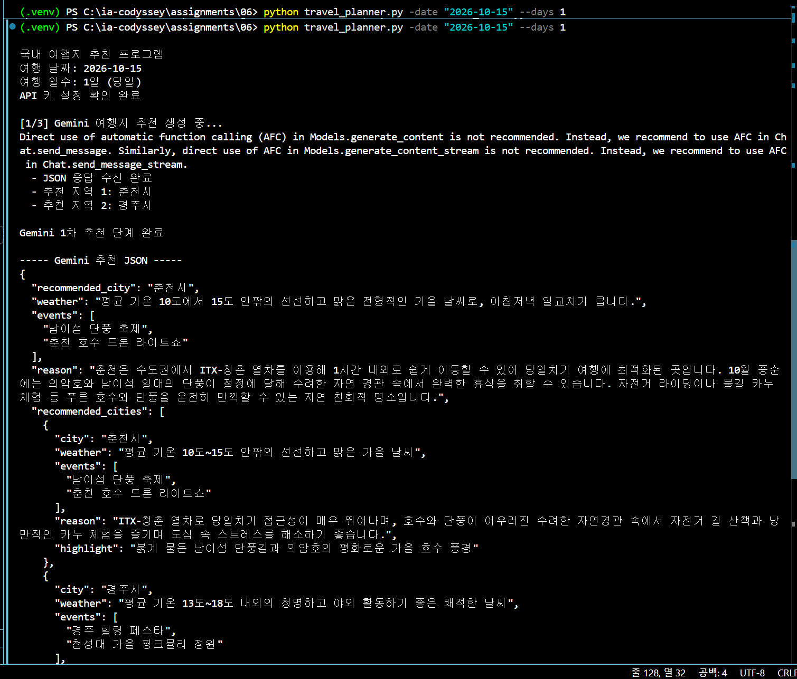

*[이미지 13] 실행 화면 — 입력 확인, API 키 확인, [1/3] 추천 지역 2곳(경주시·가평군) 수신*

### 7.2 1차 추천 JSON (Gemini 구조화 출력)

`results/data_2026-10-15_1d.json`의 `recommendation` 부분이다.

```json
{
  "recommended_city": "경주시",
  "weather": "선선하고 맑은 전형적인 가을 날씨로 야외 활동을 하기에 가장 쾌적한 시기입니다.",
  "events": ["신라문화제", "경주 문화유산 야행"],
  "reason": "10월 중순의 경주는 첨성대 주변의 분홍빛 핑크뮬리와 황남동의 황금빛 들판이 어우러져 눈부신 가을 풍경을 선사합니다. KTX를 이용해 편리하게 접근할 수 있어 당일치기로도 유적지와 아름다운 정취를 충분히 만끽할 수 있습니다.",
  "recommended_cities": [
    {
      "city": "경주시",
      "weather": "선선하고 맑은 전형적인 가을 날씨로 야외 활동을 하기에 가장 쾌적한 시기입니다.",
      "events": ["신라문화제", "경주 문화유산 야행"],
      "reason": "10월 중순의 경주는 첨성대 주변의 분홍빛 핑크뮬리와 황남동의 황금빛 들판이 어우러져 최고의 가을 풍경을 선사합니다. 고즈넉한 대릉원 돌담길과 동궁과 월지의 야경까지 당일치기로 알차게 역사와 낭만을 즐기기에 좋습니다.",
      "highlight": "첨성대 핑크뮬리 군락지와 고즈넉한 대릉원 가을 산책"
    },
    {
      "city": "가평군",
      "weather": "아침저녁으로는 다소 쌀쌀하지만 낮에는 맑고 따뜻하여 단풍 구경에 최적입니다.",
      "events": ["자라섬 재즈 페스티벌", "아침고요수목원 들국화·단풍축제"],
      "reason": "서울 근교의 가평은 남이섬과 자라섬의 메타세쿼이아 길을 따라 오색 단풍을 감상할 수 있는 대표적인 자연 힐링 여행지입니다. 북한강을 바라보는 예쁜 카페들과 가을 꽃 축제를 즐기며 하루 동안 자연 속에서 온전한 휴식을 취할 수 있습니다.",
      "highlight": "남이섬 메타세쿼이아 가을 단풍길과 자라섬 정원"
    }
  ]
}
```

**검증 결과**

- 필수 키 4개(`recommended_city` / `weather` / `events` / `reason`) 모두 존재
- `events`가 문자열 배열
- `recommended_cities`가 **정확히 2개**
- `recommended_city`("경주시")가 `recommended_cities[0].city`와 일치
- `--days 1`(당일) 조건 반영 — 경주는 "KTX로 당일치기", 가평은 "서울 근교"로 **당일 접근성**을 근거로 제시
- 두 도시의 성격이 겹치지 않음 (역사·유적 / 자연·힐링)

### 7.3 Kakao 맛집 검색 결과

`recommended_cities`의 도시명이 그대로 검색어가 되어 **도시당 5곳씩 총 10곳**을 수집했다.

**① 경주시 — 검색어 `"경주시 맛집"`**

| # | name | address | category | phone |
|---|---|---|---|---|
| 1 | [도미](http://place.map.kakao.com/1783751879) | 경북 경주시 중앙로 10 | 음식점 > 양식 | 010-3464-1142 |
| 2 | [보불어탕명가](http://place.map.kakao.com/26846275) | 경북 경주시 보불로 174-17 | 음식점 > 한식 > 해물,생선 | 054-744-7000 |
| 3 | [이재원의과자공방](http://place.map.kakao.com/1363391265) | 경북 경주시 봉황로 89 | 음식점 > 간식 > 제과,베이커리 | 054-624-4124 |
| 4 | [소향몽 경주본점](http://place.map.kakao.com/1335858493) | 경북 경주시 사정로57번길 16 | 음식점 > 한식 | 054-701-0010 |
| 5 | [강동미엔](http://place.map.kakao.com/1006812325) | 경북 경주시 봉황로 41 | 음식점 > 중식 | 0503-7153-6613 |

**② 가평군 — 검색어 `"가평군 맛집"`**

| # | name | address | category | phone |
|---|---|---|---|---|
| 1 | [설악한우마을정육센터](http://place.map.kakao.com/13049625) | 경기 가평군 설악면 신천중앙로 101 | 음식점 > 한식 > 육류,고기 | 031-584-7444 |
| 2 | [송원](http://place.map.kakao.com/26304008) | 경기 가평군 상면 수목원로 72 | 음식점 > 한식 > 두부전문점 | 031-585-5571 |
| 3 | [조무락닭갈비](http://place.map.kakao.com/27152914) | 경기 가평군 가평읍 북한강변로 1068 | 음식점 > 한식 > 육류,고기 > 닭요리 | 031-582-6300 |
| 4 | [소문난정통닭갈비](http://place.map.kakao.com/13325459) | 경기 가평군 가평읍 태평길 13-8 | 음식점 > 한식 > 육류,고기 > 닭요리 | 031-581-7250 |
| 5 | [델씨엘로](http://place.map.kakao.com/24450217) | 경기 가평군 청평면 경춘로 1031 | 음식점 > 양식 > 이탈리안 | 031-584-1767 |

**정규화 결과 예시 (저장된 JSON 원문)**

```json
{
  "name": "송원",
  "address": "경기 가평군 상면 수목원로 72",
  "category": "음식점 > 한식 > 두부전문점",
  "url": "http://place.map.kakao.com/26304008",
  "phone": "031-585-5571",
  "lng": 127.368454115677,
  "lat": 37.7688571896443
}
```

**검증 결과**

- 도시별로 `restaurants_by_city` 딕셔너리에 분리 저장
- `place_name`→`name`, `road_address_name`→`address`, `place_url`→`url` 정규화 정상 동작
- `x`/`y`→`lng`/`lat` 실수 변환 정상 (경주 `129.2…`/`35.8…`, 가평 `127.4…`/`37.7…` — 실제 지리 좌표와 일치)
- `category_group_code=FD6` 적용으로 **10곳 모두 "음식점" 카테고리**
- `errors: []` — 오류 없음

### 7.4 최종 여행 리포트

`results/report_2026-10-15_1d.md`가 생성되었다. 과제가 요구하는 항목이 모두 포함되어 있다.

| 필수 항목 | 포함 내용 |
|---|---|
| 추천 지역 | 기본(경주시) / 대안(가평군) |
| 추천 이유 | 도시별 1순위·2순위로 구분 |
| 날씨 요약 | 도시별 |
| 행사/축제 | 도시별 2건씩 |
| 맛집 리스트 | 도시별 5곳 (이름·주소·특징) |
| 일정 제안 | A안(경주) / B안(가평), 오전·오후·저녁 |
| 오류 요약 | "오류 없음" |

**리포트 발췌 — 일정 제안 (A안 오전)**

```markdown
### A안 — 첫 번째 도시 당일 코스 (경주시)
* **오전**
  * **KTX 경주역 도착 및 대릉원 산책:** 맑은 아침 공기를 마시며 고즈넉한 대릉원
    돌담길을 따라 산책합니다. 첨성대 주변으로 이동하여 분홍빛으로 물든 핑크뮬리
    군락지에서 가을 인생 사진을 남깁니다.
  * **점심 식사:** 황리단길 인근의 **소향몽 경주본점**에서 정갈한 한식으로
    든든한 점심 식사를 즐깁니다.
```

**환각 방지 규칙 검증 — 리포트의 식당 10곳 전수 대조**

리포트에 등장하는 모든 식당이 Kakao 검색 결과에 실제로 존재하는지 대조했다.

| 리포트 식당명 | Kakao 검색 결과 존재 | 주소 일치 |
|---|---|---|
| 소향몽 경주본점 / 도미 / 보불어탕명가 / 이재원의과자공방 / 강동미엔 | 5/5 | 일치 |
| 송원 / 조무락닭갈비 / 소문난정통닭갈비 / 설악한우마을정육센터 / 델씨엘로 | 5/5 | 일치 |

> **10곳 전부 일치했고, 지어낸 식당은 한 곳도 없었다.** 반면 일정에 등장하는 관광지(대릉원·첨성대·남이섬 등)는 LLM의 지식에서 나온 것으로 별도 검증 대상이 아니다. 즉 **"검증된 실제 데이터(Kakao)는 API에서 가져오고, 서술과 구성은 LLM이 담당"** 하는 역할 분담이 의도대로 동작했다.

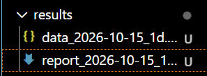

*[이미지 15] `results/` 폴더에 생성된 결과 파일 2개 (파일명에 날짜와 일수 `_1d` 포함)*

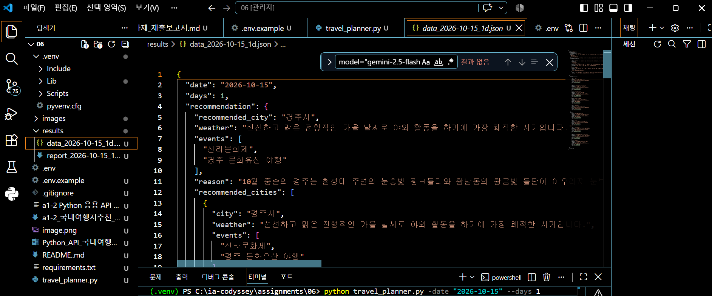

*[이미지 16] 원본 데이터 JSON — `date` / `days` / `recommendation` / `restaurants_by_city` / `errors` 구조*

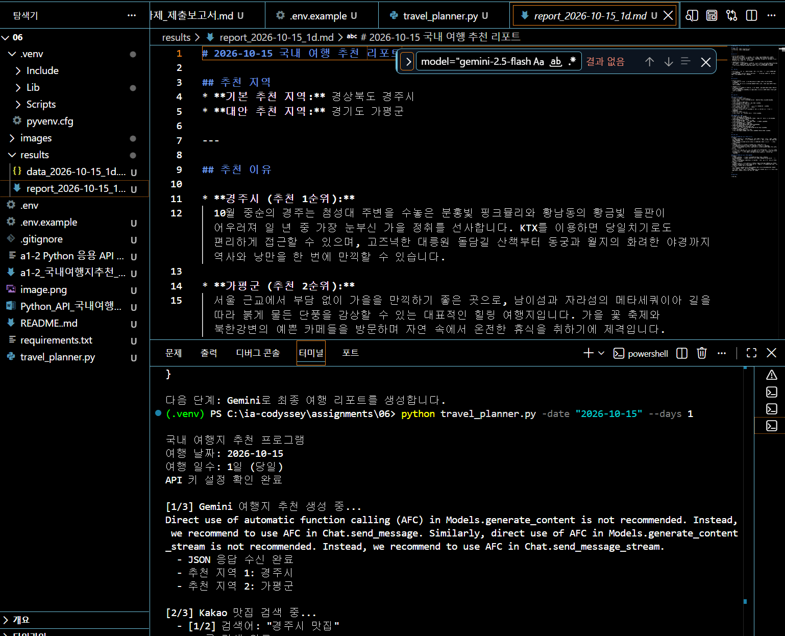

*[이미지 17] 최종 Markdown 여행 리포트 — 추천 지역(경주시·가평군)과 추천 이유 섹션*

---

## 8. 검증 결과

### 8.1 실행으로 검증한 항목

`-date "2026-10-15" --days 1` 실행 1회로 아래 7개 항목을 모두 확인했다.

| No | 검증 항목 | 기대 결과 | 결과 | 근거 |
|---|---|---|---|---|
| 1 | 정상 실행 (당일) | 3단계 완료 + 파일 2개 생성 | 성공 | 7.1 · [이미지 13] |
| 2 | LLM 구조화 출력 | 필수 키 4개 + `recommended_cities` 2개 | 성공 | 7.2 |
| 3 | API 간 데이터 연결 | 추천 도시명이 Kakao 검색어로 사용 | 성공 | 7.3 |
| 4 | 맛집 검색·정규화 | 도시당 5건, 7개 필드 정규화 | 성공 | 7.3 |
| 5 | 최종 리포트 생성 | 필수 7개 항목 + A안/B안 일정 | 성공 | 7.4 |
| 6 | 결과 파일 저장 | `results/`에 JSON + Markdown | 성공 | [이미지 15·16·17] |
| 7 | 환각 방지 | 리포트 식당이 모두 Kakao 결과에 존재 | 성공 (10/10) | 7.4 |

### 8.2 명령어로 확인하는 예외 처리

아래 항목은 정상 실행에서는 발생하지 않는 예외 경로이며, 실행 명령과 구현 위치를 함께 정리했다.

| 확인 명령 | 구현 위치 | 동작 |
|---|---|---|
| `python travel_planner.py -date "2026/10/15"` | `main()` — `validate_date()` 반환값 검사 | 사용법 출력 후 `return` (API 호출 없음) |
| `python travel_planner.py -date "..." --days 3` | `parse_arguments()` — `choices=[1, 2]` | argparse가 실행 전 차단 |
| `python travel_planner.py` | `parse_arguments()` — `required=True` | 필수 인자 누락 안내 후 종료 |
| `.env`에서 키를 비우고 실행 | `load_config()` | 안내 출력 후 `SystemExit(1)` |
| 잘못된 Kakao 키로 실행 | `search_kakao_restaurants()` — `except RequestException` | `API_ERROR` 기록 후 `[]` 반환, 리포트 생성은 계속 |
| 검색 결과가 없는 키워드 | `search_kakao_restaurants()` — `if not documents` | `EMPTY_RESULT` 기록 후 `[]` 반환, 다음 도시로 계속 |
| LLM이 JSON 외 문장 출력 | `get_travel_recommendation()` — `for attempt in range(2)` | 재요청 1회 후 실패 시 종료 (무한 재시도 없음) |

---

## 9. 과제 목표 달성 내용

### 9.1 REST API 요청/응답 구조와 GET/POST의 차이

REST API는 클라이언트가 서버에 **요청(Request)** 을 보내고, 서버가 **응답(Response)** 을 반환하는 방식으로 동작한다.

**Request(요청)의 구성**

| 구성 요소 | 역할 | 본 프로그램의 예 |
|---|---|---|
| URL | 어느 API에 요청할 것인가 | `https://dapi.kakao.com/v2/local/search/keyword.json` |
| HTTP Method | 어떤 방식으로 요청할 것인가 | `GET` |
| Header | API 키 등 인증 정보 | `Authorization: KakaoAK {REST_API_KEY}` |
| Query Parameter | 검색어, 결과 개수 등 | `query=경주시 맛집`, `size=5` |
| Body | 서버에 전달할 데이터 | Gemini 요청의 프롬프트 본문 |

**Response(응답)의 구성**

| 구성 요소 | 역할 | 본 프로그램의 예 |
|---|---|---|
| HTTP Status Code | 요청 처리 결과 | `200`, `401`, `429` 등 |
| JSON 또는 텍스트 본문 | 실제 데이터 | Kakao의 `documents` 배열, Gemini의 생성 텍스트 |
| 오류 메시지 | 실패 원인 | `raise_for_status()`가 예외로 전달 |

**GET과 POST의 차이**

| 구분 | GET | POST |
|---|---|---|
| 주 용도 | 데이터 조회 | 데이터를 서버에 전달하여 처리·생성 요청 |
| 데이터 전달 | 주로 URL의 Query Parameter | 주로 Request Body |
| 본 과제 적용 | Kakao Local 장소 검색 | Gemini 콘텐츠 생성 요청 |
| 코드에서의 사용 | `requests.get()`으로 직접 호출 | `google-genai` SDK가 API 통신을 내부 처리 |

Kakao Local API는 장소 정보를 **조회**하는 기능이므로 GET 방식으로 호출했다.

```text
GET https://dapi.kakao.com/v2/local/search/keyword.json
      ?query=경주시%20맛집
      &category_group_code=FD6
      &size=5
      &page=1
      &sort=accuracy
Header: Authorization: KakaoAK {REST_API_KEY}
```

Gemini API는 프롬프트 내용을 서버에 전달하고 새로운 응답을 **생성**하도록 요청하는 방식이다. 본 프로그램에서는 HTTP 요청을 직접 작성하지 않고 `google-genai` SDK의 `generate_content()`를 통해 호출했다. SDK가 내부적으로 HTTP 통신과 인증을 처리하지만, 데이터를 본문에 실어 보내 새 결과를 만들어 달라고 요청한다는 점에서 POST 성격의 호출이다.

```python
response = client.models.generate_content(
    model="gemini-3.5-flash",
    contents=prompt        # 프롬프트가 요청 본문에 해당
)
```

**주요 상태 코드와 대응**

| 코드 | 의미 | 본 프로그램의 대응 |
|---|---|---|
| 200 | 성공 | 정상 처리 |
| 400 | 잘못된 요청 | `raise_for_status()` → `API_ERROR` 기록 후 계속 |
| 401 | 인증 실패 | 키 값·`KakaoAK ` 접두어 점검 → 해당 도시만 실패 처리 |
| 403 | 권한 없음 | 앱 설정 점검 → 해당 도시만 실패 처리 |
| 429 | 쿼터 초과 | `API_ERROR` 기록 후 계속 |
| 500 | 서버 오류 | `API_ERROR` 기록 후 계속 |

### 9.2 LLM 출력의 구조화와 다음 단계 연결

LLM에게 자연어 답변을 받으면 다음 API의 입력으로 바로 쓸 수 없다. 그래서 프롬프트에서 **JSON 구조와 필수 키를 지정**하고, 설명 문장·Markdown 코드블록을 출력하지 않도록 제한했다. 실제 실행에서 확인된 연결은 다음과 같다.

```text
CLI 입력 (-date, --days)
        ↓  프롬프트 변수로 치환
Gemini 출력 JSON
   → recommended_cities[0].city = "경주시"  → Kakao 검색어 "경주시 맛집" → 5곳
   → recommended_cities[1].city = "가평군"  → Kakao 검색어 "가평군 맛집" → 5곳
                                                ↓
                restaurants_by_city = { "경주시": [...], "가평군": [...] }
                                                ↓
                        다시 Gemini에 전달 → 최종 Markdown 리포트
```

이 과정에서 **데이터가 세 번 형태를 바꾼다.** ① LLM의 자연어 → JSON, ② Kakao의 응답 스키마 → 내부 스키마, ③ 두 JSON → 사람이 읽는 Markdown. API 연동의 실체는 결국 **형태 변환의 연속**이라는 것을 확인했다.

또한 같은 입력에도 LLM의 출력은 매번 달라진다(10장 이슈 7). 그래서 프로그램은 특정 도시명을 가정하지 않고 **구조(필수 키 존재, 배열 길이)만 검증**한다.

### 9.3 외부 API 호출의 대표 오류와 대응 원칙

과제가 지목한 네 가지 대표 오류를 모두 처리했다.

| 오류 유형 | 원인 | 본 프로그램의 대응 |
|---|---|---|
| **인증** (401/403) | 키 오타, `KakaoAK ` 접두어 누락, 앱 설정 | `API_ERROR` 기록 후 해당 도시만 빈 리스트 처리 |
| **쿼터** (429) | 호출 한도 초과 | 재시도하지 않고 기록 후 계속 |
| **네트워크** | DNS 실패, 타임아웃, 연결 끊김 | `timeout=10` 지정, `requests.RequestException` 포착 후 계속 |
| **파싱** | LLM이 JSON 외 문장 출력 | `for attempt in range(2)`로 **재요청 1회 상한** |
| (추가) 구조 오류 | 필수 키 누락, 도시 개수 불일치 | 파싱 성공이어도 `ValueError` 처리 → 재요청 1회 |

대응의 핵심 원칙은 **"부분 실패가 전체 실패가 되지 않게 한다"** 이다. 도시 A의 검색이 실패해도 도시 B의 검색과 리포트 생성은 그대로 진행된다.

네트워크 오류는 실제로 겪었다. `pip install` 중 `getaddrinfo failed`가 반복 발생했는데(10장 이슈 3), 이때 pip이 **총 5회까지만 재시도하고 중단**하는 것을 보고 재시도에 상한을 두는 이유를 실제로 확인할 수 있었다.

### 9.4 API 키를 `.env`/환경변수로 관리하는 이유

1. **유출 방지** — 코드를 GitHub에 올릴 때 키가 함께 공개되는 사고를 막는다.
2. **교체 용이** — 키가 바뀌어도 소스 코드를 수정할 필요가 없다.
3. **과금·쿼터 사고 예방** — 키가 노출되면 타인이 사용해 한도를 소모하거나 과금이 발생할 수 있다.
4. **환경 분리** — 개발/배포 환경에서 서로 다른 키를 코드 변경 없이 사용할 수 있다.

`travel_planner.py`에는 키 문자열이 한 글자도 들어 있지 않고 `os.getenv()`로만 읽는다. `.env`는 `.gitignore` 첫 줄에 등록했고([이미지 06]), 저장소에는 값이 비어 있는 `.env.example`만 포함한다. 설정 방법은 3.4절, Git 제외 확인 명령은 6.12절에 있다. **캡처 이미지에서도 키가 드러나지 않도록 관리했다**(10장 이슈 8).

---

## 10. 수행 과정에서의 이슈 및 해결

### 이슈 1 — 가상환경 생성 실패 (`ensurepip`)

`python -m venv .venv` 실행 시 pip 설치 단계(`_setup_pip` → `ensurepip`)에서 `Traceback`이 발생하며 가상환경 생성이 중단되었다.

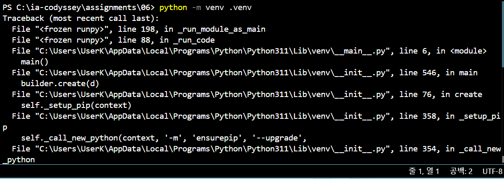

*[이미지 T1] `python -m venv .venv` 실행 시 `ensurepip` 단계에서 발생한 오류*

| 구분 | 내용 |
|---|---|
| 증상 | `.venv` 폴더는 생성되었으나 `Scripts` 안에 `pip.exe`가 없음 |
| 원인 | pip을 설치하는 `ensurepip` 단계가 실패하여 가상환경이 미완성 상태로 남음 |
| 해결 | `python -m venv .venv`를 다시 실행한 뒤 `dir .\.venv\Scripts`로 `pip.exe` 생성을 확인하고 활성화 → 프롬프트에 `(.venv)` 표시 확인 ([이미지 02]) |
| 배운 점 | 가상환경 생성 후에는 활성화만 확인하지 말고 **`pip`이 실제로 만들어졌는지** 확인해야 한다 |

### 이슈 2 — `requirements.txt` 없이 설치 시도

가상환경을 활성화한 직후 `pip install -r requirements.txt`를 실행했으나 파일을 아직 만들지 않아 실패했다.

```text
ERROR: Could not open requirements file: [Errno 2] No such file or directory: 'requirements.txt'
```

`requirements.txt`를 먼저 작성한 뒤([이미지 01]) 재실행하여 정상 설치되었다([이미지 02]).

### 이슈 3 — 패키지 설치 중 네트워크 오류

`pip install -U google-genai requests python-dotenv` 실행 시 `getaddrinfo failed`(DNS 조회 실패)로 연결이 반복 실패했다.

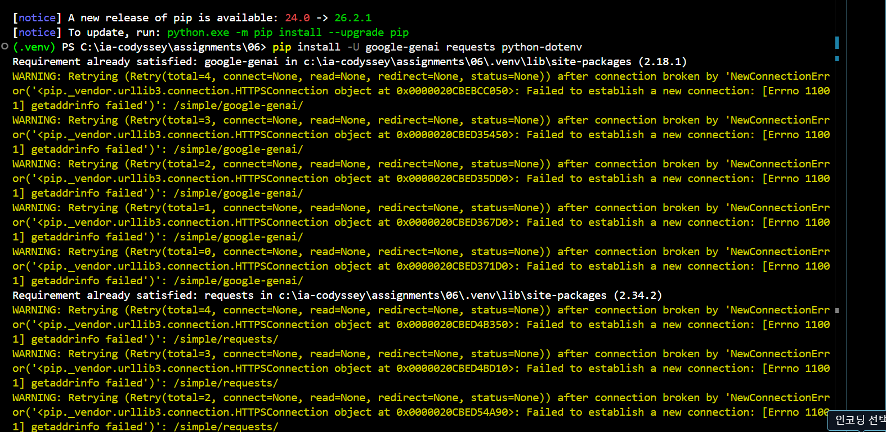

*[이미지 T2] `pip install -U` 실행 중 발생한 네트워크 연결 실패 (`getaddrinfo failed`)*

| 구분 | 내용 |
|---|---|
| 증상 | `Failed to establish a new connection: [Errno 11001] getaddrinfo failed`가 각 패키지마다 5회씩 재시도 후 실패 |
| 원인 | 일시적인 DNS/네트워크 연결 문제 (PyPI 서버 접속 불가) |
| 영향 | **없음** — `Requirement already satisfied` 문구대로 `google-genai 2.18.1`, `requests 2.34.2`가 이미 설치되어 있어 실행에 지장 없음 |
| 배운 점 | 외부 통신은 **언제든 실패할 수 있다**는 것을 설치 단계에서 먼저 경험했다. pip이 무한 재시도가 아니라 5회에서 멈추듯, 본 프로그램도 LLM 재요청을 **1회로 제한**하고 Kakao 호출에 `timeout=10`을 지정했다 |

### 이슈 4 — `.gitignore` 파일명 오타

처음에 `.gitnore`(i 누락)로 파일을 만들었다. 이 이름으로는 **Git이 무시 규칙으로 인식하지 않아 `.env`가 그대로 커밋된다.**

| 구분 | 내용 |
|---|---|
| 위험도 | **높음** — 실제 API 키가 공개 저장소에 올라갈 수 있는 상황 |
| 해결 | 올바른 이름 `.gitignore`를 생성하고 첫 줄에 `.env` 등록, 오타 파일 `.gitnore` 삭제 |
| 확인 방법 | `git status --ignored` 실행 시 `.env`가 **Ignored files** 목록에 있어야 한다 (6.12절) |
| 배운 점 | 보안 설정은 "파일을 만들었다"가 아니라 **"실제로 동작하는지 확인했다"** 까지 가야 한다 |

### 이슈 5 — PowerShell 스크립트 실행 정책 차단

`.\.venv\Scripts\Activate.ps1` 실행이 시스템 정책으로 차단되어, **현재 세션에만** 정책을 완화한 뒤 활성화했다.

```powershell
Set-ExecutionPolicy -Scope Process -ExecutionPolicy RemoteSigned
```

`-Scope Process`를 사용하면 해당 터미널 창에서만 적용되고 시스템 전체 설정은 바뀌지 않는다.

### 이슈 6 — Gemini AFC 경고 메시지

`client.models.generate_content()` 호출 시 아래 경고가 출력된다.

```text
Direct use of automatic function calling (AFC) in Models.generate_content is not recommended.
Instead, we recommend to use AFC in Chat.send_message.
```

| 구분 | 내용 |
|---|---|
| 성격 | **오류가 아닌 권고 메시지** — 함수 호출(Function Calling) 기능을 쓸 때는 `Chat` 방식을 권장한다는 안내 |
| 영향 | 없음. 본 프로그램은 함수 호출 기능을 사용하지 않고 단발성 텍스트 생성만 하므로 `generate_content`가 적합하며, 실제로 JSON 응답이 정상 수신되었다 |
| 조치 | 실행 로그 가독성을 위해 향후 로깅 레벨 조정으로 숨길 수 있다 |

### 이슈 7 — 같은 명령, 다른 추천 결과 (LLM 비결정성)

동일한 `-date "2026-10-15" --days 1` 명령을 여러 번 실행했는데 추천 지역이 매번 달랐다.

| 실행 | 추천 지역 1 | 추천 지역 2 |
|---|---|---|
| 1회차 | 춘천시 | 경주시 |
| 2회차 | 경주시 | 강릉시 |
| 3회차 (최종 저장분) | 경주시 | 가평군 |

| 구분 | 내용 |
|---|---|
| 원인 | LLM은 확률적으로 응답을 생성하므로 같은 프롬프트여도 매번 결과가 달라진다 |
| 판단 | **오류가 아님.** 과제 목표도 "추천 정확도"가 아니라 "구조화된 출력과 다음 단계 연결"이다 |
| 대응 | 프로그램은 특정 도시명을 가정하지 않고 **구조(필수 키 5개, 배열 길이 2)만 검증**하도록 작성했다 |
| 보고서 작성 시 주의 | 본문에 인용하는 로그·JSON·리포트는 **같은 실행분**으로 통일해야 한다. 본 보고서 7장은 모두 `results/`에 저장된 **3회차 실행 결과**로 통일했다 |

### 이슈 8 — 캡처 이미지의 API 키 노출 위험

키가 화면에 나타나는 캡처를 두 장 촬영했으나, 검토 결과 **두 장 모두 보고서에 넣지 않고 파일을 삭제**했다.

**① `.env` 파일을 편집기에서 연 화면** — 키 값을 빨간색으로 덮어 가렸으나,

| 구분 | 내용 |
|---|---|
| 문제 | 편집기 우측 **미니맵(minimap)에 원본 문자열이 축소 렌더링**되어 있었다. 본문의 색칠은 미니맵까지 가리지 못한다 |
| 조치 | 이미지 삭제 + `.env` 파일은 **어떤 캡처에도 포함하지 않는 것**으로 원칙 변경 |

**② Gemini API 키 발급 화면** — 키 값과 프로젝트 번호를 가렸으나,

| 구분 | 내용 |
|---|---|
| 문제 | 가린 프로젝트 번호와 **같은 값이 바로 위 「프로젝트 이름」 항목에 그대로 남아 있었다.** 한 화면에 같은 정보가 여러 번 표시되는 구조를 놓쳤다 |
| 조치 | 이미지 삭제 + API 키 발급 화면 자체를 증빙에서 제외 |

**공통 판단**

| 구분 | 내용 |
|---|---|
| 위험 | 이미지를 확대하거나 원본 해상도로 내려받으면 값이 복원될 수 있다. GitHub에 올라간 이미지는 **커밋 기록에 남아 나중에 삭제해도 되돌릴 수 없다** |
| 대체 증빙 | 값이 비어 있는 `.env.example`과 `.gitignore`로 대체했다 ([이미지 06]·[이미지 07]). 키가 코드에 없다는 사실은 `os.getenv()` 사용 코드로 확인할 수 있다 |
| 배운 점 | 마스킹은 "보이는 곳"만 가리기 쉽다. **미니맵·탭 미리보기·스크롤바 썸네일·터미널 스크롤백**, 그리고 **같은 값이 반복 표시되는 다른 항목**까지 확인해야 한다. 애초에 **비밀 값이 나타나는 화면은 캡처하지 않는 것**이 가장 확실하다 |

---

## 11. 자기 평가 및 배운 점

### 11.1 학습 목표 달성도

| 학습 목표 | 근거 |
|---|---|
| REST API 요청/응답 구조와 GET/POST 차이 설명 | 9.1 — Request·Response 구성 요소와 Kakao GET 실제 호출 |
| LLM 출력을 JSON으로 구조화하여 다음 단계 입력으로 연결 | 5.3~5.6 / 7.2~7.4 / 9.2 |
| 외부 API 대표 오류(인증·쿼터·네트워크·파싱)와 대응 원칙 설명 | 5.8 / 8.2 / 9.3 / 10장 (실제 이슈 8건 경험) |
| API 키를 `.env`로 관리하는 이유 설명 | 3.4 / 6.12 / 9.4 / 이슈 4·8 |

### 11.2 배운 점

- **Python 프로그램의 구조** — 기능별로 함수를 나누고 `main()`에서 순서대로 조립하면, 한 단계가 실패해도 어디를 고쳐야 하는지 바로 찾을 수 있다.
- **`.env`의 역할** — API 키처럼 공개하면 안 되는 값을 코드와 분리해서 관리하는 방법과, 그것이 왜 필요한지를 실제 사고 직전 상황(이슈 4·8)에서 체감했다.
- **Visual Studio Code로 개발하는 흐름** — 가상환경 구성, 터미널 실행, 오류 메시지 확인, 결과 파일 열람까지 하나의 화면에서 반복하며 프로그램을 완성했다.

### 11.3 개선 여지

| 항목 | 현재 | 개선 방향 |
|---|---|---|
| 키 미설정 안내 문구 | `".env 파일을 확인하세요."` | 설정할 변수명과 형식까지 함께 출력하면 과제 요구인 "설정 방법 안내"에 더 정확히 부합한다 |
| 결과 저장 시점 | 최종 리포트 생성이 실패하면 원본 JSON도 저장되지 않는다 | 맛집 검색 직후 원본 JSON을 먼저 저장하면 API 호출 결과를 잃지 않는다 |
| 결과 캐싱 | 매 실행마다 API를 새로 호출한다 | 같은 날짜·일수 재실행 시 저장된 JSON 재사용 (보너스 과제 2) |
| 리포트 응답 처리 | Gemini 응답을 그대로 저장 | 응답이 코드블록으로 감싸여 오는 경우를 대비한 제거 처리 |
| AFC 경고 | 매 실행 시 출력 | 로깅 레벨 조정으로 숨김 |

**키 미설정 안내 문구 개선안**

```text
오류: KAKAO_REST_API_KEY가 설정되지 않았습니다.

프로젝트 폴더의 .env 파일에 다음 항목을 설정하세요.
KAKAO_REST_API_KEY=발급받은_REST_API_KEY
```

변수명과 형식만 보여주므로 보안 문제가 없으면서, 처음 실행하는 사용자가 무엇을 해야 하는지 바로 알 수 있다.

---

## 12. 최종 확인

| 구분 | 항목 | 확인 |
|---|---|---|
| CLI | Python 3.11.9에서 실행, `argparse` 사용 | 완료 |
| CLI | `-date "YYYY-MM-DD"` 필수, `--days 1\|2` 선택 | 완료 |
| CLI | `-date`만으로도 과제 원문 형식 그대로 실행 | 완료 (6.7) |
| CLI | 잘못된 날짜 형식 검증 후 사용법 출력 | 완료 (6.8) |
| LLM | 1차 추천을 JSON으로 수신·파싱 | 완료 |
| LLM | 필수 키 4개 + `recommended_cities` 2곳 | 완료 |
| LLM | 파싱·구조 검증 실패 시 재요청 1회 상한 | 완료 |
| LLM | 최종 리포트를 Markdown으로 생성 | 완료 |
| LLM | `--days` 값에 따라 일정 구성 분기 | 완료 |
| Kakao | `Authorization: KakaoAK` 헤더 인증 | 완료 |
| Kakao | 추천 도시명으로 `"도시명 맛집"` 검색, 도시당 5건 | 완료 |
| Kakao | `name`/`address`/`category`/`url`/`phone`/`lat`/`lng` 정규화 | 완료 |
| Kakao | 검색 실패·0건에도 프로그램 계속 진행 | 완료 |
| 오류 | `try-except`로 API·파싱 오류 처리 | 완료 |
| 오류 | 키 미설정 시 즉시 종료 및 설정 안내 | 완료 |
| 오류 | `errors` 리스트 기록 후 JSON에 저장 | 완료 |
| 결과물 | `results/` 자동 생성, JSON + Markdown 저장 | 완료 |
| 결과물 | 리포트에 추천 지역·이유·날씨·행사·맛집·일정·오류 요약 포함 | 완료 |
| 결과물 | 리포트의 맛집이 모두 Kakao 검색 결과에 존재 (10/10) | 완료 |
| 결과물 | `README.md` 작성 (개요·실행 방법·키 설정·결과 확인·보안) | 완료 |
| 보안 | 코드에 실제 키 하드코딩 없음 | 완료 |
| 보안 | `.env`를 `.gitignore`에 등록, 오타 파일 삭제 | 완료 |
| 보안 | `git status --ignored`로 `.env` 제외 확인 | 완료 (6.12) |
| 보안 | 키가 보이는 캡처 이미지 삭제 | 완료 |
