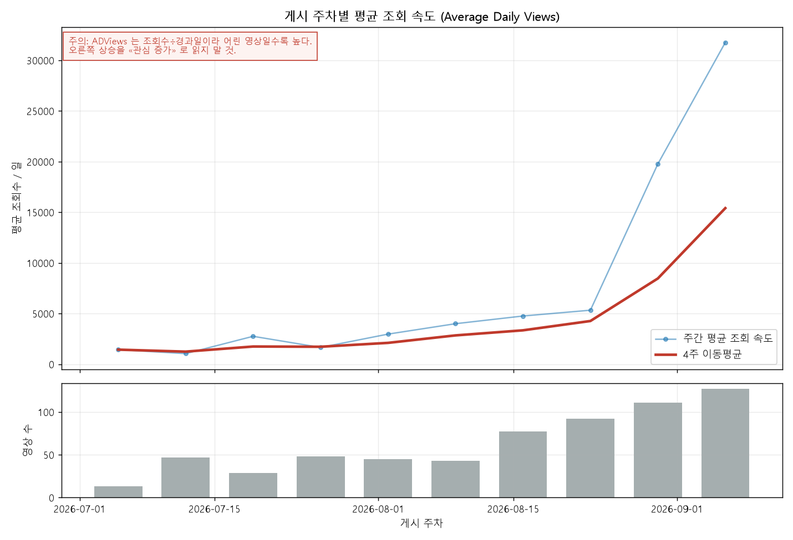
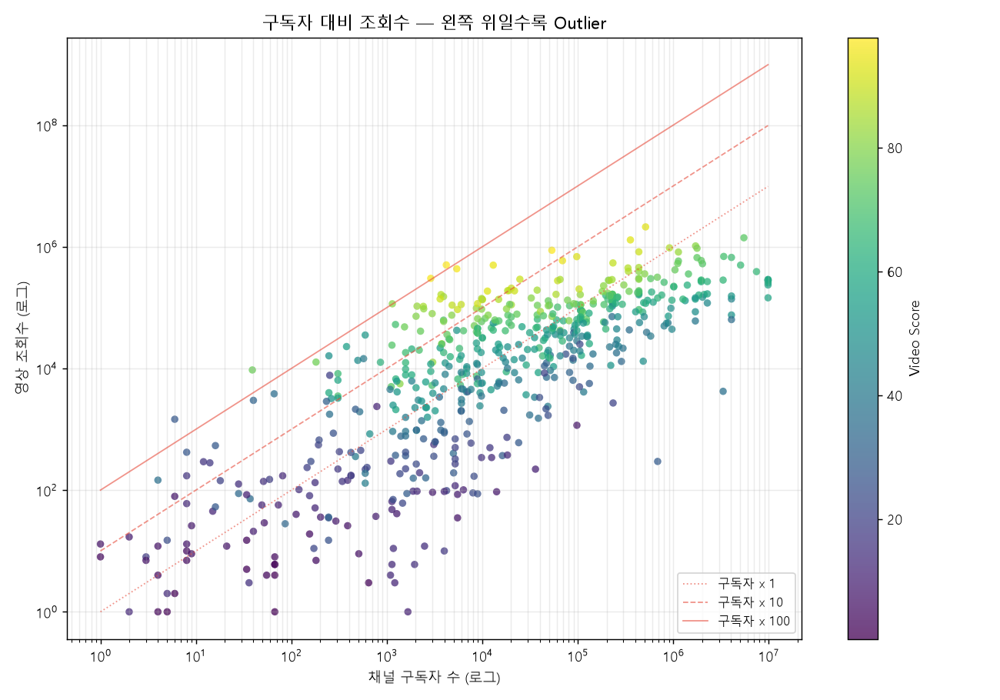
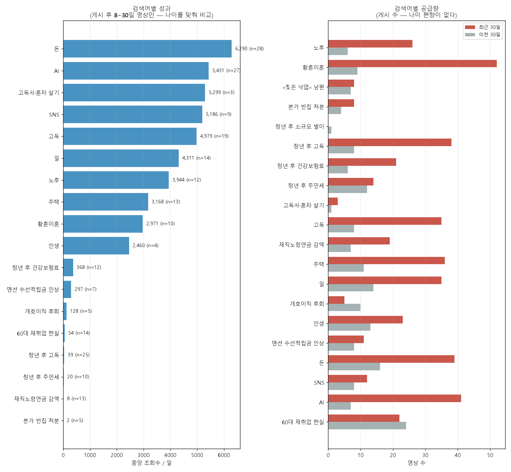

# 일본 YouTube 롱폼 콘텐츠 트렌드 분석 리포트

2026-09-02 · Japanese Long-form Opportunity Radar (MVP)

---

## 1. 분석 주제 및 선정 이유

일본 YouTube 롱폼 영상의 공개 데이터를 모아, **작은 채널에서 비정상적으로
잘 된 영상**과 **실제로 성장 중인 채널**을 찾는다.

조회수가 높은 영상을 찾는 것이 목적이 아니다. 조회수 상위는 이미 큰 채널이
차지하고 있어 새로 만들 소재를 알려주지 않는다. 구독자가 적은데 크게 터진
영상이 «아직 충분히 다뤄지지 않은 주제» 를 가리킨다고 보고 그것을 찾는다.

---

## 2. 분석 질문

1. 최근 일본 롱폼 영상의 조회 성과는 상승하고 있는가?
2. 구독자가 적은 채널 중 평소보다 비정상적으로 높은 조회수를 낸 영상이 있는가?
3. 한 영상의 우연한 성공과 채널 전체의 성장을 구분할 수 있는가?
4. 어떤 주제가 상대적으로 좋은 성과를 내고, 공급은 어떻게 변하고 있는가?

---

## 3. 데이터 설명

| 항목 | 내용 |
|---|---|
| 출처 | YouTube Data API v3 (공개 데이터) |
| 수집일 | 2026-09-02 |
| 게시 기간 | 2026-07-03 ~ 2026-09-01 (약 60일) |
| 수집 영상 | 777건 |
| 분석 대상 | **632건** (조회수 스냅샷이 있는 것) |
| 채널 수 | 449개 |
| 영상 길이 | 중앙 23분 (10분 이상만 수집) |

### 수집 방법

검색어는 두 벌이다.

```
넓은 낱말 8개   老後 · お金 · 仕事 · 孤独 · AI · 人生 · SNS · 住宅
롱테일 12개     定年後 住民税 · 在職老齢年金 減額 · 実家 空き家 処分 ·
                熟年離婚 · 定年後 孤独 · 60代 再就職 現実 …
```

넓은 낱말로 먼저 모은 뒤, 「대상 + 상황 + 문제」 형태의 롱테일 검색어를
더했다. 둘의 결과가 크게 달랐고 그것이 인사이트 3이 되었다.

각 검색어에 대해
`order=relevance` 와 `order=date` 로 각각 검색한 뒤 중복을 제거했다.

두 정렬을 함께 쓴 이유는, 관련성 정렬이 인기 영상에 치우쳐 **정작 찾으려는
작은 채널이 잘 안 나오기 때문**이다. 최신순은 채널 규모와 무관하게 나온다.

`regionCode=JP` 와 `relevanceLanguage=ja` 는 **검색 조건일 뿐 언어 판정에
쓰지 않았다.** 요청 파라미터라 모든 결과가 같은 값을 가져 변별력이 없다.
일본어 판정은 제목·설명의 가나 비율과 `defaultAudioLanguage` 로 했다.

### 컬럼

고정 정보와 변하는 정보를 파일로 나눴다. 조회수는 매일 달라지므로
같은 파일에 두면 고정 정보를 매일 다시 저장하게 된다.

```
videos.csv           video_id · title · channel_id · published_at
                     duration_seconds · default_audio_language
                     detected_language · kana_ratio · seed · found_at

video_snapshots.csv  collected_at · video_id · views · likes · comments
                     channel_subscribers · hidden_subscriber_count · watch_status
```

### 사용한 API 할당량

| 작업 | units | 빈도 |
|---|---:|---|
| 수집 (검색 16회) | 1,615 | 하루 1회 |
| 스냅샷 | 12 | 하루 1회 |
| 채널 검증 | 40~57 | 가끔 |
| **정상 운영 합계** | **약 1,630** / 하루 10,000 (16%) | |

개발 중에는 수집을 하루 5번 돌려 8,075 units(81%)까지 쓴 날이 있었다.
여섯 번이면 하루치가 동나 **그날은 스냅샷도 못 남긴다** — 시계열에 구멍이
나고 지나간 날의 조회수는 다시 받을 수 없다. 그래서 `collector.py` 에
**같은 날 두 번째 실행을 API 호출 전에 막는** 가드를 넣었다(`--force` 로 우회).

`search.list` 는 `videos.list` 보다 100배 비싸다. 그래서 **수집은 하루 한두 번만
하고, 분석은 저장된 CSV 만 읽도록** 코드를 나눴다.

---

## 4. 데이터 정제

### 중복

같은 영상이 여러 검색어에서 나온다. `video_id` 로 중복을 제거하고
**처음 발견한 검색어**를 기록했다.

### 결측치

| 항목 | 처리 |
|---|---|
| 구독자 비공개 (`hiddenSubscriberCount`) | 빈 값으로 두고 구독자 대비 지표에서 제외. **0으로 채우면 비율이 무한이 된다** |
| 삭제·비공개 영상 | `videos.list` 는 에러가 아니라 조용히 빼고 준다. 응답에 없는 id 는 `watch_status = unavailable` 로 기록 |
| 자막 없음 | 메타데이터 분석은 그대로 진행 |

### 이상치

**이상치를 제거하지 않았다. 이 분석에서는 이상치가 찾는 대상이다.**

대신 등급으로 나눴다.

```
Rising  구독자 대비 2배 이상    Outlier  5배 이상    Super Outlier  10배 이상
```

### ⚠️ 다만 «분모가 작은 비율» 은 잘라냈다

구독자 대비 조회수는 분모가 작으면 비율이 잡음이 된다.
롱테일 검색어를 넣은 뒤 실제로 이런 것이 1위로 올라왔다.

```
구독 6명 → 조회 1,461회 = 244배
```

이것은 «유난히 잘 됐다» 가 아니라 «구독자가 거의 없다» 는 말일 뿐이고,
1,461회는 수요의 증거가 못 된다. 넓은 낱말로 모을 때는 구독 100명 미만이
2건뿐이었는데 롱테일을 넣자 82건이 되었다 — **검색어가 좁을수록 이 잡음이
늘어난다.**

그래서 **구독자 1,000명 미만은 비율을 계산하지 않는다**(`config.MIN_SUBSCRIBERS_FOR_RATIO`).
0으로 채우지 않고 결측으로 둔다 — «비율이 0» 과 «비율을 못 잰다» 는 다르다.
632건 중 139건이 여기 해당한다.

자르기 전후로 이상치 1위가 바뀌었다.

```
자르기 전   244배  구독      6 →   1,461회   ← 잡음
자른 뒤     120배  구독  4,190 → 502,006회   ← 신호
```

### 필터

```
길이     600초(10분) 이상만
언어     제목·설명의 가나 비율 10% 이상 또는 defaultAudioLanguage=ja
```

---

## 5. 시계열 분석

### 분석 1 — 이동평균

게시 주차별 평균 조회 속도에 4주 이동평균을 걸었다.

### 분석 2 — 변화율

최근 4주 평균과 그 전 4주 평균을 비교했다.

### 분석 3 — 구간별 통계

게시 후 경과일로 구간(Age Bucket)을 나눠 같은 나이대끼리 비교했다.

```
0~3일 · 4~7일 · 8~14일 · 15~30일 · 31~90일
```

**구간별 표본 수를 함께 기록했다.** 표본이 20건 미만이면 백분위가 불안정해
인접 구간과 병합하고, 그래도 부족하면 전체 중앙값 대비 비율로 물러선다.
이번 데이터에서는 모든 구간이 20건을 넘어 병합이 일어나지 않았다.

---

## 6. 시각화 및 분석 결과

### 그래프 1 — 게시 주차별 평균 조회 속도



오른쪽으로 갈수록 급격히 오른다. **그러나 이것을 «관심이 늘었다» 로 읽으면
안 된다.** 아래 §7 에서 설명한다.

### 그래프 2 — 구독자 대비 조회수



로그-로그 축. 대각선은 구독자의 1배·10배·100배 선이다.
**왼쪽 위** — 구독자가 적은데 조회수가 높은 영역이 찾는 대상이다.

### 그래프 3 — 검색어별 성과와 공급량



왼쪽은 **게시 후 8~30일 영상만으로** 잰 성과다. 나이를 맞추지 않으면
최근 영상이 많은 검색어가 무조건 이긴다. 오른쪽 공급량은 게시 수라
나이 편향이 없다.

---

## 7. 관찰 · 해석 · 행동

### 인사이트 1 — 겉보기 상승의 대부분은 지표의 편향이다

**[관찰]**

```
최근 4주 평균 조회 속도   15,408 / 일
그 전 4주 평균 조회 속도   2,844 / 일
겉보기 변화               +441.8%
```

같은 데이터를 **나이를 맞춰** 다시 재면 이렇게 된다.

```
게시 후 8~30일 영상 231건   중앙 1,973 / 일   평균 5,294 / 일
```

**[해석]**

Average Daily Views 는 `조회수 ÷ 게시 후 경과일` 이다. 유튜브 조회수는
**초기에 몰리고** 그 뒤로는 완만해지는데, 분모인 경과일은 계속 늘어난다.
따라서 **어린 영상일수록 이 값이 구조적으로 높다.**

«최근 30일 vs 이전 30일» 을 이 지표로 비교하는 것은 사실상 **어린 영상과
늙은 영상을 비교**하는 것이다. +442% 는 관심의 증가가 아니라 지표의 성질이다.

처음에 검색어별 성장률을 이 방식으로 계산했을 때 `人生 +16,162%` 같은 값이
나왔다. 나이를 통제해 다시 재자 **人生 은 8개 검색어 중 꼴찌**가 되었다.
같은 데이터에서 순위가 뒤집힌 것이 편향의 크기를 보여준다.

**[행동]**

기간 비교에는 나이 편향이 없는 지표만 쓴다 — **게시 수(공급량)** 와
**같은 나이대 안에서의 성과**. 그리고 반복 수집이 쌓이면 실제 일별 조회
증가분으로 다시 잰다.

---

### 인사이트 2 — 구독자 1만 이하에서 절반이 Outlier다

**[관찰]**

```
구독자 1만 이하 영상 290건
그중 구독자 대비 5배 이상   47건 (16%)
```

상위 세 건.

| 구독자 대비 | 구독자 | 조회수 | 주제 |
|---:|---:|---:|---|
| 120배 | 4,190 | 502,006 | AI 마을 방치 실험 (ゆっくり解説) |
| 105배 | 2,880 | 301,976 | 노후자금·우체국은행 |
| 101배 | 1,140 | 115,383 | 세키스이하우스 37평 단층집 건축비 |

구독자 1,000명 미만을 잘라낸 뒤의 순위다(§4). 자르기 전에는 구독 6명짜리
채널이 244배로 1위였다.

1위 채널은 구독자 4,190명에 **올려 둔 영상이 4편뿐**이다. 같은 «구독 대비
100배» 라도 671편을 쌓아 온 채널과는 전혀 다른 일이라, 화면에 채널의
전체 영상 수를 함께 띄운다.

**5배 이상 비율이 49%에서 16%로 떨어졌다.** 표본이 72건에서 290건으로
늘면서 앞의 49%가 작은 표본의 우연이었음이 드러났다. 늘어난 분모가
사실에 가깝다.

**[해석]**

구독자가 적은 채널의 영상이 구독자 수의 100배 넘게 재생됐다는 것은,
**구독자가 아니라 검색·추천으로 유입됐다**는 뜻이다. 그 주제에 대한 수요가
채널 규모와 무관하게 존재한다는 신호다.

다만 구독자 공개값은 반올림된 근사치이므로 미세한 차이는 해석하지 않는다.

**[행동]**

이 영상들의 자막을 받아 어떤 질문과 갈등에 반응했는지 본다.
실제로 `yt-dlp` 로 자막을 받아 앞 3분·반복 키워드·마지막 1분을 뽑는
기능을 넣었다(§11).
`ゆっくり解説` 형식이 상위에 있는 점도 형식 선택의 근거가 된다.

---

### 인사이트 3 — 좁은 검색어는 «맞는 주제» 를 찾아 주지만 «수요» 는 못 보여준다

**[관찰]**

검색어를 넓은 낱말에서 「대상 + 상황 + 문제」 형태로 바꿔 다시 모았다.
같은 날, 같은 방식으로 모은 두 벌을 비교했다.

| | 넓은 낱말 (お金·AI·老後 …) | 롱테일 (定年後 住民税 …) |
|---|---:|---:|
| 영상 | 334건 | 298건 |
| 조회수 중앙 | **67,550** | **375** |
| 구독자 중앙 | 89,850 | 1,325 |
| 구독 100명 미만 | 2건 | **82건** |
| 구독대비 5배 이상 | 14% | 16% |

검색어별 중앙 조회 속도(게시 후 8~30일)도 자릿수가 다르다.

| 검색어 | 중앙 조회속도 | 표본 | 최근 30일 | 이전 30일 |
|---|---:|---:|---:|---:|
| お金 (넓은) | 6,290 | 28 | 39 | 16 |
| AI (넓은) | 5,431 | 27 | 41 | 7 |
| 孤独 (넓은) | 4,979 | 19 | 35 | 8 |
| **熟年離婚** (롱테일) | **2,971** | 10 | **52** | 9 |
| 定年後 健康保険料 | 368 | 12 | 21 | 6 |
| 定年後 孤独 | 39 | 25 | 38 | 8 |
| 在職老齢年金 減額 | 8 | 13 | 19 | 7 |
| 実家 空き家 処分 | 2 | **5** | 8 | 4 |

**[해석]**

넓은 낱말은 유튜브 관련성 정렬이 **인기 영상 위주로** 돌려준다. 좁은 질의는
경쟁이 적어 작은 채널이 상위에 오른다. 그래서 롱테일 검색어는 주제는 정확히
맞히지만 **대부분 아무도 보지 않는 영상**을 물어 온다 — 조회수 중앙 375회는
수요의 증거가 못 된다.

예외가 하나 있다. **`熟年離婚`(황혼이혼)** 은 롱테일인데도 중앙 2,971회/일이고,
공급이 9건 → 52건으로 **5.8배** 늘었다. 좁으면서도 시장이 실재하는 주제다.
실제로 이 검색어가 구독대비 5배 이상 영상을 15건으로 가장 많이 물어 왔다.

반대로 `実家 空き家 処分`(표본 5건, 2회/일)과 `定年後 小商い`(표본 0건)는
검색량 자체가 거의 없다. 주제로는 맞지만 **유튜브에서 찾는 사람이 없다.**

**[행동]**

두 벌을 다 쓴다. 넓은 낱말은 «이 주제에 수요가 있는가» 를, 롱테일은
«우리가 낄 자리가 있는가» 를 본다. 어느 한쪽만으로는 판단할 수 없다.

표본이 5건 미만인 롱테일 검색어는 다음 정리 때 뺀다. 화면이
「영상 15건 이상 모았는데 이상치 0건」인 것을 뺄 후보로 짚어 준다.

---

### 인사이트 4 — 영상만 터진 채널과 채널째 오르는 채널은 다르다

**[관찰]**

채널 30개를 검증했다. Video Score 와 Channel Score 를 **합치지 않고 따로** 냈다.

| 채널 | Video | Channel | 기준 | 모멘텀 | 해석 |
|---|---:|---:|---:|---:|---|
| ねっと | 87.6 | 100.0 | 360.7 | 206.7 | 채널째 폭발 |
| 都のオワリです | 87.2 | 20.2 | 0.82 | 0.81 | 영상만 눈에 띔 |

`ねっと` 의 실제 조회수.

```
최근 5개    187,934 · 2,001 · 72,670 · 6,276 · 154,300     중앙 72,670
그 앞 10개   12,144 · 296 · 628 · 973 · 717 · 213 · …      중앙 약 350
```

**[해석]**

`ねっと` 는 수백 회 보던 채널이 수만 회로 올라섰다. 한 영상의 우연이 아니라
채널 전체가 오르고 있다.

`都のオワリです` 는 구독자 대비로는 눈에 띄었으나 **그 채널 평소보다 오히려
못했다**(기준 0.82). 두 점수를 하나로 합쳤다면 이 차이가 사라졌을 것이다.

**[행동]**

`ねっと` 같은 채널을 정기 관찰 대상에 넣고 어떤 주제로 올랐는지 추적한다.
`都のオワリです` 유형은 소재 후보에서 우선순위를 낮춘다.

---

## 8. 결론

1. 나이를 통제하지 않은 성장률은 **지표의 편향**이다. 통제하면 순위가 뒤집힌다.
2. 구독자 1만 이하 영상의 **절반이 구독자 대비 5배 이상**이다. 작은 채널에서
   기회를 찾는다는 전제가 데이터로 뒷받침된다.
3. **좁은 검색어는 맞는 주제를 찾아 주지만 수요는 못 보여준다.**
   조회수 중앙이 67,550회에서 375회로 떨어졌다. 예외는 `熟年離婚` 하나다.
4. **영상의 강함과 채널의 성장은 다른 질문**이다. 하나로 합치면 안 된다.

---

## 8-B. 데이터 출처와 이용 조건

| | |
|---|---|
| 출처 | YouTube Data API v3 — **공개된 메타데이터만** |
| 수집 방법 | `search.list` → `videos.list` → `channels.list` (`src/collector.py`) |
| 자막 | `yt-dlp` 로 받은 **자동생성 자막**. 원문 전체는 저장만 하고 리포트에 싣지 않는다 |
| 댓글 | `commentThreads.list` — 공개 댓글만. 고른 후보 영상에 한해 50건까지 |
| 개인정보 | 댓글 작성자 이름·채널 id 를 저장하지 않는다. 본문·좋아요·시각만 남긴다 |

**이용 조건 주의**

- YouTube API Services Terms of Service 를 따른다. 수집한 데이터를
  재배포하지 않는다 — `data/raw/*.csv` 는 저장소에 올리지 않는다.
- 자막·댓글은 원저작자의 것이다. 이 프로젝트는 **분석과 요약에만** 쓰고
  원문을 그대로 옮겨 싣지 않는다. 리포트의 자막 인용은 발췌이고 출처를 밝힌다.
- 할당량은 하루 10,000 units 이며 **태평양시 자정** 에 초기화된다.
  한국 날짜로 세면 어긋난다 (`Client.quota_day()`).

---

## 9. 한계점

- **가장 큰 한계 — 지금의 시계열은 진짜 시계열이 아니다.**
  영상마다 스냅샷이 한 장뿐이라, 이 분석의 «시계열» 은 개별 영상의 시간
  변화가 아니라 **게시 시점별 코호트의 성과 비교**다. 반복 수집이 쌓이면
  실제 일별 조회 증가분으로 다시 분석할 수 있다. 수집기는 이미 매일
  돌도록 만들었고 오늘이 첫날이다.
- Average Daily Views 는 실제 조회 속도가 아니라 평균이다. 이름을 그렇게 쓴다.
- Channel Baseline 과 Momentum 은 **대상보다 오래된 영상**과 비교했다.
  비교 대상이 시간을 더 가졌으므로 값은 **과소평가**다. 나온 신호는 진짜지만
  놓친 것이 있을 수 있다.
- 구독자 공개값은 반올림된 근사치다. 미세한 차이를 해석하지 않았다.
- YouTube 검색 결과는 플랫폼 알고리즘의 영향을 받는다. 같은 검색어로 다른 날
  검색하면 다른 결과가 나올 수 있다.
- 검색어는 처음에 임의로 8개를 정한 것이다. 다른 검색어를 넣으면 결론이
  달라진다. 지금은 **잘 된 영상 제목에서 후보를 뽑아 사람이 고르는 화면**을
  넣어(§11) 이 한계를 조금씩 줄이도록 했다.
- **검색어 상한과 할당량 목표가 서로 어긋난다.** 검색어 1개는 200 units 이라
  15개면 3,000 units(30%)로 «하루 20% 이내» 를 넘는다. 20% 선은 10개다.
  프로그램은 막지 않고 지금 몇 %인지 화면에 띄운다 — 어느 쪽을 택할지는
  쓰는 사람이 정할 일이다.
- 조회수가 높다고 콘텐츠의 질이나 장기 수요가 높다는 뜻은 아니다.
- **두 벌의 검색어를 같은 표에 섞어 놓았다.** 넓은 낱말과 롱테일은 유튜브
  검색이 다르게 반응하므로 조회 속도를 나란히 비교하면 오해할 수 있다.
  인사이트 3에서 나눠 보았지만, 백분위·Video Score 는 아직 한 모집단으로
  계산한다 — 롱테일 영상이 구조적으로 낮은 점수를 받는다.
- 구독자 1,000명 미만 139건은 구독대비 지표에서 빠졌다. 그중에 진짜
  «막 시작해서 터진» 채널이 섞여 있을 수 있다. 지금은 가려낼 방법이 없다.

---

## 10. AI 사용 로그

### AI 를 사용한 작업

- 분석 설계 검토 — 지표의 편향을 지적받아 계산 방식을 두 번 고쳤다
- Python 코드 작성 및 오류 수정
- 결측치·이상치 처리 방식 검토
- 그래프 구성과 한글·일본어 폰트 문제 해결

### 사용 이유

개발 시간 단축, 그리고 **혼자서는 못 봤을 방법론적 결함을 잡기 위해서**다.
실제로 두 번 잡혔다.

1. 검색어별 성장률을 나이 보정 없이 계산해 `+16,162%` 가 나왔다
2. Channel Baseline 을 ADViews 로 계산해 `2,941배` 가 나왔다 — 오래된 영상의
   ADViews 가 0 에 수렴하기 때문이었다

둘 다 **에러가 나지 않고 그럴듯한 숫자로 나왔다.** 값을 눈으로 보고 «이게
말이 되나» 를 따지지 않았다면 그대로 리포트에 들어갔을 것이다.

### 이번에 추가로 잡힌 것

3. `注文住宅` 의 뜻을 물었더니 **「나만의 맞춤형 주문주택 짓기 노하우」** 가
   나왔다. 제목 번역용 프롬프트를 낱말에 쓴 탓이다. 오류가 아니라 **없는 제목을
   지어낸 것**이라, 읽는 사람은 그걸 낱말 뜻으로 믿게 된다
4. 검색어 성과를 중앙 점수로 줄 세우니 `住宅` 을 «성과 꼴찌» 로 짚었다.
   그런데 `住宅` 은 **이상치가 8건으로 두 번째로 많은 검색어**다. 우리가 찾는
   것은 평균이 높은 주제가 아니라 유난히 잘 된 영상이므로, 그대로 뺐다면
   가장 잘 잡아내는 검색어를 버릴 뻔했다
5. 자막을 못 받은 영상의 실패 사유가 `429`(요청 과다)인데 «자막 없음» 으로
   적힐 뻔했다. 자막이 있는 영상을 없다고 기록하면 그 소재를 영영 안 보게 된다

### 검증 방법

- 계산값을 원본 데이터로 직접 확인 (`ねっと` 채널의 실제 조회수를 뽑아 대조)
- 같은 코드를 다시 실행해 같은 결과가 나오는지 확인
- 그래프의 수치와 데이터프레임 값을 비교
- 폰트 문제는 실제로 그림을 그려 눈으로 확인

---

## 부록 — 재현 방법

```bash
pip install -r requirements.txt
copy .env.example .env          # YOUTUBE_API_KEY 를 넣는다

python -m src.collector           # 검색 → 필터 → videos.csv
python -m src.snapshot_collector  # 매일 1회
python -m src.channel_analyzer    # 채널 검증
python analysis.py                # 그래프 3개 + 인사이트
streamlit run app.py --server.address 127.0.0.1     # 화면
```

---

## 11. 분석에서 도구로

리포트를 쓰고 끝내면 **하루짜리 스냅샷**이다. 매일 열어 쓰는 도구로 만들었다.

### 아침 화면

```
🔥 지금 오르는 중        직전 관측 대비 하루 증가 상위 10
🆕 어제 새로 들어온 것    Video Score 상위 10 (게시 후 경과일 함께)
```

「어제 새로 들어온 것」에는 **«어제 처음 봤다» 이지 «어제 떴다» 가 아니다** 를
명시했다. 검색으로 이제야 걸린 한 달 전 영상일 수 있기 때문이다.
실제로 상위 10건 중 게시 30일이 넘은 것이 섞여 나와, 그 수를 따로 표시한다.

### Claude 웹으로 넘기기

고른 영상 하나를 약 2,750자짜리 한 장으로 뽑는다.

```
■ 소재        제목(한/일) · 길이 · 게시일 · URL
■ 왜 이 영상인가  구독대비 · 두 점수 · 나이대 순위 · 검색어 성과
■ 자막 발췌    앞 3분 / 반복 키워드 / 마지막 1분
■ 주변        같은 검색어 상위 5편 · 같은 채널 수집분
```

자막은 `yt-dlp` 로 받는다(무료, API 키 불필요). **전체를 넣지 않는다** —
20분물이 약 6,900자라 그대로 붙이면 부담이고, «이 소재를 할까 말까» 를
정하는 데는 앞뒤와 반복 낱말이면 충분하다. 실측 발췌량은 828~1,725자였다.

Channel Score 가 빈 채널은 `nan` 이 아니라 **「판정 못 함」과 그 이유**를 적는다.
「점수가 낮다」와 「모른다」는 다르다.

### 검색어 관리

잘 된 영상(구독자 대비 5배 이상) 제목에서 2번 이상 나온 말을 후보로 낸다.
**한글 뜻을 반드시 병기한다** — 쓰는 사람이 일본어를 모르기 때문이다.

```
注文住宅 주문주택   5편   ← 진짜 주제
家づくり 집짓기     4편   ← 진짜 주제
残酷   잔혹/잔인    2편   ← 수식어. 넣으면 아무거나 걸린다
```

**프로그램은 후보만 내고 사람이 고른다.** 제목에서 뽑은 말은 주제가 아니라
형식이거나 채널명일 때가 많다. 「무시」한 것은 다시 제안하지 않는다.
