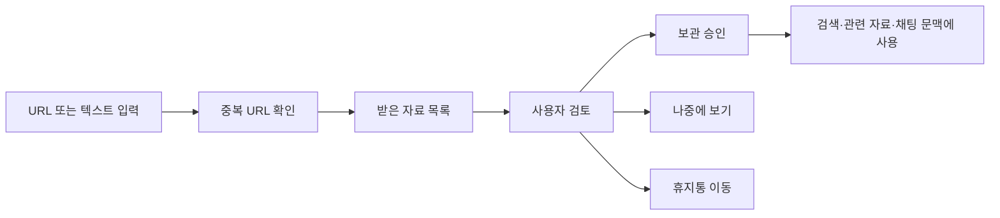
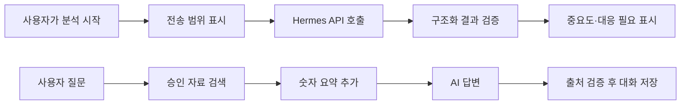
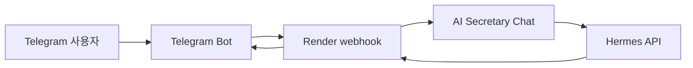

# M1-2 — AI Agent 개발: 나만의 AI 비서 구축

**AI Secretary**는 내가 저장한 URL·텍스트 자료와 숫자 기록만 근거로 답하는 개인 자료 비서입니다. 자료를 무조건 AI에 보내지 않고, 사용자가 보관 승인하거나 분석을 시작한 자료만 처리합니다. 질문할 때는 승인된 자료와 숫자 요약을 함께 넣어 “내 상황을 아는 답변”을 만들고, 근거가 없으면 한계를 말하도록 설계했습니다.

## 1. 바로 확인하기

| 구분 | URL | 상태 |
|---|---|---|
| GitHub 저장소 | https://github.com/art-ruby/ia-codyssey/tree/m1-2/assignments/M1-2 | `m1-2` 브랜치의 M1-2 과제 폴더 |
| 웹 서비스 | https://ia-codyssey-web.vercel.app | 배포 완료, Google 로그인 화면 진입 확인 |
| API 상태 | https://ai-secretary-api.onrender.com/health | `status: ok`, AI·Firebase `ready` 확인 |
| Swagger UI | https://ai-secretary-api.onrender.com/docs | 공개 확인 |

> Render 무료 인스턴스는 오래 쉬면 첫 요청이 느릴 수 있습니다. 처음 접속할 때 30~60초 정도 걸릴 수 있습니다.

## 2. 만든 서비스 요약

| 문제 | 구현한 기능 |
|---|---|
| 링크와 메모가 쌓여도 다시 보기 어렵다 | URL·텍스트 자료 접수, 중복 URL 안내, 검토 후 보관 승인 |
| 중요한 자료를 놓치기 쉽다 | 사용자 시작 AI 분석, 중요도·대응 필요 여부 제안, 오늘 화면 우선순위 표시 |
| 저장한 자료를 다시 찾기 어렵다 | 보관함 검색·필터, 관련 자료 제안·연결, 휴지통 복원·영구 삭제 |
| 개인 활동 숫자를 관리하고 싶다 | 날짜·지표·값·메모 CRUD, 합계·평균·최대·최소·추세 요약 |
| AI 소식을 따로 찾아보기 번거롭다 | AI 동향의 '새 소식': 고른 공식 블로그·커뮤니티 RSS를 모아 관심 분야 우선으로 보여주고, 고른 글만 받은 자료로 저장 |
| 내 자료를 근거로 질문하고 싶다 | 승인 자료 검색 + 숫자 요약 주입 + 근거 검증 + 대화 자동 저장 |
| 모바일에서도 간단히 쓰고 싶다 | Vercel 웹 UI, 반응형 메뉴, Telegram Bot 선택 연동 |

서비스는 **단일 소유자** 기준입니다. Google 로그인 후 서버가 Firebase UID를 확인하고, 모든 API 요청에서 소유자와 자료 모드(`personal` / `sample`)를 검증합니다.

## 3. 과제 요구사항 대응

| 과제 요구 | 구현 내용 | 위치 |
|---|---|---|
| 데이터 추가·조회·수정·삭제 API | `POST/GET/PUT/DELETE /api/data`, 버전 충돌 409, 입력 검증 422 | `server/app/features/data/` |
| 데이터 요약 API | `GET /api/data/summary`, 기간별 합계·평균·최대·최소·추세 | `server/app/features/data/summary.py` |
| 대화 저장·목록·불러오기·삭제 | `POST/GET/DELETE /api/conversations`, `GET /api/conversations/{id}` | `server/app/features/conversations/` |
| AI 채팅 API | `POST /api/chat`, 승인 자료와 숫자 요약을 문맥에 주입 | `server/app/features/chat/` |
| Firestore 사용 | `data`, `conversations`, `materials`, `projects`, `settings` 등 | `server/app/core/firestore.py` |
| 인증과 소유자 제한 | Firebase ID 토큰 검증, `OWNER_UID` 불일치 403 | `server/app/core/auth.py` |
| 환경변수로 비밀값 관리 | `.env.example`만 추적, 실제 키는 Render·로컬 `.env` | `.env.example`, `server/app/core/config.py` |
| CORS 제한 | `ALLOWED_ORIGINS`에 등록한 정확한 Origin만 허용 | `server/app/main.py` |
| Swagger | `/docs`, `ENABLE_API_DOCS=true`일 때 공개 | `server/app/main.py` |
| 웹 화면 | 오늘, 받은 자료, 보관함, AI 동향, 채팅, 대화 기록, 설정 등 | `web/` |
| 표본 데이터 100건 이상 | 표본 모드용 숫자 120건 생성 스크립트 | `server/scripts/seed_sample.py` |

과제의 OpenAI API 형식은 Python `openai` SDK로 구현했습니다. 실제 AI Provider는 OpenAI 호환 Hermes API이며, Render에서는 이 PC의 Tailscale Funnel 중계 경로를 통해 연결합니다.

## 4. 핵심 동작 흐름

### 4.1 자료 저장과 보관 승인



- URL만 넣어도 저장할 수 있습니다.
- 같은 URL이 있으면 기존 자료 열기, 메모 추가, 별도 저장 중 선택합니다.
- 보관 승인 전 자료는 새 채팅 문맥에 들어가지 않습니다.

### 4.2 AI 분석과 채팅



AI에는 자료 ID나 비밀값을 보내지 않습니다. 답변이 인용한 출처는 서버가 다시 검증합니다. 삭제·휴지통·분석 제외 자료는 새 답변 문맥에서 빠집니다.

## 5. 기술 스택

| 영역 | 기술 |
|---|---|
| 백엔드 | Python 3.11, FastAPI, Uvicorn, Pydantic |
| 저장소·인증 | Firebase Firestore, Firebase Auth, Firebase Admin SDK |
| AI | `openai` SDK, Hermes API, Tailscale Funnel 중계 |
| 프론트엔드 | HTML, CSS, Vanilla JavaScript |
| 배포 | Render API, Vercel Web |
| 테스트 | pytest, Node.js 내장 테스트 러너 |
| 선택 연동 | Telegram Bot webhook |

## 6. 로컬 실행 방법

### 6.1 서버 실행

```powershell
# assignments/M1-2 폴더에서 실행
python -m venv .venv
.\.venv\Scripts\python.exe -m pip install -r server/requirements.txt -r server/requirements-dev.txt

Copy-Item .env.example .env
# .env 파일에 Firebase, AI, CORS 값을 채웁니다.

.\.venv\Scripts\python.exe -m uvicorn app.main:app --app-dir server --host 127.0.0.1 --port 8000 --reload
```

확인:

```powershell
Invoke-WebRequest http://127.0.0.1:8000/health -UseBasicParsing
```

`ENABLE_API_DOCS=true`이면 로컬 Swagger는 `http://127.0.0.1:8000/docs`에서 열립니다.

### 6.2 웹 실행

```powershell
# 다른 터미널에서 assignments/M1-2 폴더 기준
node web/scripts/build-config.mjs
.\.venv\Scripts\python.exe -m http.server 5500 --bind 127.0.0.1 --directory web
```

브라우저에서 `http://127.0.0.1:5500`으로 접속합니다.

로컬 웹을 쓰려면 `.env`의 `ALLOWED_ORIGINS`에 `http://127.0.0.1:5500`을 넣고, Firebase 승인 도메인에 필요한 로컬 도메인을 추가합니다.

### 6.3 표본 데이터 생성

```powershell
.\.venv\Scripts\python.exe server/scripts/seed_sample.py
```

표본 모드에서 숫자 기록 120건과 예시 자료를 확인할 수 있습니다.

## 7. 환경변수

실제 값은 `.env`, Render, Vercel에만 둡니다. 저장소에는 `.env.example`만 포함합니다.

### 서버(Render 또는 로컬)

| 변수 | 설명 |
|---|---|
| `OPENAI_API_KEY` | AI Provider 인증값. Render에서는 중계 토큰으로 사용 |
| `AI_PROVIDER_BASE_URL` | OpenAI 호환 API 주소 |
| `AI_PROVIDER_MODEL` | 예: `gpt-5.5` |
| `AI_PROVIDER_ROUTE` | Hermes 구독 경로 |
| `FIREBASE_SERVICE_ACCOUNT_JSON` | Firebase 서비스 계정 JSON 한 줄 문자열 |
| `OWNER_UID` | 허용할 Firebase 사용자 UID |
| `ALLOWED_ORIGINS` | 허용할 웹 Origin. 예: `https://ia-codyssey-web.vercel.app` |
| `ENABLE_API_DOCS` | `true`이면 Swagger 공개 |
| `AI_DAILY_REQUEST_LIMIT` | AI 일일 호출 제한 |
| `AI_TIMEOUT_SECONDS` | AI 호출 제한 시간 |
| `TELEGRAM_BOT_TOKEN` | 선택 기능: Telegram Bot 토큰 |
| `TELEGRAM_ALLOWED_CHAT_ID` | 선택 기능: 허용할 Telegram 채팅 ID |
| `TELEGRAM_WEBHOOK_SECRET` | 선택 기능: Telegram webhook 검증 토큰 |

### 웹(Vercel)

| 변수 | 설명 |
|---|---|
| `API_BASE_URL` | Render API 주소 |
| `FIREBASE_WEB_API_KEY` | Firebase 웹 공개 API 키 |
| `FIREBASE_AUTH_DOMAIN` | Firebase Auth 도메인 |
| `FIREBASE_PROJECT_ID` | Firebase 프로젝트 ID |

웹 환경변수 네 개는 공개 가능한 값입니다. 서버 비밀값은 Vercel에 넣지 않습니다.

## 8. 배포 구성

### 8.1 Render API

- Blueprint: `render.yaml`
- 서비스 이름: `ai-secretary-api`
- 주요 확인 주소:
  - `/health`
  - `/docs`
- 필수 설정:
  - Render Environment에 서버 환경변수 입력
  - `ENABLE_API_DOCS=true`
  - `ALLOWED_ORIGINS=https://ia-codyssey-web.vercel.app`

### 8.2 Vercel Web

- 프로젝트: `ia-codyssey-web`
- Root Directory: `assignments/M1-2/web`
- Build Command: `node scripts/build-config.mjs`
- Output Directory: `.`
- 실제 배포에서 확인한 보안 헤더:
  - `Content-Security-Policy`
  - `X-Frame-Options: DENY`
  - `X-Content-Type-Options: nosniff`

### 8.3 Firebase

- Authentication: Google 로그인 사용
- Authorized domains에 웹 도메인 추가:
  - `ia-codyssey-web.vercel.app`
- Firestore는 브라우저 직접 접근을 막고 서버 Admin SDK만 사용합니다.

## 9. 검증

최근 확인한 항목입니다.

| 항목 | 결과 |
|---|---|
| Render `/health` | 200, AI·Firebase ready |
| Render `/docs` | 200, Swagger UI 표시 |
| Vercel `/` | 200 |
| Vercel `js/config.js` | 200, 공개 웹 설정 생성 확인 |
| Vercel 보안 헤더 | CSP, frame deny, nosniff 확인 |
| Google 로그인 | `auth/unauthorized-domain` 오류 없이 Google 계정 선택 화면 진입 |
| 서버 테스트 | `python -m pytest server/tests -q` → 678 passed |
| 웹 테스트 | `node --test web/scripts/*.test.mjs` → 48 passed |

실행 명령:

```powershell
.\.venv\Scripts\python.exe -m pytest server/tests -q
node --test web/scripts/*.test.mjs
```

## 10. 완료 상태와 운영 참고

**완료** (2026-10-04 확인)

- MVP(Phase 01~07) 기능을 구현했습니다. 자료 접수·보관 승인·AI 분석·보관함·휴지통·숫자 기록·요약·자료 기반 채팅·대화 기록까지 연결했습니다.
- 서버 테스트 678개와 웹 테스트 48개를 통과했습니다. 최신 검증 명령은 9장과 `docs/verification.md`에 기록합니다.
- Render API는 최신 코드로 배포되어 있습니다. `ENABLE_API_DOCS=true`를 설정했고 `/health` 200, `/docs` 200을 확인했습니다.
- Vercel 웹은 `ia-codyssey-web`에 운영 배포했습니다. 공개 설정 환경변수 4개를 등록했고, 응답에 CSP·`X-Frame-Options`·`nosniff` 헤더가 붙는 것을 확인했습니다.
- Google 로그인은 `auth/unauthorized-domain` 오류 없이 Google 계정 선택 화면까지 진입하는 것을 확인했습니다.
- Telegram Bot webhook은 선택 기능으로 연결했습니다.

**운영 참고**

- AI 분석·채팅은 이 PC의 Hermes·Tailscale·중계 서버가 켜져 있어야 동작합니다. PC가 꺼져 있으면 자료 저장·검색·숫자 CRUD는 동작하지만 AI 호출은 실패할 수 있습니다.
- Render 무료 티어는 오래 쉬면 첫 요청이 느릴 수 있습니다. 현재 웹은 연결 실패 시 재시도 배너를 보여 줍니다.
- 동일 URL 후보가 10건을 넘으면 일부만 표시됩니다. 51건 일괄 승인은 자동 테스트로 분할·재개를 확인했습니다.
- 보너스 과제(Function Calling·MCP, 그래프·CSV 내보내기·다크 모드)와 Windows 파일 정리 기능(Phase 09~10)은 이번 MVP 범위 밖입니다.

## 11. 보안과 개인정보 처리

- `.env`, Firebase 서비스 계정 원본, API 키, Telegram Bot 토큰은 Git에 넣지 않습니다.
- 서버는 Firebase ID 토큰의 서명·만료·폐기 여부를 확인합니다.
- 소유자 UID가 맞지 않으면 403으로 거부합니다.
- 요청 본문 크기를 제한합니다.
- Firestore 보안 규칙은 브라우저 직접 읽기·쓰기를 막습니다.
- AI 요청에는 승인된 자료와 필요한 숫자 요약만 넣습니다.
- AI 도구 사용 경로는 차단하고, 텍스트 응답만 받습니다.
- 웹 화면은 `innerHTML` 대신 안전한 DOM API와 `textContent` 중심으로 구성했습니다.

## 12. Telegram Bot 선택 연동

Telegram Bot은 Render API의 `/api/telegram/webhook`으로 연결합니다.

흐름:



필요 환경변수:

- `TELEGRAM_BOT_TOKEN`
- `TELEGRAM_ALLOWED_CHAT_ID`
- `TELEGRAM_WEBHOOK_SECRET`

Telegram은 과제 필수 기능이 아니라 확장 기능입니다. 웹과 API가 기본 제출 흐름입니다.

## 13. 사용 범위와 한계

- URL 본문을 자동 크롤링하지 않습니다. URL만 저장할 수 있지만, 정확한 분석을 원하면 사용자가 설명이나 본문을 함께 넣어야 합니다.
- PC 파일 정리, 스크린샷 정리, Downloads 정리는 확장 단계 예정 기능이며 이번 MVP 필수 흐름에는 포함하지 않았습니다.
- 운영 관련 제약은 10장에 정리했습니다.

## 14. 주요 문서

| 문서 | 내용 |
|---|---|
| `docs/prd.md` | 제품 요구사항과 인수 기준 |
| `task.md` | Phase별 작업 기록 |
| `docs/ai-secretary/AI_SECRETARY_SCENARIO.md` | 사용자 시나리오 |
| `docs/mockup/index.html` | 초기 UI 목업 |
| `docs/system-architecture.html` | 시스템 구성도: Vercel·Render·Firestore·Hermes·Tailscale·Telegram의 역할과 웹·Telegram 요청 경로 |
| `docs/api-contract.md` | API 계약 |
| `docs/decisions.md` | 설계 결정 기록 |
| `docs/deployment.md` | Render·Vercel·Firebase·Telegram 배포 절차 |
| `docs/verification.md` | 검증 기록 |
| `docs/보안취약점.md` | 보안 점검과 보완 기록 |
| `docs/chat-evaluation.md` | 채팅 검색 품질 평가 |
| `.env.example` | 환경변수 이름 예시 |

## 15. 폴더 구조

```text
assignments/M1-2/
├─ server/              # FastAPI 서버
│  ├─ app/core/         # 설정, 인증, Firestore, 공통 제한
│  ├─ app/features/     # data, materials, chat, reviews, telegram 등 기능
│  ├─ scripts/          # 스모크, 표본 데이터, 배포 보조 스크립트
│  └─ tests/            # 서버 테스트
├─ web/                 # Vercel 정적 웹
│  ├─ assets/           # CSS
│  ├─ js/               # 화면과 API 호출 코드
│  └─ scripts/          # config 생성과 웹 테스트
├─ docs/                # 계약, 결정, 검증, 배포 문서
│  ├─ ai-secretary/     # 사용자 시나리오
│  └─ mockup/           # 초기 목업
├─ render.yaml          # Render Blueprint
├─ firebase.json        # Firebase 규칙·색인 배포 설정
└─ README.md
```
