# Python & Git 미션과제 제출보고서

> 원본 DOCX에 포함된 실행 화면 캡처 28개를 추출하여 각 그림 캡션과 함께 배치했습니다.

Python & Git 기초

Git과 함께하는 Python 첫 발자국  
나만의 프롬프트 관리 프로그램 제작

미션과제 제출보고서  
작성일  2026. 8. 10.

## 1. 미션 개요

여러 문서와 메신저에 흩어진 프롬프트를 한곳에서 관리하기 위해 Python 콘솔 기반 Prompt Manager를 제작하였다. 사용자가 메뉴 번호를 입력하면 프롬프트 목록 확인, 키워드 검색, 새 프롬프트 등록, 즐겨찾기 설정과 조회를 수행하도록 구성하였다.

이 과정에서 Python의 리스트와 딕셔너리, 함수, 조건문, 반복문, 사용자 입력을 실제 프로그램에 적용했다. 또한 Git으로 변경 이력을 기록하고 GitHub 원격 저장소에 업로드하여 코드와 문서를 함께 관리하였다.

## 2. 개발 목표와 결과물

- 터미널에서 실행되는 메뉴형 Python 프로그램 제작

- 이전 미션에서 작성한 프롬프트를 기본 데이터로 3개 이상 등록하는 요구사항을 충족했다. 현재 prompts.json에는 총 4개의 프롬프트가 저장되어 있다.

- 실제로 구현된 기능은 전체 프롬프트 조회, 제목·내용·카테고리 통합 검색, 새 프롬프트 추가, 즐겨찾기 목록 조회, 즐겨찾기 설정·해제이다. 별도의 카테고리별 조회 메뉴와 번호 입력 방식의 독립 상세 보기 메뉴는 구현하지 못했다.

- 함수 단위로 코드를 분리하여 읽기 쉬운 구조로 작성

- JSON 파일 저장·불러오기 기능을 추가하여 데이터 영속화 구현

- README.md와 소스 코드를 GitHub 저장소에 업로드

## 3. 개발 환경 설정

### 3.1 Python 설치와 버전 확인

VS Code 터미널에서 Python 버전을 확인하였다. 실행 결과 Python 3.11.9가 표시되어 과제 기준인 Python 3.10 이상을 충족하는 환경임을 확인했다.

```text
python --version
```

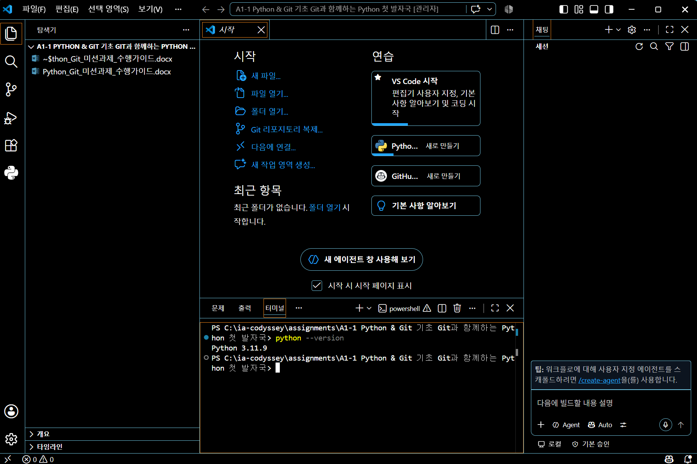

*그림 1. 터미널에서 Python 3.11.9 버전 확인*

### 3.2 Git 설치와 기본 설정

Git 버전과 사용자 설정을 확인하고 기본 브랜치 이름을 main으로 지정하였다. 이후 로컬 저장소의 변경 내용을 기능 단위로 기록할 수 있도록 준비했다.

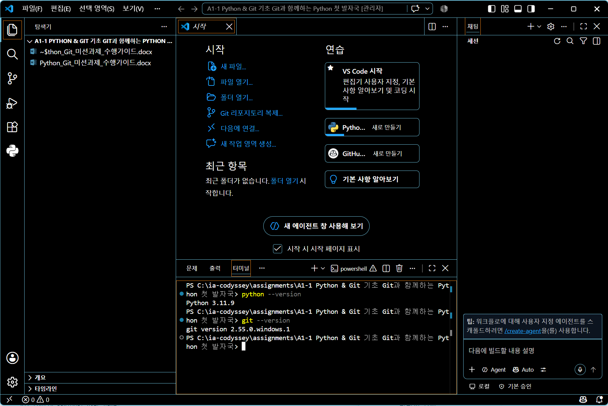

*그림 2. Git 설치 및 사용자 설정 확인*

### 3.3 VS Code 프로젝트 폴더 준비

과제 폴더 안에 python-prompt-manager 프로젝트를 만들고 VS Code에서 폴더 전체를 열었다. 왼쪽 탐색기에서 소스 파일과 프로젝트 구조를 한눈에 확인할 수 있도록 구성하였다.

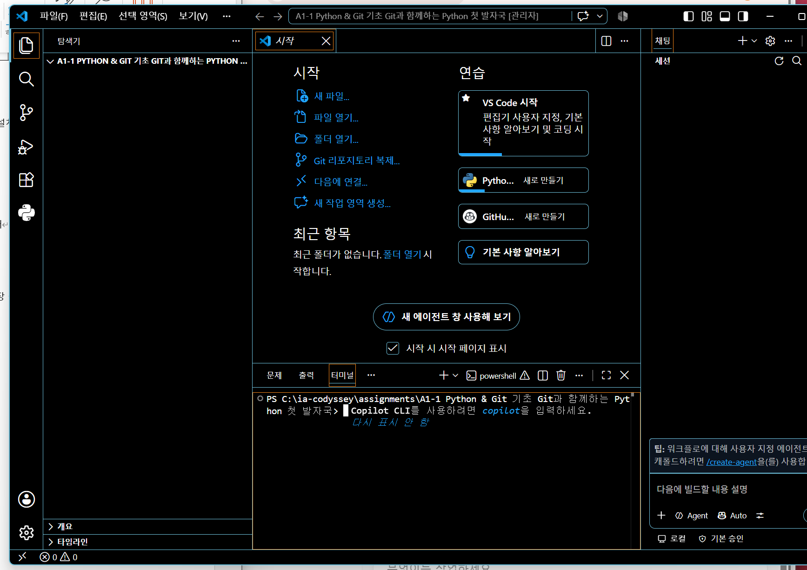

*그림 3. VS Code에서 프로젝트 작업 환경 준비*


*그림 4. python-prompt-manager 프로젝트 폴더 열기*

## 4. Python 첫 실행과 Git 저장소 시작

### 4.1 Hello Python 실행

hello.py 파일을 만들고 print("Hello")를 입력한 뒤 터미널에서 실행하였다. Hello가 정상 출력되어 VS Code와 Python 실행 환경이 연결된 것을 확인했다.

```text
print("Hello")

python hello.py
```

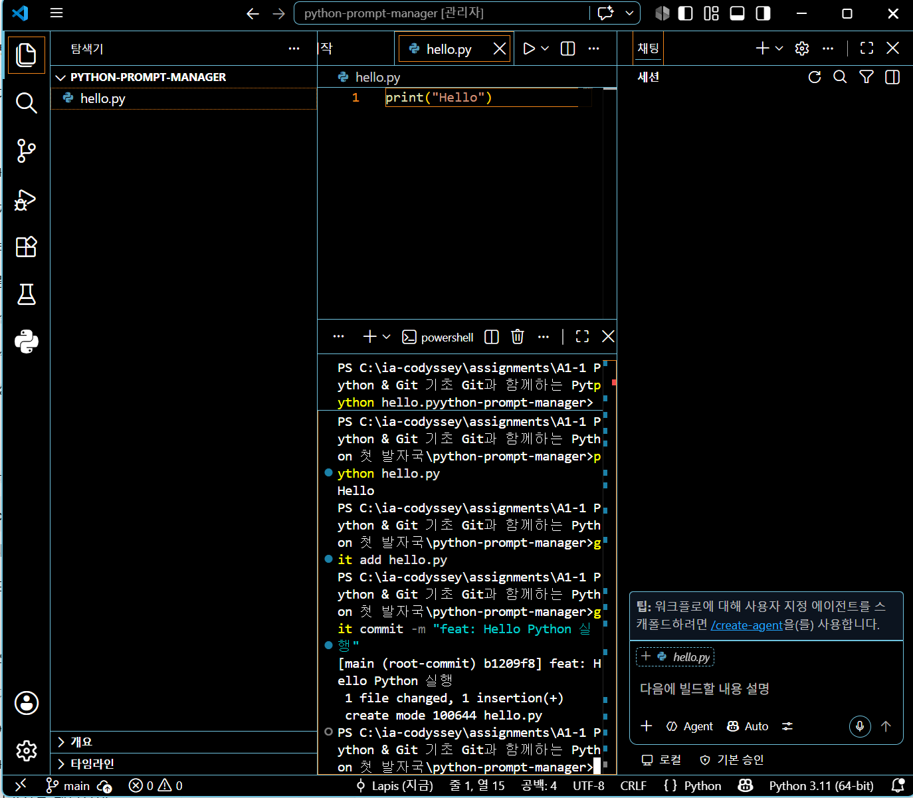

*그림 5. hello.py 작성*


*그림 6. Hello 실행 결과와 첫 커밋*

### 4.2 Git 초기화와 프로젝트 기본 파일

프로젝트는 Git 저장소로 관리되고 있으며 README.md, src/main.py, prompts.json 등의 파일을 단계적으로 커밋했다. 다만 ignore 규칙 파일은 .gitignore가 아니라 .gitnore로 잘못 작성되어 있으므로 Git의 제외 규칙으로 실제 적용되지 않는다.

```text
git init
git add .
git commit -m "chore: 프로젝트 기본 구조 생성"
```

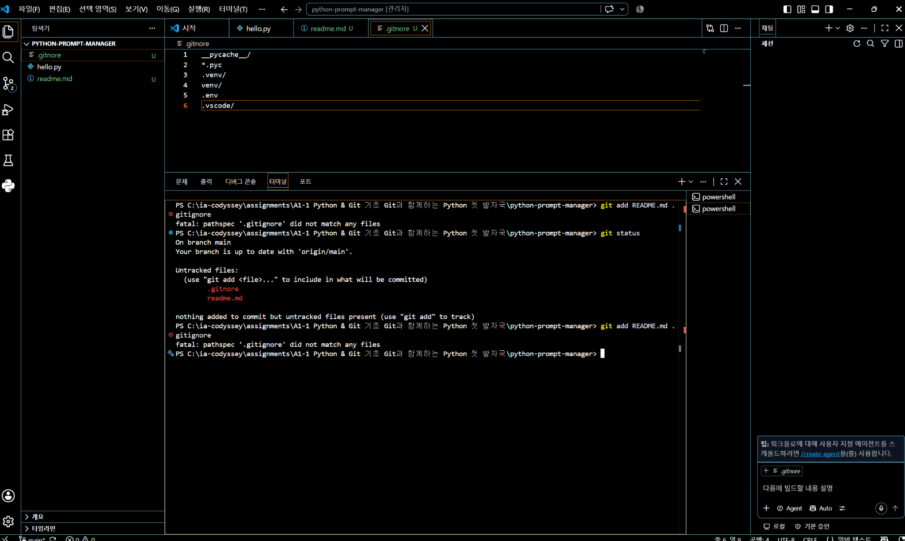

*그림 7. .gitnore 작성 화면(파일명 오탈자로 인해 Git 제외 규칙은 미적용)*


*그림 8. README.md와 프로젝트 파일 구성*


*그림 9. README.md 작성 및 Git 반영*

## 5. Prompt Manager 프로그램 구현

### 5.1 프로그램 구조 설계

프로그램의 각 기능을 하나의 큰 코드에 몰아넣지 않고 함수로 분리하였다. main()의 while 반복문이 메뉴를 계속 보여주고, 사용자가 선택한 번호에 따라 각각의 기능 함수가 실행된 뒤 다시 메뉴로 돌아오도록 설계하였다.

- load_prompts(), save_prompts(): JSON 데이터 불러오기와 저장

- show_all_prompts(): 전체 프롬프트 출력

- search_prompts(): 제목·내용·카테고리 키워드 검색

- add_prompt(): 새 프롬프트 입력과 등록

- show_favorites(), toggle_favorite(): 즐겨찾기 조회와 상태 변경

- main(): 메뉴 출력, 선택 분기, 반복 실행과 종료


*그림 10. src/main.py 생성과 프로그램 시작 코드*

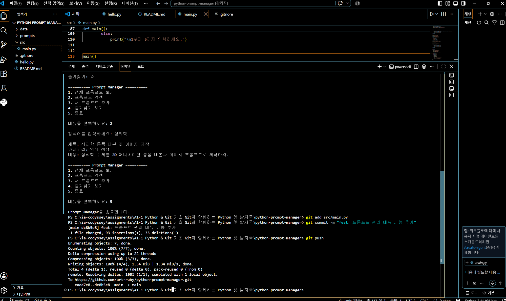

*그림 11. main() 반복 메뉴와 입력 분기 구현*

### 5.2 기본 프롬프트 데이터 등록

프롬프트 데이터는 리스트 안에 딕셔너리를 넣는 형태로 구성하였다. 각 딕셔너리는 title, content, category, favorite 필드를 가진다. 현재 prompts.json에는 자동화, 영상 생성, 텍스트 생성, 기타 카테고리의 프롬프트 4개가 등록되어 있다. 카테고리는 고정 선택 목록이 아니라 새 프롬프트 추가 시 문자열로 직접 입력한다.

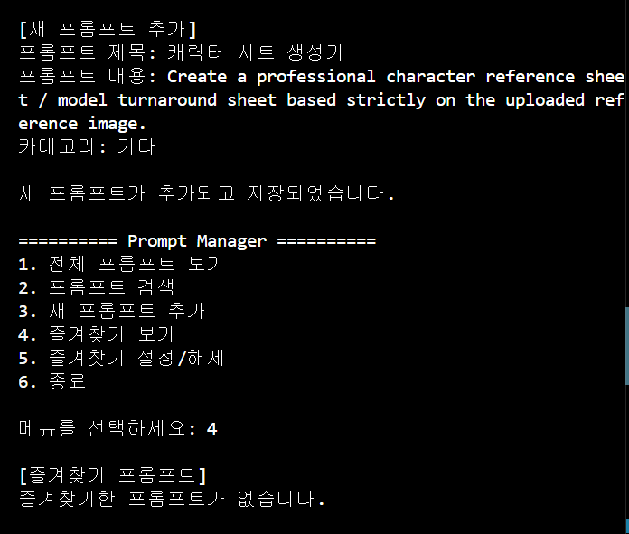

*그림 12. 이전 작업에서 사용한 이미지 생성 프롬프트 자료*

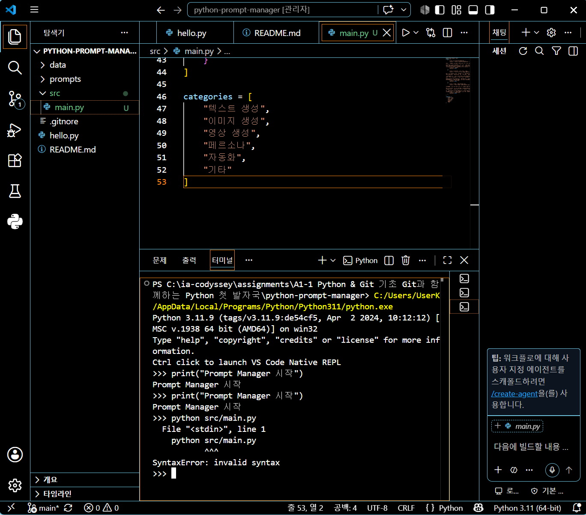

*그림 13. 기본 프롬프트 데이터 코드 작성*

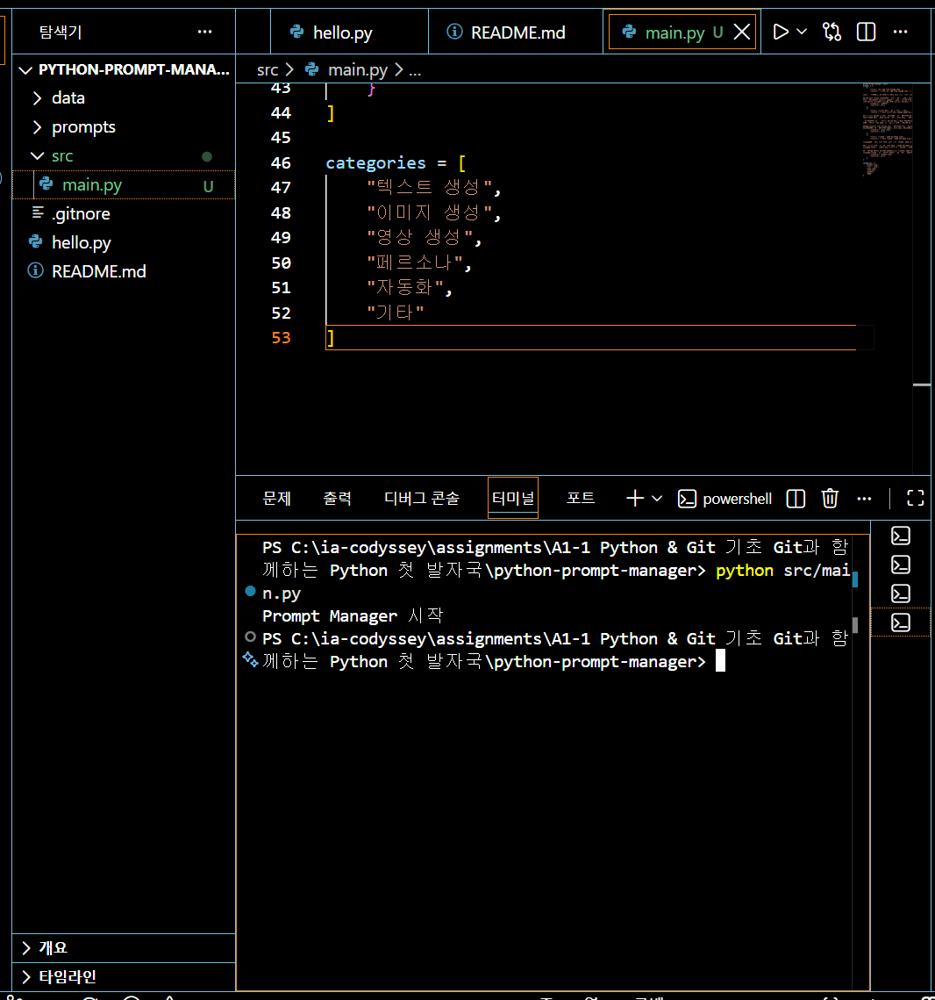

*그림 14. 카테고리 데이터 구성*

### 5.3 메뉴와 입력 처리

메뉴는 번호 선택 방식으로 구현했다. 사용자가 1부터 6까지 입력하면 전체 보기, 검색, 추가, 즐겨찾기 보기, 즐겨찾기 설정·해제, 종료 기능이 실행된다. 범위를 벗어난 값을 입력하면 안내 메시지를 출력하고 메뉴를 다시 표시한다.


*그림 15. 프로그램 메뉴 구성*


*그림 16. 메뉴 기능 구현 코드*

### 5.4 JSON 저장·불러오기 보너스 구현

보너스 과제인 프롬프트 영속화를 위해 JSON 저장 기능을 구현하였다. 프로그램 시작 시 prompts.json을 읽고, 프롬프트 추가나 즐겨찾기 변경 시 UTF-8 JSON으로 전체 목록을 다시 저장한다. 파일이 없거나 JSON이 손상되면 코드에 정의된 기본 프롬프트 3개로 복구한다. 따라서 데이터는 종료 시 초기화되지 않고 다음 실행에서도 유지된다.

필수 기능을 넘어 프로그램 종료 후에도 추가한 프롬프트와 즐겨찾기 상태가 유지되도록 JSON 영속화 기능을 구현하였다. 프로그램 시작 시 prompts.json을 읽고, 데이터 변경 시 ensure_ascii=False 옵션으로 한글을 보존하여 저장한다.


*그림 17. JSON 모듈과 저장 경로 설정*

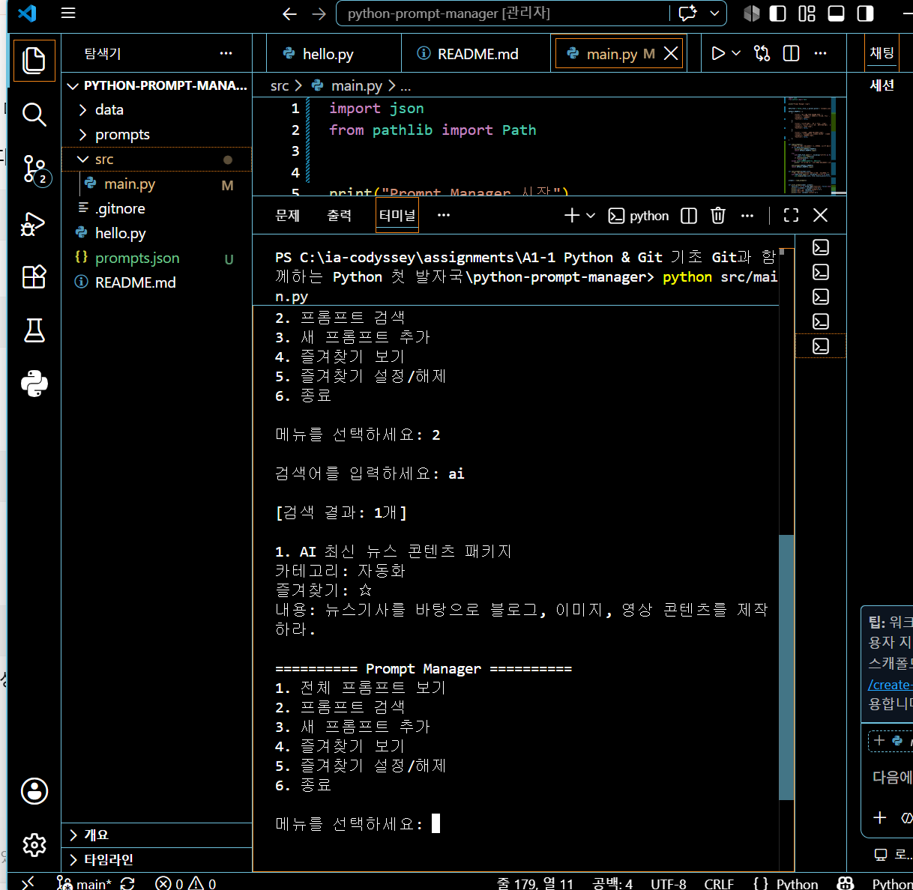

*그림 18. JSON 불러오기·저장 기능 구현*

## 6. 프로그램 실행 및 기능 테스트

### 6.1 메뉴 실행과 전체 프롬프트 보기

프로젝트 폴더 터미널에서 python src/main.py를 실행하였다. 프로그램 시작 메시지와 메뉴가 출력되었고, 전체 보기에서 기본 프롬프트가 번호와 함께 표시되는 것을 확인했다.

```text
python src/main.py
```


*그림 19. 프로그램 실행과 전체 프롬프트 출력*


*그림 20. 전체 목록과 메뉴 반복 실행 확인*

### 6.2 프롬프트 검색

검색어를 입력하면 제목, 내용 또는 카테고리에 해당 단어가 포함된 프롬프트만 출력하도록 구현하였다. 검색 결과가 없거나 검색어가 비어 있는 경우에는 별도의 안내 메시지가 출력된다.

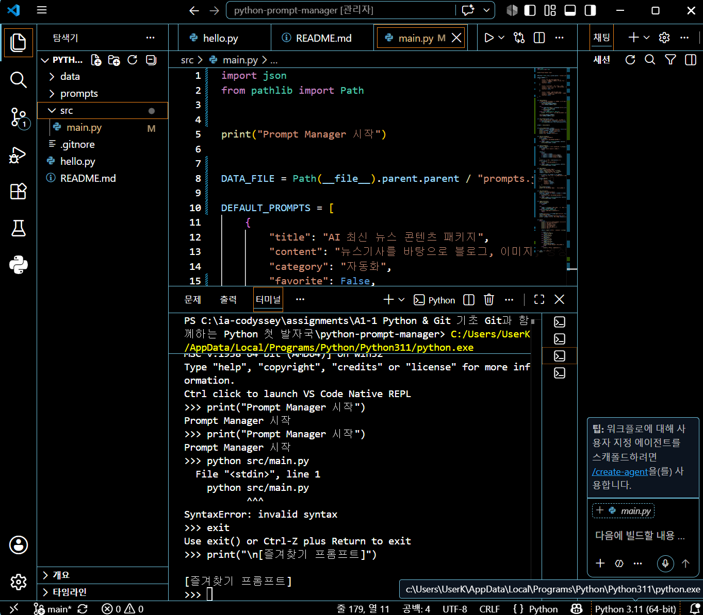

*그림 21. 키워드 검색 기능 실행 결과*

### 6.3 새 프롬프트 추가

메뉴에서 새 프롬프트 추가를 선택하고 제목, 내용, 카테고리를 차례로 입력하였다. 입력한 데이터는 리스트에 추가되는 동시에 prompts.json에 저장되도록 하였다.


*그림 22. 새 프롬프트 추가 기능 실행*

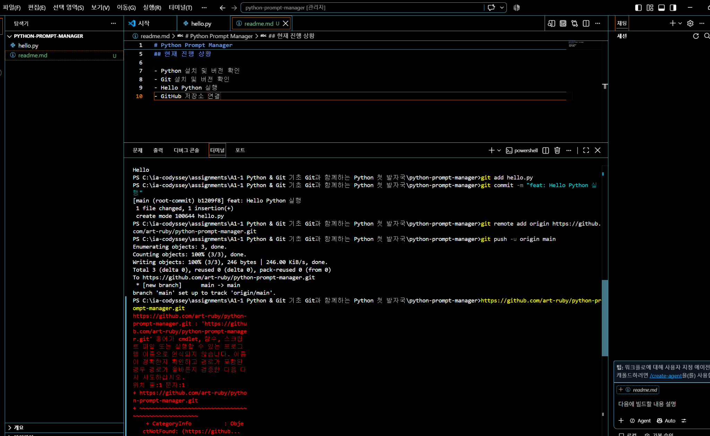

*그림 23. 추가 기능 코드와 실행 결과 확인*

### 6.4 즐겨찾기 설정과 조회

즐겨찾기 설정 메뉴에서 프롬프트 번호를 입력하면 favorite 값이 True 또는 False로 전환된다. 즐겨찾기 보기에서는 favorite가 True인 항목만 모아 출력되며, 변경 상태 역시 JSON 파일에 저장된다.

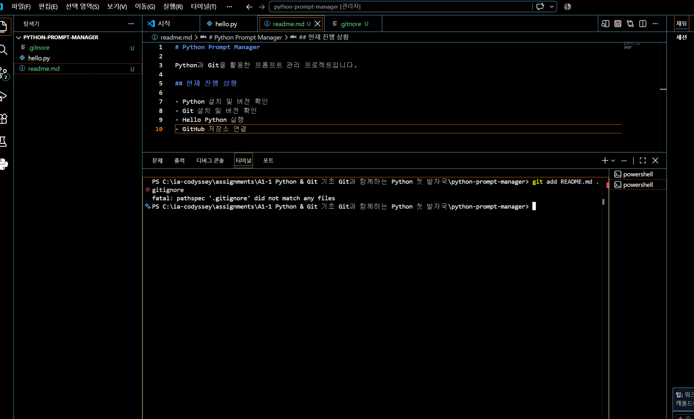

*그림 24. 즐겨찾기 설정·해제 기능 구현*

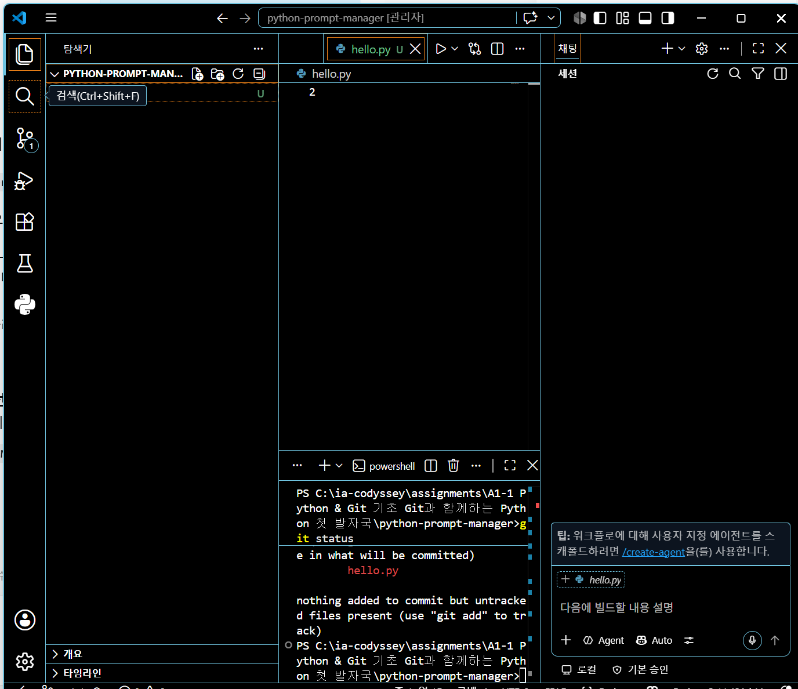

*그림 25. 즐겨찾기 목록 실행 결과*

### 6.5 저장 상태 확인

프로그램을 종료한 뒤 다시 실행하여 앞에서 추가한 프롬프트와 즐겨찾기 상태가 남아 있는지 확인하였다. 이를 통해 JSON 자동 저장과 재실행 시 불러오기 기능이 정상 작동함을 확인했다.

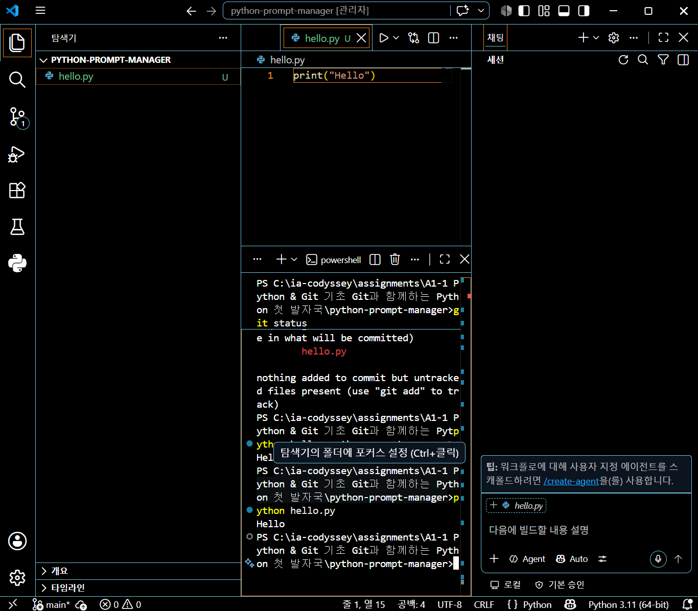

*그림 26. 프로그램 재실행 후 데이터 유지 확인*

## 7. GitHub 저장소와 과제 Git 요구사항 점검

### 7.1 실제 커밋·브랜치·원격 저장소 상태

현재 main 브랜치에 의미 있는 커밋 5개가 있으며 origin/main과 연결되어 있다. 최근 이력은 Hello 실행, README 및 ignore 파일 추가, 기본 프롬프트 등록, 메뉴 기능 추가, JSON 저장 및 즐겨찾기 완성 순서이다. 그러나 과제 기준인 최소 10개 커밋에는 부족하고, 추가 브랜치 생성·checkout·merge 기록 및 병합 커밋도 확인되지 않는다. 따라서 해당 Git 요구사항은 아직 미충족 상태이다.

```text
git add src/main.py prompts.json README.md
git commit -m "feat: 프롬프트 저장 및 즐겨찾기 기능 완성"
git push
```


*그림 27. GitHub 저장소에 소스 코드와 파일 업로드*

### 7.2 README.md 보완

README.md에는 프로그램 목적, 실제 실행 명령, 1~6번 메뉴, 실제 구현 기능, JSON 데이터 구조와 저장 방식, 현재 카테고리, 전체 파일 구조, GitHub 원격 주소를 정리하였다. 또한 과제 요구사항과 실제 구현을 대조하여 완료·부분 충족·미충족 항목을 구분하고, 구현되지 않은 기능을 완료된 것처럼 설명하지 않도록 수정하였다.


*그림 28. GitHub에서 README와 저장소 최종 확인*

## 8. 과제 요구사항 대조 및 수행 결과

[구현 완료] Python Prompt Manager는 콘솔 메뉴, 기본 프롬프트 4개, 전체 목록, 통합 검색, 프롬프트 추가, 즐겨찾기 조회·설정·해제, 잘못된 메뉴 번호 안내, 기능별 함수 분리를 구현했다. [보너스 구현] json과 pathlib을 사용하여 prompts.json을 불러오고 변경 내용을 영구 저장한다. [미충족 또는 차이] 별도의 카테고리별 조회 메뉴와 번호 기반 독립 상세 보기 메뉴가 없으며, 추가 입력값이 비어 있으면 재입력을 요청하지 않고 해당 추가 작업을 종료한다. Git 커밋은 5개로 최소 10개 기준에 부족하고, 추가 브랜치 생성·병합 기록도 없다. .gitignore 대신 .gitnore가 존재하여 제외 규칙도 적용되지 않는다. 따라서 현재 결과물은 과제의 핵심 기능을 일부 구현했지만 모든 필수 요구사항을 완전히 충족한 상태는 아니다.

현재 확인된 주요 산출물은 src/main.py, prompts.json, README.md, hello.py와 본 제출 보고서이다. GitHub 원격 저장소는 https://github.com/art-ruby/python-prompt-manager 이며 현재 브랜치는 main이다.

GitHub 저장소  
https://github.com/art-ruby/python-prompt-manager

## 9. 배운 점과 시행착오

Python 실행 위치: Python 대화형 입력창(>>>)과 프로젝트 터미널을 구분해야 했다. 파일 실행 명령은 프로젝트 경로가 표시되는 터미널에서 입력해야 한다는 점을 익혔다.

데이터 구조: 여러 프롬프트를 리스트로 묶고, 각 프롬프트의 제목·내용·카테고리·즐겨찾기 상태를 딕셔너리로 관리하는 방식을 이해했다.

함수 분리: 기능별로 함수를 나누면 오류가 난 위치를 찾기 쉽고, 이후 기능을 추가하거나 수정하기도 편해진다는 점을 체감했다.

저장 방식: 메모리의 데이터는 프로그램 종료 시 사라지지만 JSON 파일로 저장하면 다시 불러올 수 있다는 차이를 배웠다.

Git과 GitHub: Git은 로컬 변경 이력을 기록하고, GitHub는 그 기록과 파일을 원격에서 공유·보관하는 역할을 한다는 점을 실제 커밋과 푸시를 통해 익혔다.

## 10. 미충족 요구사항과 향후 개선 계획

우선 .gitnore를 .gitignore로 바로잡고, 별도 카테고리별 조회 메뉴와 번호 기반 상세 보기 기능을 추가해야 한다. 프롬프트 추가 시 빈 입력을 받으면 기능을 끝내지 않고 다시 입력받도록 개선할 필요가 있다. Git 과제 기준을 충족하려면 기능 브랜치를 생성하여 checkout 후 작업하고 main에 merge한 기록을 남기며, 기능 단위의 의미 있는 커밋을 최소 10개 이상 확보해야 한다. 이후 선택 과제로 수정·삭제, Markdown 내보내기, 조회수 기록과 인기 프롬프트 정렬을 구현할 수 있다.
